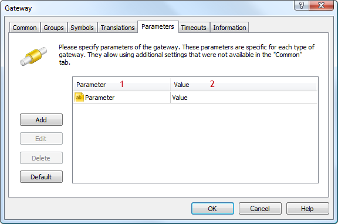

[🏠 Document Start](../README.md) / [Configuration Interfaces](README.md) / Additional Parameters

[Previous](Funds-and-ETF/IMTConFundSink/OnFundSync.md) | [Next](Additional-Parameters/IMTConParam.md)

# Configuration of Additional Parameters

The additional parameter configuration interfaces are auxiliary. They provide access to parameters of the "Name-Value" type. For example, such parameters are used for [configuring gateways](Gateways.md):

Shown above:

  * [Parameter name](Additional-Parameters/IMTConParam/Name.md).
  * [Parameter value](Additional-Parameters/IMTConParam/Value.md).

The following interfaces are available for configuring "Name-Value" parameters:

  * [IMTConParam](Additional-Parameters/IMTConParam.md)  
The interface allows managing the parameter object, allowing access to its name, type and value.
  * [IMTConParamArray](Additional-Parameters/IMTConParamArray.md)  
The interface allows managing the object of the array of parameters.

