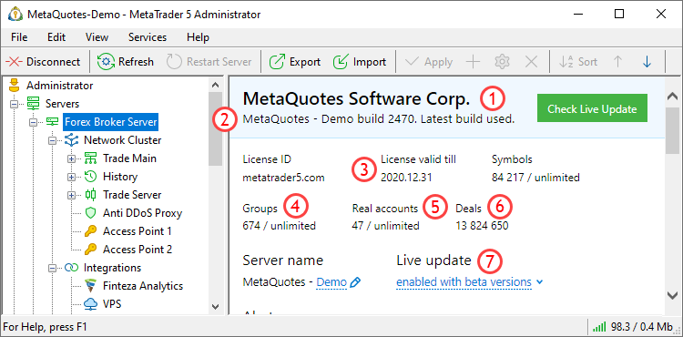

[🏠 Document Start](../README.md) / [Configuration Interfaces](README.md) / Common

[Previous](README.md) | [Next](Common/IMTCon.md)

# Common Configuration

The common configuration basically includes the information specified in the license, as well as the mode of the platform components update.

The following interfaces of common parameters are available:

  * [IMTConCommon](Common/IMTCon.md) — configure common platform parameters.
  * [IMTConAccountAllocation](Common/IMTConAccountAllocation.md) — configure [account allocations](https://support.metaquotes.net/ru/docs/mt5/platform/administration/admin_accounts/account_allocation_groups).
  * [IMTConAccountAgreement](Common/IMTConAccountAgreement.md) — configure agreements for account allocations.
  * [IMTConCommonSink](Common/IMTConSink.md) — interface for handling common configuration change events.

The below figure shows different elements of the common configuration in MetaTrader 5 Administrator, to help you understand the purpose of the interfaces.

The following elements are shown above:

1\. [The name of the platform owner](Common/IMTConCommon/IMTCon-Owner.md).

2\. [The full name of the platform](Common/IMTConCommon/IMTCon-NameFull.md).

3\. [License expiry date](Common/IMTConCommon/IMTCon-ExpirationLicense.md).

4\. [Platform limit on groups](Common/IMTConCommon/IMTCon-LimitGroups.md).

5\. [The number of real clients in the platform](Common/IMTConCommon/IMTCon-TotalUsersReal.md).

6\. [The number of trades in the platform](Common/IMTConCommon/IMTCon-TotalDeals.md).

7\. [Platform components update mode](Common/IMTConCommon/IMTCon-LiveUpdateMode.md).
