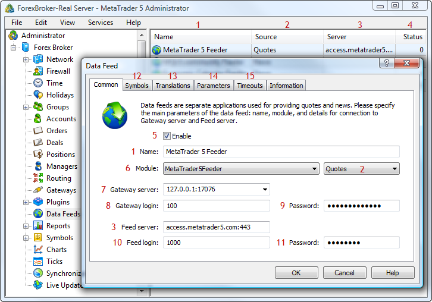

[🏠 Document Start](../README.md) / [Configuration Interfaces](README.md) / Data Feeds

[Previous](Plugins/IMTConPluginSink/OnPluginSync.md) | [Next](Data-Feeds/IMTConFeeder.md)

# Data Feed Configuration

To receive quotes and news in the online trading platform, data feeds are used. Data feeds transmit information to the history server, from which they are translated to access points (data centers) and terminals.

The following interfaces of data feeds are available:

  * [IMTConFeeder](Data-Feeds/IMTConFeeder.md)  
An interface for configuring data feeds.
  * [IMTConFeederModule](Data-Feeds/IMTConFeederModule.md)  
An interface for managing the parameters of data feed modules.
  * [IMTConFeederTranslate](Data-Feeds/IMTConFeederTranslate.md)  
An interface for managing conversion of symbols and quotes received from a data feed.
  * [IMTConFeederSink](Data-Feeds/IMTConFeederSink.md)  
An interface for handling events of changes in data feed configurations.

The below figure shows different elements of data feed configuration in the MetaTrader 5 Administrator, to help you understand the purpose of the interfaces:

The following elements are shown above:

1\. [The name of the data feed configuration](Data-Feeds/IMTConFeeder/Name.md).

2\. [Information supplied by the data feed](Data-Feeds/IMTConFeeder/Flags.md).

3\. [The server from which the data feed transmits information](Data-Feeds/IMTConFeeder/FeedServer.md).

4\. Status of the data feed.

5\. [State of the data feed](Data-Feeds/IMTConFeeder/Mode.md).

6\. [The name of the data feed module](Data-Feeds/IMTConFeeder/Module.md).

7\. [Server address of the gateway, on which the data feed accepts history server connections](Data-Feeds/IMTConFeeder/GatewayServer.md).

8\. [The login of the gateway server for history server connection](Data-Feeds/IMTConFeeder/GatewayLogin.md).

9\. [The password of the gateway server for history server connection](Data-Feeds/IMTConFeeder/GatewayPassword.md).

10\. [Login to connect to the source server](Data-Feeds/IMTConFeeder/FeedLogin.md).

11\. [Password to connect to the source server](Data-Feeds/IMTConFeeder/FeedPassword.md).

12\. [Setup of symbols for transmitting quotes](Data-Feeds/IMTConFeeder/SymbolAdd.md).

13\. [Setup of conversion of transmitted quotes](Data-Feeds/IMTConFeeder/TranslateAdd.md).

14\. [Setup of the data feed parameters](Data-Feeds/IMTConFeeder/ParameterAdd.md).

15\. [Timeout setup](Data-Feeds/IMTConFeeder/Timeout.md).
