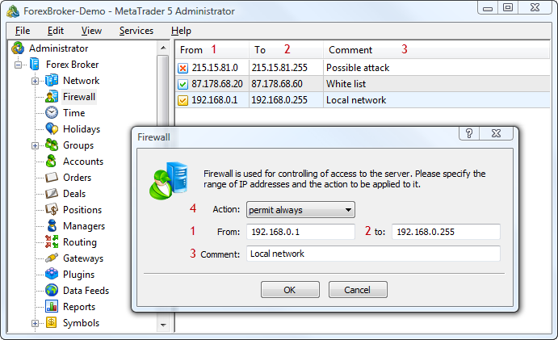

[🏠 Document Start](../README.md) / [Configuration Interfaces](README.md) / Firewall

[Previous](Holidays/IMTConHolidaySink/OnHolidaySync.md) | [Next](Firewall/IMTCon.md)

# Firewall Configuration

A firewall is designed to protect your system from access from unwanted IP addresses. If a group of addresses is blocked, users (client, manager, administrator) with the address within the specified range will not be able to connect to the server. By default, it is assumed that all addresses are allowed.

> The latest rule is applied to an address, regardless of previous instructions, except for the addresses that are always allowed. Thus, the position of each instruction in the list is a very important factor when setting access from IP addresses.

The following firewall interfaces are available:

  * [IMTConFirewall](Firewall/IMTCon.md)  
Interface for configuring firewall rules.
  * [IMTConFirewallSink](Firewall/IMTConSink.md)  
>Interface for handling events of changes in the firewall rules.

To help you understand the purpose of interfaces, below is a picture that shows various elements of firewall configuration in the MetaTrader 5 Administrator:

The following elements are shown above:

1\. [Beginning of the range](Firewall/IMTConFirewall/IMTCon-From.md) of addresses.

2\. [End of the range](Firewall/IMTConFirewall/IMTCon-To.md) of addresses.

3\. [A comment](Firewall/IMTConFirewall/IMTCon-Comment.md) to a rule.

4\. [Action](Firewall/IMTConFirewall/IMTCon-Action.md) applied to the range of addresses.
