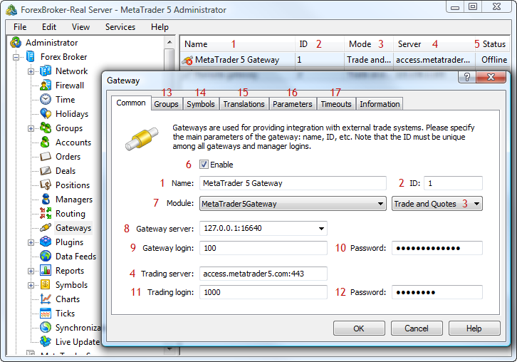

[🏠 Document Start](../README.md) / [Configuration Interfaces](README.md) / Gateways

[Previous](History-Synchronization/IMTConHistorySyncSink/OnHistorySyncSync.md) | [Next](Gateways/IMTConGateway.md)

# Gateway Configuration

Gateways are used for integrating the MetaTrader 5 platform with external trading systems. Gateways allow to transmit trade operations to external systems, as well as transmit quotes and news from them.

The following gateway interfaces are available:

  * [IMTConGateway](Gateways/IMTConGateway.md)  
An interface that provides access to all the main parameters of the gateway.
  * [IMTConGatewayModule](Gateways/IMTConGatewayModule.md)  
An interface that provides access to the parameters of the gateway module.
  * [IMTConGatewayTranslate](Gateways/IMTConGatewayTranslate.md)  
An interface that provides access to the settings for converting symbols and quotes received via the gateway.
  * [IMTConGatewaySink](Gateways/IMTConGatewaySink.md)  
An interface is used for handling gateway events.

The below figure shows different elements of gateway configuration in the MetaTrader 5 Administrator, to help you understand the purpose of the interfaces:

The following elements are shown above:

1\. [The name of gateway configuration](Gateways/IMTConGateway/Name.md).

2\. [Gateway ID](Gateways/IMTConGateway/ID.md).

3\. [Gateway operation mode](Gateways/IMTConGateway/Flags.md).

4\. [Address of the server of the external trading system](Gateways/IMTConGateway/TradingServer.md).

5\. The gateway status.

6\. [The state of the gateway configuration](Gateways/IMTConGateway/Mode.md).

7\. [The gateway module](Gateways/IMTConGateway/Module.md).

8\. [Gateway server address](Gateways/IMTConGateway/GatewayServer.md).

9\. [A login for authentication on the gateway server](Gateways/IMTConGateway/GatewayLogin.md).

10\. [A password for authentication on the gateway server](Gateways/IMTConGateway/GatewayPassword.md).

11\. [A login to authorize on the external server](Gateways/IMTConGateway/TradingLogin.md).

12\. [A password to authorize on the external server](Gateways/IMTConGateway/TradingPassword.md).

13\. [Configuration of groups](Gateways/IMTConGateway/GroupAdd.md), trade operations from which will be processed by the gateway.

14\. [Configuration of symbols](Gateways/IMTConGateway/SymbolAdd.md), for which the gateway will transmit quotes and process trade operations.

15\. [Configuration of parameters for conversion](Gateways/IMTConGateway/TranslateAdd.md) of price data transmitted by the gateway.

16\. [Setup of gateway parameters](Gateways/IMTConGateway/ParameterAdd.md).

17\. [Setup of gateway timeouts](Gateways/IMTConGateway/Timeout.md).
