[🏠 Document Start](../README.md) / [Configuration Interfaces](README.md) / Groups

[Previous](Spreads/IMTConSpreadSink/OnSpreadSync.md) | [Next](Groups/IMTConGroup.md)

# Configuration of Groups (#configuration-of-groups)

The MetaTrader 5 API allows managing groups in the trading platform — adding new groups, modifying and deleting existing ones.

The following interfaces of group settings are available:

  * [IMTConGroup (#imtcongroup)](Groups.md#imtcongroup)
  * [IMTConGroupSymbol (#imtcongroupsymbol)](Groups.md#imtcongroupsymbol)
  * [IMTConGroupArray](Groups/IMTConGroupArray.md)
  * [IMTConGroupSink (#imtgroupsink)](Groups.md#imtgroupsink)
  * [IMTConCommTier (#commission)](Groups.md#commission)
  * [IMTConCommission (#commission)](Groups.md#commission)

The below figure shows different elements of group configuration in the MetaTrader 5 Administrator, to help you understand the purpose of the interfaces:

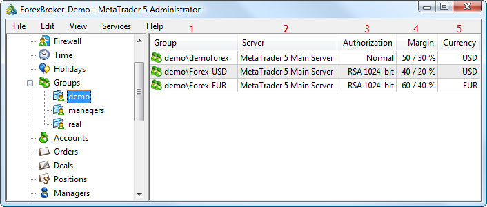

The following elements are shown above:

1\. [Group name](Groups/IMTConGroup/Group.md).

2\. [The server to which the group is linked](Groups/IMTConGroup/Server.md).

3\. [The type of authorization](Groups/IMTConGroup/AuthMode.md).

4\. The [Margin Call](Groups/IMTConGroup/MarginCall.md) and [Stop Out](Groups/IMTConGroup/MarginStopOut.md) levels.

5\. [The group deposit currency](Groups/IMTConGroup/Currency.md).

Below is a detailed description of the correspondence of methods and group settings in the MetaTrader 5 Administrator.

## IMTConGroup (#imtcongroup)

The [IMTConGroup](Groups/IMTConGroup.md) interface provides access to the main group settings. In MetaTrader 5 Administrator, group settings are divided into several tabs:

  * [Common (#common)](Groups.md#common)
  * [Company (#company)](Groups.md#company)
  * [News&Mail (#news-mail)](Groups.md#news-mail)
  * [Permissions (#permissions)](Groups.md#permissions)
  * [Margin (#margin)](Groups.md#margin)
  * [Symbols (#symbols)](Groups.md#symbols)
  * [Commissions (#commissions)](Groups.md#commissions)
  * [Reports (#reports)](Groups.md#reports)

### Common (#common)

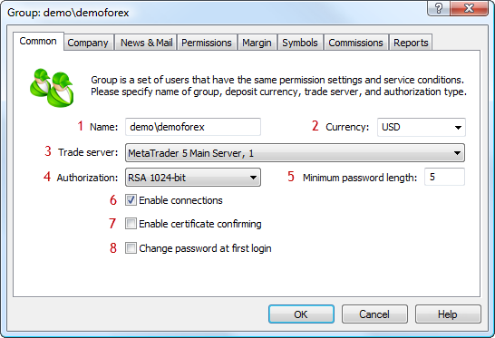

The following elements are shown above:

1\. [Group name](Groups/IMTConGroup/Group.md).

2\. [Deposit currency](Groups/IMTConGroup/Currency.md).

3\. [A trade server to which the group is linked](Groups/IMTConGroup/Server.md).

4\. [The type of authorization for the clients in the group](Groups/IMTConGroup/AuthMode.md).

5\. [Minimum length of account password](Groups/IMTConGroup/AuthPasswordMin.md).

6\. [Allow accounts from the group to connect to the server](Groups/IMTConGroup/PermissionsFlags.md).

7\. [Enable confirmation of certificates](Groups/IMTConGroup/PermissionsFlags.md).

8\. [Forced password change upon first connection](Groups/IMTConGroup/PermissionsFlags.md).

### Company (#company)

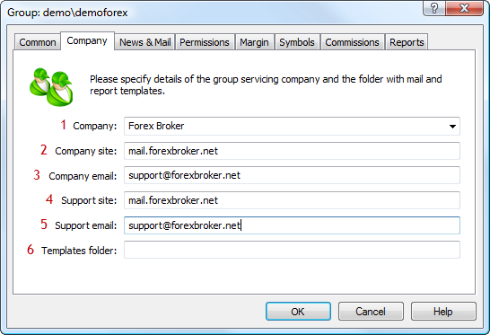

The following elements are shown above:

1\. [The name of the company that services the group](Groups/IMTConGroup/Company.md).

2\. [The address of the company's website](Groups/IMTConGroup/CompanyPage.md).

3\. [The email address of the company](Groups/IMTConGroup/CompanyEmail.md).

4\. [The address of the company's technical support website](Groups/IMTConGroup/CompanySupportPage.md).

5\. [The e-mail address for technical support of the company](Groups/IMTConGroup/CompanySupportEmail.md).

6\. [A folder of templates of the company](Groups/IMTConGroup/CompanyCatalog.md).

### News&Mail (#news-mail)

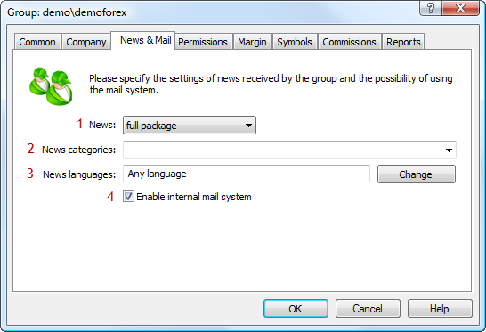

The following elements are shown above:

1\. [The mode of news sending to the clients from the group](Groups/IMTConGroup/NewsMode.md).

2\. [News categories available to the group](Groups/IMTConGroup/NewsCategory.md).

3\. [News languages available to the group](Groups/IMTConGroup/NewsLangAdd.md).

4\. [An option of enabling and disabling the internal mail system](Groups/IMTConGroup/MailMode.md).

### Permissions (#permissions)

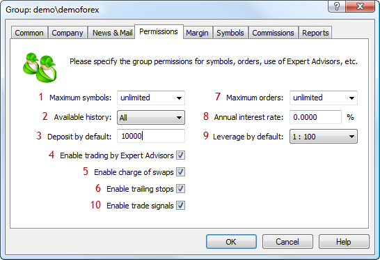

The following elements are shown above:

1\. [Maximum number of symbols available to the group](Groups/IMTConGroup/LimitSymbols.md).

2\. [Available trading history](Groups/IMTConGroup/LimitHistory.md).

3\. [A default deposit for demo accounts](Groups/IMTConGroup/DemoDeposit.md).

4\. [The option enables/disables trading using Expert Advisors](Groups/IMTConGroup/TradeFlags.md).

5\. [An option for enabling/disabling swap charging](Groups/IMTConGroup/TradeFlags.md).

6\. [The option enables/disables the use of trailing stop](Groups/IMTConGroup/TradeFlags.md).

7\. [The maximum number of placed orders at a time](Groups/IMTConGroup/LimitOrders.md).

8\. [The annual interest rate](Groups/IMTConGroup/TradeInterestrate.md).

9\. [Default leverage for demo accounts](Groups/IMTConGroup/DemoLeverage.md).

10\. [The option enables/disables the use of the Signals service](Groups/IMTConGroup/TradeFlags.md).

### Margin (#margin)

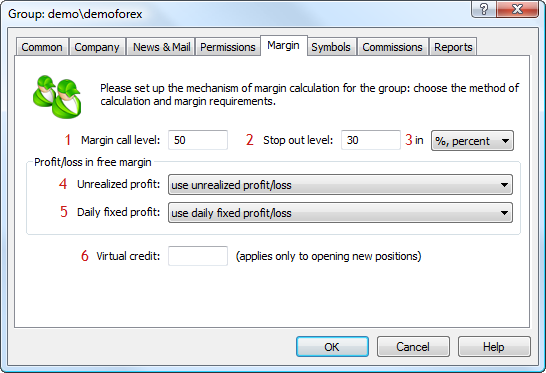

The following elements are shown above:

1\. [The Margin Call level](Groups/IMTConGroup/MarginCall.md).

2\. [The Stop Out level](Groups/IMTConGroup/MarginStopOut.md).

3\. [The mode of Margin Call and Stop Out check](Groups/IMTConGroup/MarginSOMode.md).

4\. [Including floating profit/loss into free margin calculation](Groups/IMTConGroup/MarginFreeMode.md).

5\. [Including daily recorded profit into free margin calculation](Groups/IMTConGroup/MarginFreeProfitMode.md).

6\. [The amount of virtual credit](Groups/IMTConGroup/TradeVirtualCredit.md).

### Symbols (#symbols)

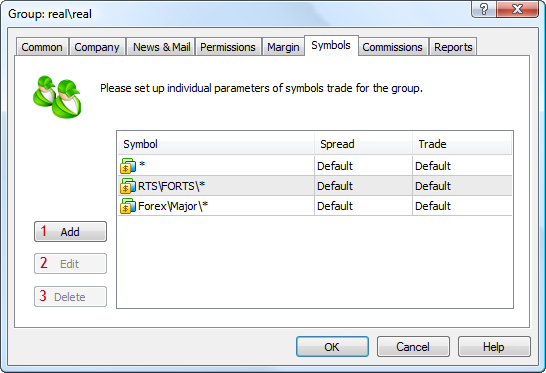

The following elements are shown above:

1\. [Add a symbol configuration](Groups/IMTConGroup/SymbolAdd.md).

2\. [Modify a symbol configuration](Groups/IMTConGroup/SymbolUpdate.md).

3\. [Delete a symbol configuration](Groups/IMTConGroup/SymboDelete.md).

### Commissions (#commissions)

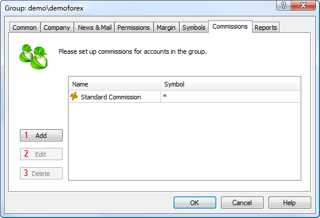

The following elements are shown above:

1\. [Add commission configuration](Groups/IMTConGroup/CommissionAdd.md).

2\. [Modify commission configuration](Groups/IMTConGroup/CommissionUpdate.md).

3\. [Delete commission configuration](Groups/IMTConGroup/CommissionDelete.md).

### Reports (#reports)

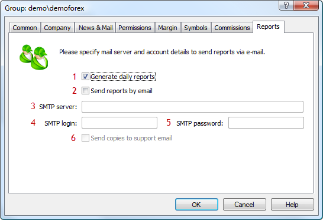

The following elements are shown above:

1\. [An option of enabling/disabling generation of daily reports](Groups/IMTConGroup/ReportsMode.md).

2\. [An option of enabling/disabling emailing of reports](Groups/IMTConGroup/ReportsFlags.md).

3\. [Address of SMTP server for sending reports](Groups/IMTConGroup/ReportsSMTP.md).

4\. [A login to authorize on the SMTP server](Groups/IMTConGroup/ReportsSMTPLogin.md).

5\. [A password to authorize on the SMTP server](Groups/IMTConGroup/ReportsSMTPPass.md).

6\. [An option of enabling/disabling sending copies of reports to the technical support mailbox](Groups/IMTConGroup/ReportsFlags.md).

## IMTConGroupSymbol (#imtcongroupsymbol)

The IMTConGroupSymbol interface provides access to individual symbol settings for a group. Dialogs of symbol settings for a group are similar to the dialogs of [common symbol settings (#imtconsymbol)](Symbols.md#imtconsymbol). Therefore, here only some of the group symbol settings from MetaTrader 5 Administrator:

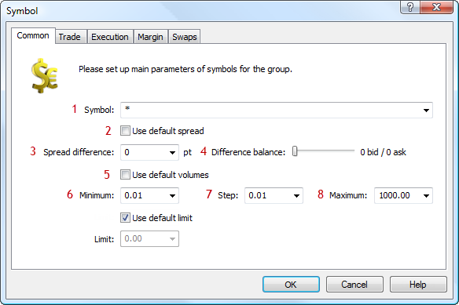

The following elements are shown above:

1\. [Symbols to which settings apply](Groups/IMTConGroupSymbol/Path.md).

2\. [The option of using default spread settings](Groups/IMTConGroupSymbol/SpreadDiffDefault.md).

3\. [Spread difference](Groups/IMTConGroupSymbol/SpreadDiff.md).

4\. [Spread balance difference](Groups/IMTConGroupSymbol/SpreadDiffBalance.md).

5\. [Option of using default volume settings](Groups/IMTConGroupSymbol/VolumeMinDefault.md).

6\. [Minimal volume](Groups/IMTConGroupSymbol/VolumeMin.md).

7\. [Volume change step](Groups/IMTConGroupSymbol/VolumeStep.md).

8\. [Maximal volume](Groups/IMTConGroupSymbol/VolumeMax.md).

## IMTConGroupSink (#imtgroupsink)

The [IMTConGroupSink](Groups/IMTConGroupSink.md) interface contains handlers of the events of group configuration changes.

## IMTConCommTier and IMTConCommission (#commission)

These interfaces provide access to group commission settings. The [IMTConCommission](Groups/IMTConCommission.md) interface provides access to the main commission settings, and [IMTConCommTier](Groups/IMTConCommTier.md) — to the settings of commission levels.

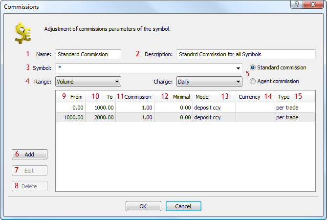

The following elements are shown above:

1\. [Commission name](Groups/IMTConCommission/Name.md).

2\. [Description of the commission](Groups/IMTConCommission/Description.md).

3\. [Symbols, for which the commission is charged](Groups/IMTConCommission/Path.md).

4\. [Type of ranges for commission levels](Groups/IMTConCommission/RangeMode.md).

5\. [Type of commission](Groups/IMTConCommission/Mode.md).

6\. [Adding a commission level](Groups/IMTConCommission/TierAdd.md).

7\. [Editing a commission level](Groups/IMTConCommission/TierUpdate.md).

8\. [Deleting a commission level](Groups/IMTConCommission/TierDelete.md).

9\. [Start of a commission level](Groups/IMTConCommTier/RangeFrom.md).

10\. [End of a commission level](Groups/IMTConCommTier/RangeTo.md).

11\. [Commission amount](Groups/IMTConCommTier/Value.md).

12\. [Maximum commission amount](Groups/IMTConCommTier/Minimal.md).

13\. [Method of commission charging](Groups/IMTConCommTier/Mode.md).

14\. [Commission calculation currency](Groups/IMTConCommTier/Currency.md).

15\. [Type of commission charging](Groups/IMTConCommTier/Type.md).
