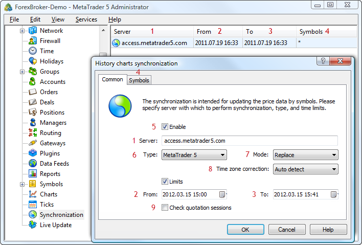

[🏠 Document Start](../README.md) / [Configuration Interfaces](README.md) / History Synchronization

[Previous](Managers/IMTConManagerSink/HookManagerDelete.md) | [Next](History-Synchronization/IMTConHistorySync.md)

# Configuration of History Synchronization

Using the functions and interfaces described in this section, you can manage configurations of price data synchronization with other MetaTrader 5 and MetaTrader 4 servers. They also allow to subscribe and unsubscribe from events associated with their change.

The following interfaces of group settings are available:

  * [IMTConHistorySync](History-Synchronization/IMTConHistorySync.md)  
An interface that provides access to all the main parameters of history data synchronization.
  * [IMTConHistorySyncSink](Managers/IMTConManagerSink.md)  
An interface for handling events of changes in configurations of history data synchronization.

The below figure shows different elements of configuration of historical data synchronization in the MetaTrader 5 Administrator, to help you understand the purpose of the interfaces:

The following elements are shown above:

1\. [Address of the server fro data synchronization](History-Synchronization/IMTConHistorySync/Server.md).

2\. [The beginning of the period for which data are synchronized](History-Synchronization/IMTConHistorySync/From.md).

3\. [The end of the period for which data are synchronized](History-Synchronization/IMTConHistorySync/To.md).

4\. [Symbols for which data is synchronized](History-Synchronization/IMTConHistorySync/SymbolAdd.md).

5\. [State of configuration](History-Synchronization/IMTConHistorySync/Mode.md).

6\. [Type of server with which data are synchronized](History-Synchronization/IMTConHistorySync/ServerType.md).

7\. [Data synchronization mode](History-Synchronization/IMTConHistorySync/ModeSync.md).

8\. [Time zone correction](History-Synchronization/IMTConHistorySync/TimeCorrection.md).

9\. [Taking into account quoting sessions during synchronization](History-Synchronization/IMTConHistorySync/Flags.md).
