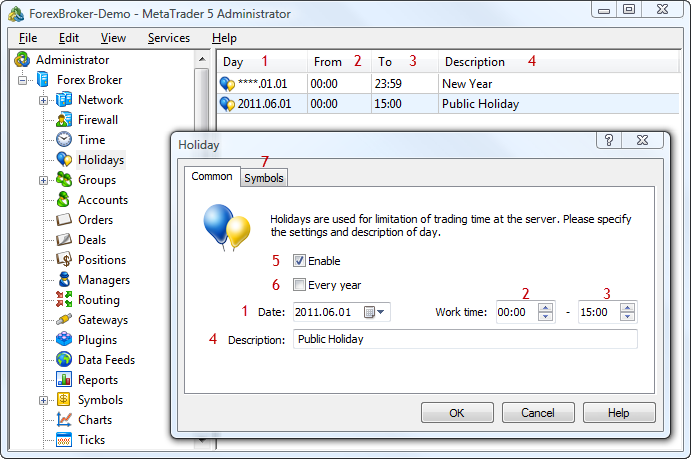

[🏠 Document Start](../README.md) / [Configuration Interfaces](README.md) / Holidays

[Previous](Time/IMTConTimeSink/IMTConSink-OnSync.md) | [Next](Holidays/IMTConHoliday.md)

# Holiday Configuration

Using the functions and interfaces described in this section, you can add holidays to the work timetable of the server, both for groups of symbols and for each symbol individually. On holidays, clients can connect, view charts and history of trades, but cannot trade.

The following interfaces of holiday settings are available:

  * [IMTConHoliday](Holidays/IMTConHoliday.md)  
An interface for configuring holidays.
  * [IMTConHolidaySink](Holidays/IMTConHolidaySink.md)  
An interface for handling events of changes of holiday settings.

The below figure shows different elements of holiday configurations in the MetaTrader 5 Administrator, to help you understand the purpose of the interfaces:

The following elements are shown above:

1\. [The date of a holiday](Holidays/IMTConHoliday/Year.md).

2\. [Beginning time](Holidays/IMTConHoliday/WorkFrom.md).

3\. [End time](Holidays/IMTConHoliday/WorkTo.md).

4\. [Description of a holiday](Holidays/IMTConHoliday/Description.md).

5\. [State of a holiday](Holidays/IMTConHoliday/Mode.md).

6\. An indication that the holiday is [annual](Holidays/IMTConHoliday/Year.md).

7\. Configuration of [symbols](Holidays/IMTConHoliday/SymbolAdd.md) to which the holiday applies.
