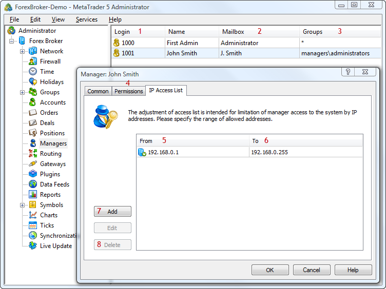

[🏠 Document Start](../README.md) / [Configuration Interfaces](README.md) / Managers

[Previous](Floating-Margin/IMTConLeverageSink/HookLeverageDelete.md) | [Next](Managers/IMTConManager.md)

# Configuration of Managers

Using the functions and interfaces described in this section, you can manage configurations of managers in the platform, as well as subscribe and unsubscribe from events associated with their change.

The following interfaces of manager settings are available:

  * [IMTConManager](Managers/IMTConManager.md) — basic manager settings.
  * [IMTConManagerAccess](Managers/IMTConManagerAccess.md) — settings of IP address ranges from which the manager is allowed to connect to the platform.
  * [IMTConManagerReport](Managers/IMTConManagerReport.md) — manager access rights to server reports.
  * [IMTConManagerSink](Managers/IMTConManagerSink.md) — events associated with changes in manager settings.

The below figure shows different elements of manager configuration in the MetaTrader 5 Administrator, to help you understand the purpose of the interfaces:

The following elements are shown above:

1\. [Manager's login](Managers/IMTConManager/Login.md).

2\. [Manager's mailbox name](Managers/IMTConManager/Mailbox.md).

3\. [Groups processed by a manager](Managers/IMTConManager/GroupAdd.md).

4\. [Manager's rights](Managers/IMTConManager/Right.md).

5\. [The beginning of the range of addresses](Managers/IMTConManagerAccess/From.md), from which a manager is allowed to connect.

6\. [The end of the range of addresses](Managers/IMTConManagerAccess/To.md), from which a manager is allowed to connect.

7\. [Adding a range of allowed addresses](Managers/IMTConManager/AccessAdd.md).

8\. [Deleting a range of allowed addresses](Managers/IMTConManager/AccessDelete.md).
