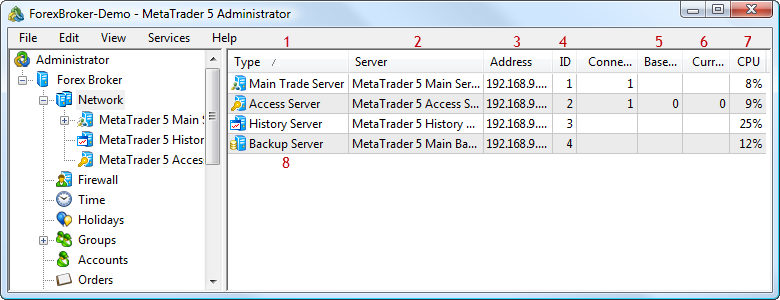
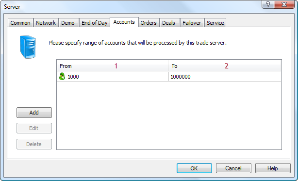
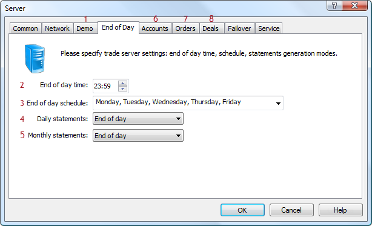
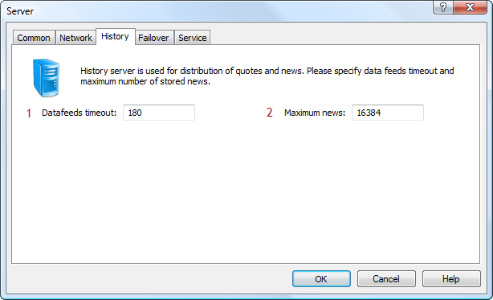
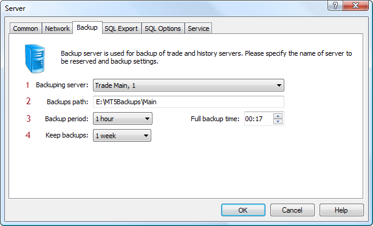
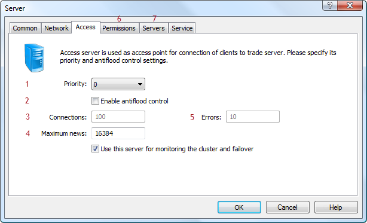
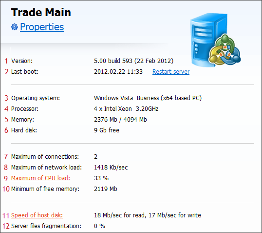

[🏠 Document Start](../README.md) / [Configuration Interfaces](README.md) / Network

[Previous](Common/IMTConCommonSink/IMTConSink-OnSync.md) | [Next](Network/IMTConServer.md)

# Network Configuration (#network-configuration)

Network configuration means the management of settings of the the server components of the platform: main and ordinary trade servers, history and access servers, backup servers.

The following interfaces of the configuration of platform components are available:

  * [IMTConServer (#imtconserver)](Network.md#imtconserver)
  * [IMTConServerTrade (#imtconservertrade)](Network.md#imtconservertrade)
  * [IMTConServerHistory (#imtconserverhistory)](Network.md#imtconserverhistory)
  * [IMTConServerBackup (#imtconserverbackup)](Network.md#imtconserverbackup)
  * [IMTConBackupFolder](Network/IMTConBackupFolder.md)
  * [IMTConServerAccess (#imtconserveraccess)](Network.md#imtconserveraccess)
  * [IMTConServerAntiDDoS](Network/IMTConServerAntiDDoS.md)
  * [IMTConClusterState](Network/IMTConClusterState.md)
  * [IMTConServerRange (#imtconserverrange)](Network.md#imtconserverrange)
  * [IMTConServerAddressRange](Network/IMTConServerAddressRange.md)
  * [IMTConServerSink (#imtconsserversink)](Network.md#imtconsserversink)

The below figure shows different elements of configuration of the platform components in the MetaTrader 5 Administrator, to help you understand the purpose of the interfaces:

The following elements are shown above:

1\. [Server Type](Network/IMTConServer/Type.md).

2\. [Server Name](Network/IMTConServer/Name.md).

3\. [Server Address](Network/IMTConServer/Address.md).

4\. [Server ID](Network/IMTConServer/Id.md).

5\. [Base priority of the Access Server](Network/IMTConServerAccess/Priority.md).

6\. [The current priority of the Access Server](Network/IMTConServerAccess/PriorityCurrent.md).

7\. [The current level of CPU](Network/IMTConServer/CPUTotal.md).

8\. [The list of all server configurations](Network/IMTConServer.md).

The detailed examples of configurations of the platform components are shown below.

## IMTConServerRange (#imtconserverrange)

The [IMTConServerRange](Network/IMTConServerRange.md) interface is used to set the ranges of accounts, orders and deals on trade servers.

The figure shows a tab of configuration of accounts range of a trade server in MetaTrader 5 Administrator:

1\. [Beginning of the range](Network/IMTConServerRange/From.md).

2\. [End of the range](Network/IMTConServerRange/To.md).

## IMTConServerTrade (#imtconservertrade)

The [IMTConServerTrade](Network/IMTConServerTrade.md) interface contains methods for managing settings that are specific to Trade Servers.

The figure shows the following elements of trade server setup in MetaTrader 5 Administrator:

1\. [Mode of operation with demo accounts](Network/IMTConServerTrade/DemoMode.md).

2\. [Time of the day end](Network/IMTConServerTrade/OvernightTime.md).

3\. [Days of operations associated with the end of the trading day](Network/IMTConServerTrade/OvernightDays.md).

4\. [Daily report generation mode](Network/IMTConServerTrade/OvernightMode.md).

5\. [Monthly report generation mode](Network/IMTConServerTrade/OvermonthMode.md).

6\. [Setting the range of accounts](Network/IMTConServerTrade/LoginsRangeAdd.md).

7\. [Setting the range of orders](Network/IMTConServerTrade/OrdersRangeAdd.md).

8\. [Setting the range of deals](Network/IMTConServerTrade/DealsRangeAdd.md).

## IMTConServerHistory (#imtconserverhistory)

The [IMTConServerHistory](Network/IMTConServerHistory.md) interface contains methods for managing settings that are specific to History Servers.

The figure shows the following elements of History Server setup in MetaTrader 5 Administrator:

1\. [Data feed timeouts](Network/IMTConServerHistory/DatafeedsTimeout.md).

2\. [Maximum number of news](Network/IMTConServerHistory/NewsMax.md).

## IMTConServerBackup (#imtconserverbackup)

The [IMTConServerBackup](Network/IMTConServerBackup.md) interface contains methods for managing settings that are specific to Backup Servers.

The figure shows the following elements of Backup Server setup in MetaTrader 5 Administrator:

1\. [A server to back up](Network/IMTConServerBackup/MasterServer.md).

2\. [The backup path](Network/IMTConServerBackup/BackupPath.md).

3\. [The frequency of backup](Network/IMTConServerBackup/BackupPeriod.md).

4\. [A period to keep backups](Network/IMTConServerBackup/BackupTTL.md).

5\. [Time to create full backups](Network/IMTConServerBackup/BackupFullTime.md).

## IMTConServerAccess (#imtconserveraccess)

The [IMTConServerAccess](Network/IMTConServerAccess.md) interface contains methods for managing settings that are specific to Access Servers.

The figure shows the following elements of Access Server setup in MetaTrader 5 Administrator:

1\. [Server priority](Network/IMTConServerAccess/Priority.md).

2\. [Enable/disable antiflood control](Network/IMTConServerAccess/AntifloodEnabled.md).

3\. [Number of connections](Network/IMTConServerAccess/AntifloodConnects.md).

4\. [Maximum number of news](Network/IMTConServerAccess/NewsMax.md).

5\. [Number of incorrect connections](Network/IMTConServerAccess/AntifloodErrors.md).

6\. [Setup of allowed types of connections](Network/IMTConServerAccess/AccessFlags.md).

7\. [Setup of serviced Trade Servers](Network/IMTConServerAccess/ServersAdd.md).

## IMTConServer (#imtconserver)

The [IMTConServer](Network/IMTConServer.md) interface contains methods for managing settings that are common to all types of servers.

The figure shows the following server parameters in MetaTrader 5 Administrator:

1\. [Version](Network/IMTConServer/Version.md), [build](Network/IMTConServer/Build.md) and [build date](Network/IMTConServer/BuildDate.md) of the server.

2\. [Time of the last server boot](Network/IMTConServer/LastBootTime.md).

3\. [Version of the operating system](Network/IMTConServer/OS.md).

4\. [Processor type](Network/IMTConServer/CPU.md).

5\. [The amount of RAM](Network/IMTConServer/MemoryFree.md).

6\. [The amount of disk space](Network/IMTConServer/HDDFree.md).

7\. [Maximum number of connections](Network/IMTConServer/ConnectsMax.md).

8\. [Maximum load of the network](Network/IMTConServer/Max.md).

9\. [Maximum CPU load](Network/IMTConServer/CPUUsageMax.md).

10\. [Minimum amount of free memory](Network/IMTConServer/MemoryFreeMin.md).

11\. The spead of data [reading](Network/IMTConServer/HDDSpeedRead.md) and [writing](Network/IMTConServer/HDDSpeedWrite.md) to a hard disk.

12\. The level of [fragmentation](Network/IMTConServer/HDDFragments.md) of server files.

## IMTConsServerSink (#imtconsserversink)

The [IMTConServerSink](Network/IMTConServerSink.md) interface contains the handlers of events of changes in the configurations of the platform components.
