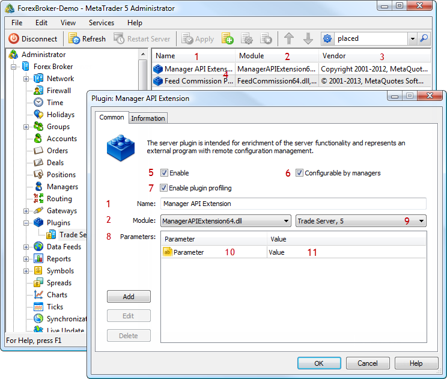

[🏠 Document Start](../README.md) / [Configuration Interfaces](README.md) / Plugins

[Previous](Network/IMTConServerSink/OnConServerSync.md) | [Next](Plugins/IMTConPlugin.md)

# Configuration of Plugins

The MetaTrader 5 API allows managing configurations of plugins in the platform and process events of configuration changes.

The following plugin interfaces are available:

  * [IMTConPlugin](Plugins/IMTConPlugin.md)  
An interface for configuring plugin parameters.
  * [IMTConPluginModule](Plugins/IMTConPluginModule.md)  
An interface for accessing parameters of plugin modules.
  * [IMTConPluginSink](Plugins/IMTConPluginSink.md)  
An interface for handling events associated with the configuration of plugins.

The below figure shows different elements of of plugin configuration in the MetaTrader 5 Administrator, to help you understand the purpose of the interfaces:

The following elements are shown above:

1\. [The name of plugin configuration](Plugins/IMTConPlugin/Name.md).

2\. [The name of the plugin module](Plugins/IMTConPlugin/Module.md).

3\. [Plugin provider](Plugins/IMTConPluginModule/Vendor.md).

4\. [The list of plugin configurations.](Plugins/IMTConPlugin.md)

5\. [The plugin operation mode](Plugins/IMTConPlugin/Mode.md).

6\. [Configuring via the manager terminal](Plugins/IMTConPlugin/Flags.md).

7\. [Enabling plugin profiling](Plugins/IMTConPlugin/Flags.md).

8\. [A block for configuring plugin parameters](Plugins/IMTConPlugin/ParameterAdd.md).

9\. [A server on which the plugin is running](Plugins/IMTConPlugin/Server.md).

10\. [The name of a plugin parameter](Plugins/IMTConPlugin/ParameterGet.md)

11\. [The value of a plugin parameter](Plugins/IMTConPlugin/ParameterGet.md)
