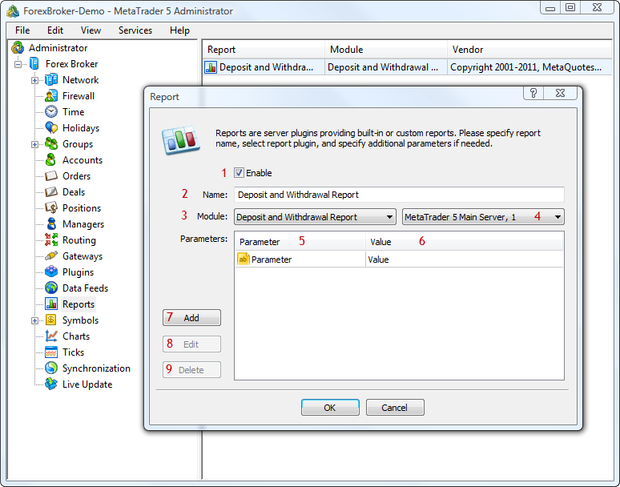

[🏠 Document Start](../README.md) / [Configuration Interfaces](README.md) / Reports

[Previous](Routing/IMTConRouteSink/OnRouteSync.md) | [Next](Reports/IMTConReport.md)

# Report Configuration

The MetaTrader 5 platform includes functions for generating various reports on the trading activity on servers. A number of reports is included in the standard package of the platform, but this list can be extended by developing custom reports using the MetaTrader 5 Report API.

Such reports are separate modules implemented as DLL files. A report module is placed in a trade server, in the special /reports folder. Further the report can be configured from the MetaTrader 5 Administrator.

> Please note that the report modules are configured separately for each trade server and generate reports specifically for that server.

The following report interfaces are available:

  * [IMTConReport](Reports/IMTConReport.md)  
An interface for configuring parameters of reports.
  * [IMTConReportModule](Reports/IMTConReportModule.md)  
An interface for accessing parameters of report modules.
  * [IMTConReportSink](Reports/IMTConReportSink.md)  
An interface for handling events associated with the configuration of reports.

The below figure shows different elements of report configuration in the MetaTrader 5 Administrator, to help you understand the purpose of the interfaces:

The following elements are shown above:

1\. [The state of a report configuration](Reports/IMTConReport/Mode.md).

2\. [The name of a report configuration](Reports/IMTConReport/Name.md).

3\. [The name of a report module](Reports/IMTConReport/Module.md).

4\. [A trade server, for which a report is configured](Reports/IMTConReport/Server.md).

5\. [The name of an additional external parameter](Additional-Parameters/IMTConParam/Name.md).

6\. [The value of an additional external parameter](Additional-Parameters/IMTConParam/Value.md).

7\. [Adding a parameter](Reports/IMTConReport/ParameterAdd.md).

8\. [Changing a parameter](Reports/IMTConReport/ParameterUpdate.md).

9\. [Deleting a parameter](Reports/IMTConReport/ParameterDelete.md).
