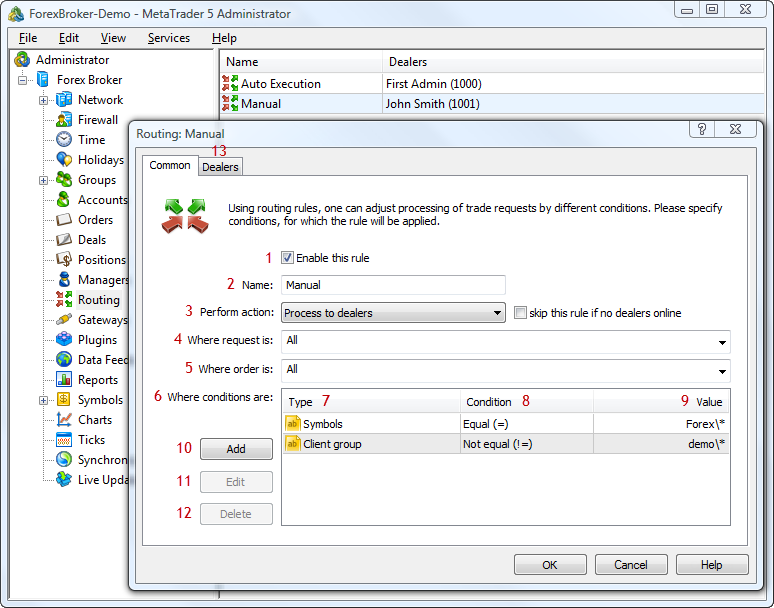

[🏠 Document Start](../README.md) / [Configuration Interfaces](README.md) / Routing

[Previous](Gateways/IMTConGatewaySink/OnGatewaySync.md) | [Next](Routing/IMTConRoute.md)

# Routing Configuration

The MetaTrader 5 platform allows creating a custom set of rules of routing clients' requests received by trade servers. In each routing rule, you can set up the parameters of trade requests, as well as actions that shall apply to them.

The following routing interfaces are available:

  * [IMTConRoute](Routing/IMTConRoute.md)  
An interface for accessing all the main rule settings.
  * [IMTConCondition](Routing/IMTConCondition.md)  
An interface for accessing additional settings or routing rules.
  * [IMTConRouteDealer](Routing/IMTConRouteDealer.md)  
An interface for accessing parameters of request passing to dealers.
  * [IMTConRouteSink](Routing/IMTConRouteSink.md)  
An interface that contains handlers of events associated with routing configuration.

The below figure shows different elements of configuration of the routing rules in the MetaTrader 5 Administrator, to help you understand the purpose of the interfaces:

The following elements are shown above:

1\. [State of a routing rule](Routing/IMTConRoute/Mode.md).

2\. [Rule name](Routing/IMTConRoute/Name.md).

3\. [Action to be taken in connection with the requests](Routing/IMTConRoute/Action.md).

4\. [Type of requests processed according to this rule](Routing/IMTConRoute/Request.md).

5\. [Type of orders processed according to this rule](Routing/IMTConRoute/Type.md).

6\. [Additional conditions for defining requests](Routing/IMTConCondition.md).

7\. [Type of additional condition](Routing/IMTConCondition/Condition.md).

8\. [Method for comparing a condition with the value](Routing/IMTConCondition/Rule.md).

9\. [The value of an additional condition](Routing/IMTConCondition/ValueType.md).

10\. [Add an additional condition](Routing/IMTConRoute/ConditionAdd.md).

11\. [Change an additional condition](Routing/IMTConRoute/ConditionUpdate.md).

12\. [Delete an additional condition](Routing/IMTConRoute/ConditionDelete.md).

13\. [A tab for configuring dealers](Routing/IMTConRouteDealer.md) to process request under a specific rule.
