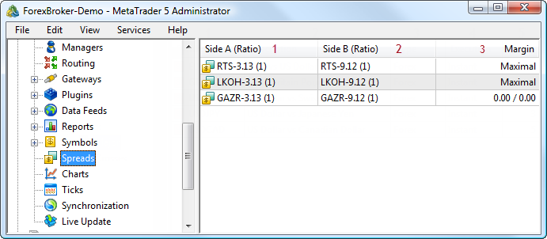
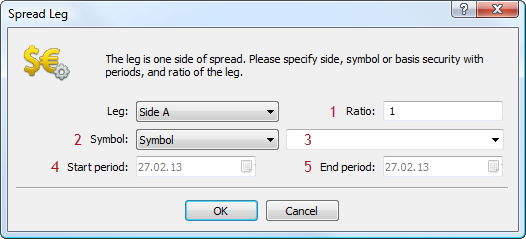
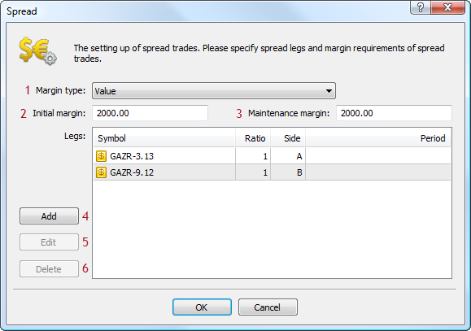

[🏠 Document Start](../README.md) / [Configuration Interfaces](README.md) / Spreads

[Previous](Symbols/IMTConSymbolSink/HookSymbolDelete.md) | [Next](Spreads/IMTConSpread.md)

# Configuration of Spreads (#configuration-of-spreads)

MetaTrader 5 API allows users to configure the charging of the margin in case client's trading positions are in a spread to one another. The spread is defined as the presence of the oppositely directed positions at related symbols. Reduced margin requirements provide more trading opportunities for traders.

The following symbol interfaces are available:

  * [IMTConSpreadLeg (#imtconspreadleg)](Spreads.md#imtconspreadleg)
  * [IMTConSpread (#imtconspread)](Spreads.md#imtconspread)
  * [IMTConSpreadSink (#imtconspreadsink)](Spreads.md#imtconspreadsink)

For better understanding the purpose of the interfaces, the figure below shows different elements of spread configuration in MetaTrader 5 Administrator:

The following elements are shown above:

1\. [Spread A leg](Spreads/IMTConSpread/ALegAdd.md)

2\. [Spread B leg](Spreads/IMTConSpread/BLegAdd.md)

3\. [Charged margin](Spreads/IMTConSpread/MarginType.md)

Below is a detailed description of the correspondence of methods and spread settings in the MetaTrader 5 Administrator.

## IMTConSpreadLeg (#imtconspreadleg)

[IMTConSpreadLeg](Spreads/IMTConSpreadLeg.md) interface provides access to configuration of spread legs.

The figure shows the sessions configuration dialog in MetaTrader 5 Administrator:

1\. [Weight](Spreads/IMTConSpreadLeg/Ratio.md)

2\. [Leg specification mode](Spreads/IMTConSpreadLeg/Mode.md)

3\. [Symbol or basic asset](Spreads/IMTConSpreadLeg/Symbol.md)

4\. [Beginning of the period (for a basic asset)](Spreads/IMTConSpreadLeg/TimeFrom.md)

5\. [End of the period (for a basic asset)](Spreads/IMTConSpreadLeg/TimeTo.md)

## IMTConSpread (#imtconspread)

[IMTConSpread](Spreads/IMTConSpread.md) interface provides access to configuration of spread settings.

The figure shows the spread configuration dialog in MetaTrader 5 Administrator:

1\. [Margin charging type](Spreads/IMTConSpread/MarginType.md)

2\. [Initial margin](Spreads/IMTConSpread/MarginInitial.md)

3\. [Maintenance margin](Spreads/IMTConSpread/MarginMaintenance.md)

4\. [Adding a spread leg](Spreads/IMTConSpread/ALegAdd.md)

5\. [Changing a spread leg](Spreads/IMTConSpread/ALegUpdate.md)

6\. [Deleting a spread leg](Spreads/IMTConSpread/ALegDelete.md)

## IMTConSpreadSink (#imtconspreadsink)

[IMTConSpreadSink](Spreads/IMTConSpreadSink.md) interface contains the handlers of the events of spread configuration changes.
