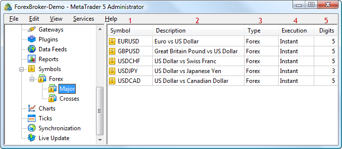
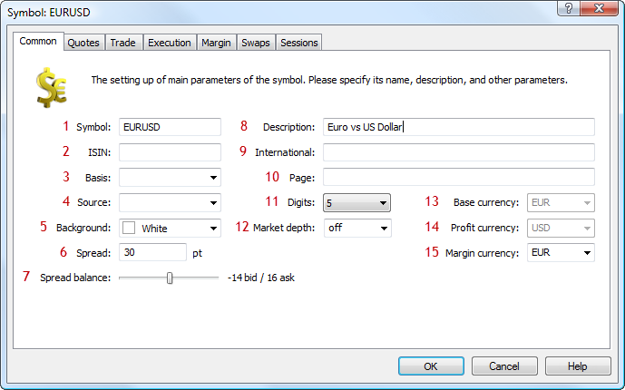
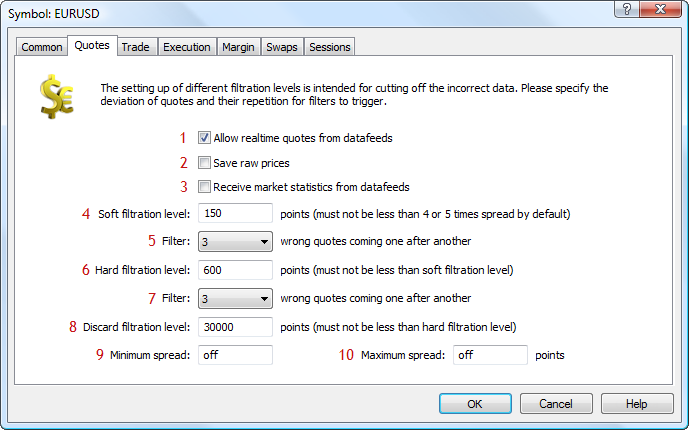
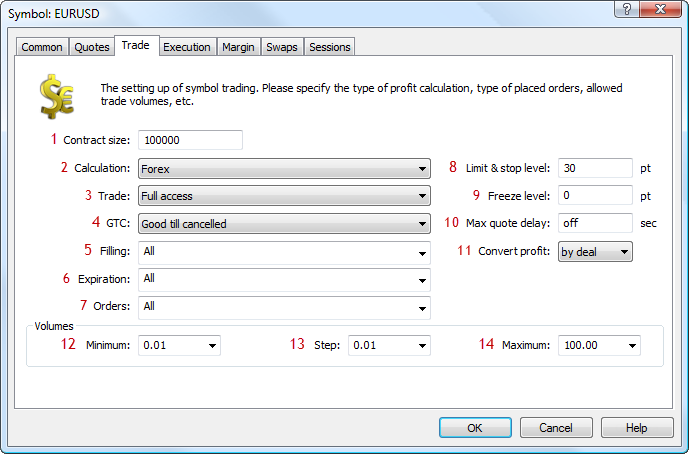
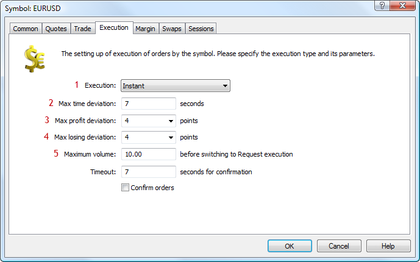
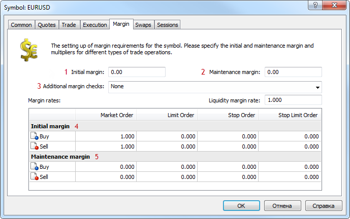
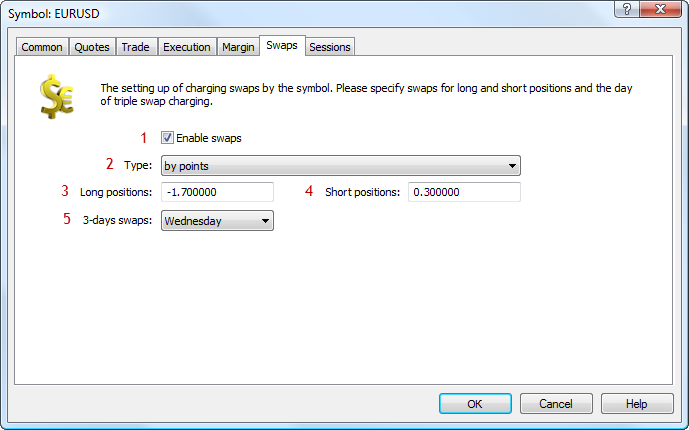
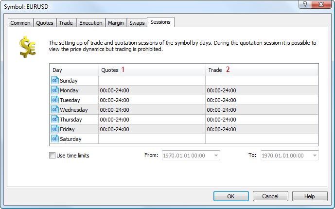
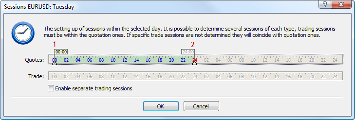

[🏠 Document Start](../README.md) / [Configuration Interfaces](README.md) / Symbols

[Previous](Firewall/IMTConFirewallSink/IMTConSink-OnSync.md) | [Next](Symbols/IMTConSymbol.md)

# Configuration of Symbols (#configuration-of-symbols)

The MetaTrader 5 API allows to manage Symbols in the trading platform — add new groups, modify and delete existing ones.

The following symbol interfaces are available:

  * [IMTConSymbol (#imtconsymbol)](Symbols.md#imtconsymbol)
  * [IMTConSymbolSession (#imtconsymbolsession)](Symbols.md#imtconsymbolsession)
  * [IMTConSymbolArray](Symbols/IMTConSymbolArray.md)
  * [IMTConSymbolSink (#imtsymbolsink)](Symbols.md#imtsymbolsink)

The below figure shows different elements of symbol configuration in the MetaTrader 5 Administrator, to help you understand the purpose of the interfaces:

The following elements are shown above:

1\. [Symbol name](Symbols/IMTConSymbol/Symbol.md).

2\. [Symbol description](Symbols/IMTConSymbol/Description.md).

3\. [Symbol type](Symbols/IMTConSymbol/CalcMode.md) (type of profit and margin calculation).

4\. [Symbol execution type](Symbols/IMTConSymbol/ExecMode.md).

5\. [Number of decimal places in the symbol price](Symbols/IMTConSymbol/Digits.md).

Below is a detailed description of the correspondence of methods and symbol settings in the MetaTrader 5 Administrator.

## IMTConSymbol (#imtconsymbol)

The [IMTConSymbol](Symbols/IMTConSymbol.md) interface provides access to configuration of all the symbol parameters. In MetaTrader 5 Administrator, symbol settings are divided into several tabs:

  * [Common (#common)](Symbols.md#common)
  * [Quotes (#quotes)](Symbols.md#quotes)
  * [Trade (#trade)](Symbols.md#trade)
  * [Execution (#execution)](Symbols.md#execution)
  * [Margin (#margin)](Symbols.md#margin)
  * [Swaps (#swaps)](Symbols.md#swaps)
  * [Sessions (#sessions)](Symbols.md#sessions)

### Common (#common)

The following elements are shown above:

1\. [Symbol name](Symbols/IMTConSymbol/Symbol.md).

2\. International Securities Identification Number ([ISIN](Symbols/IMTConSymbol/ISIN.md)).

3\. [Underlying asset](Symbols/IMTConSymbol/Basis.md).

4\. [The source of quotes for the symbol](Symbols/IMTConSymbol/Source.md).

5\. [The background color of the symbol](Symbols/IMTConSymbol/ColorBackground.md).

6\. [The amount of spread](Symbols/IMTConSymbol/Spread.md).

7\. [Spread balance](Symbols/IMTConSymbol/SpreadBalance.md).

8\. [Symbol description](Symbols/IMTConSymbol/Description.md).

9\. [International Securities Identification Number](Symbols/IMTConSymbol/International.md).

10\. [The address of the symbol web page](Symbols/IMTConSymbol/Page.md).

11\. [Number of decimal places in the symbol price](Symbols/IMTConSymbol/Digits.md).

12\. [The range of the Depth of Market](Symbols/IMTConSymbol/TickBookDepth.md).

13\. [Base currency](Symbols/IMTConSymbol/CurrencyBase.md).

14\. [Profit currency](Symbols/IMTConSymbol/CurrencyProfit.md).

15\. [Margin currency](Symbols/IMTConSymbol/CurrencyMargin.md).

### Quotes (#quotes)

The following elements are shown above:

1\. [Allow real time quotes from data feeds](Symbols/IMTConSymbol/TickFlags.md).

2\. [Keep original prices](Symbols/IMTConSymbol/TickFlags.md).

3\. [Receive market statistics from data feeds](Symbols/IMTConSymbol/TickFlags.md).

4\. [Soft filtration level](Symbols/IMTConSymbol/FilterSoft.md).

5\. [The number of quotes to set a new level](Symbols/IMTConSymbol/FilterSoftTicks.md).

6\. [Hard filtration level](Symbols/IMTConSymbol/FilterHard.md).

7\. [The number of quotes to set a new level](Symbols/IMTConSymbol/FilterHardTicks.md).

8\. [Discard filtration level](Symbols/IMTConSymbol/FilterDiscard.md).

9\. [Minimum spread](Symbols/IMTConSymbol/FilterSpreadMin.md).

10\. [Maximum spread](Symbols/IMTConSymbol/FilterSpreadMax.md).

### Trade (#trade)

The following elements are shown above:

1\. [Contract size](Symbols/IMTConSymbol/ContractSize.md).

2\. [Method of profit and margin calculation](Symbols/IMTConSymbol/CalcMode.md).

3\. [Trade settings](Symbols/IMTConSymbol/TradeMode.md).

4\. [Mode of keeping orders at a trade day change](Symbols/IMTConSymbol/GTCMode.md).

5\. [Filling types](Symbols/IMTConSymbol/FillFlags.md).

6\. [Expiration types](Symbols/IMTConSymbol/ExpirFlags.md).

7\. [Allowed types of order](Symbols/IMTConSymbol/OrderFlags.md).

8\. [Stop and Limit levels](Symbols/IMTConSymbol/StopsLevel.md).

9\. [Freeze level](Symbols/IMTConSymbol/FreezeLevel.md).

10\. [Maximum delay of quotes](Symbols/IMTConSymbol/QuotesTimeout.md).

11\. [Mode of profit conversion for Forex symbols (#entradeflags)](Symbols/IMTConSymbol/Enumerations.md#entradeflags).

12\. [Minimal volume](Symbols/IMTConSymbol/VolumeMin.md).

13\. [Volume change step](Symbols/IMTConSymbol/VolumeStep.md).

14\. [Maximal volume](Symbols/IMTConSymbol/VolumeMax.md).

### Execution (#execution)

The following elements are shown above:

1\. [Execution type](Symbols/IMTConSymbol/ExecMode.md).

2\. [Maximum time deviation](Symbols/IMTConSymbol/IETimeout.md).

3\. [Maximum price deviation in the profitable direction](Symbols/IMTConSymbol/IESlipProfit.md).

4\. [Maximum price deviation in the losing direction](Symbols/IMTConSymbol/IESlipLosing.md).

5\. [Maximal volume](Symbols/IMTConSymbol/IEVolumeMax.md).

### Margin (#margin)

The following elements are shown above:

1\. [The size of the initial margin](Symbols/IMTConSymbol/MarginInitial.md).

2\. [The size of the maintenance margin](Symbols/IMTConSymbol/MarginMaintenance.md).

3\. [The mode of checking margin](Symbols/IMTConSymbol/MarginFlags.md).

4\. [The initial margin rate](Symbols/IMTConSymbol/MarginRateInitial.md).

5\. [The maintenance margin rate](Symbols/IMTConSymbol/MarginRateMaintenance.md).

### Swaps (#swaps)

The following elements are shown above:

1\. [An option for enabling/disabling swap charging](Symbols/IMTConSymbol/SwapMode.md).

2\. [Type of swap charging](Symbols/IMTConSymbol/SwapMode.md).

3\. [The swap size for long positions](Symbols/IMTConSymbol/SwapLong.md).

4\. [The swap size for short positions](Symbols/IMTConSymbol/SwapShort.md).

5\. [The day to charge triple swap](Symbols/IMTConSymbol/Swap3Day.md).

### Sessions (#sessions)

The following elements are shown above:

1\. [Quoting sessions](Symbols/IMTConSymbol/SessionQuoteAdd.md).

2\. [Trading sessions](Symbols/IMTConSymbol/SessionTradeAdd.md).

3\. [The start date of a symbol's validity period](Symbols/IMTConSymbol/TimeStart.md).

4\. [The end date of a symbol's validity period](Symbols/IMTConSymbol/TimeExpiration.md).

## IMTConSymbolSession (#imtconsymbolsession)

The [IMTConSymbolSession](Symbols/IMTConSymbolSession.md) interface provides access to the parameters of trading and quoting sessions of a symbol.

The figure shows the sessions configuration dialog in MetaTrader 5 Administrator:

1\. [Session beginning](Symbols/IMTConSymbolSession/Open.md).

2\. [Session end](Symbols/IMTConSymbolSession/Close.md).

## IMTConSymbolSink (#imtsymbolsink)

The [IMTConSymbolSink](Symbols/IMTConSymbolSink.md) interface contains the handlers of he events of symbol configuration changes.
