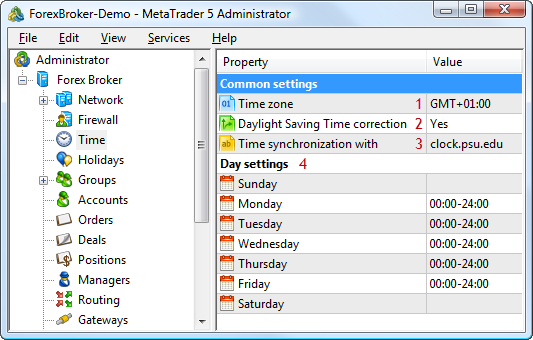

[🏠 Document Start](../README.md) / [Configuration Interfaces](README.md) / Time

[Previous](Data-Feeds/IMTConFeederSink/OnFeederSync.md) | [Next](Time/IMTCon.md)

# Time Configuration

The MetaTrader 5 API allows to manage global time settings of a trading platform: adjust working time, retrieve and change the time zone and the address of the server for synchronizing time.

The following time configuration interfaces are available:

  * [IMTConTime](Time/IMTCon.md)  
An interface for getting and setting the time parameters of a platform.
  * [IMTConTimeSink](Time/IMTConSink.md)  
An interface for handling events associated with change of time settings.

The below figure shows different elements of time configuration in the MetaTrader 5 Administrator, to help you understand the purpose of the interfaces:

The following elements are shown above:

1\. [The time zone of a platform](Time/IMTConTime/IMTCon-Zone.md).

2\. [The daylight saving time option](Time/IMTConTime/IMTCon-Daylight.md).

3\. [The address of a server for synchronizing time](Time/IMTConTime/IMTCon-Server.md).

4\. [The platform operation schedule](Time/IMTConTime/IMTCon-TableGet.md).
