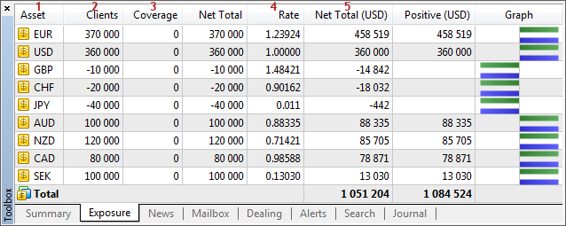

[🏠 Document Start](../../README.md) / [Database Interfaces](../README.md) / [Trade](../Trade.md) / Assets

[Previous](Summary-Positions/IMTSummarySink/OnSummaryUpdate.md) | [Next](Assets/IMTExposure.md)

# Assets

The MetaTrader 5 API allows receiving information about clients' exposure and company's hedged assets.

An important feature of working with assets is that they are bound to a certain trade server. Therefore, the application can only receive information about the exposure of client and coverage* account groups on the server to which this application is connected.

> Hedging positions apply to all accounts in coverage* groups.

The following exposure interfaces are available:

  * [IMTExposure](Assets/IMTExposure.md)  
An interface describing the record of one asset.
  * [IMTExposureArray](Assets/IMTExposureArray.md)  
An interface for working with the arrays of asset records.
  * [IMTExposureSink](Assets/IMTExposureSink.md)  
An interface for handling events associated with exposure modification.

To help you understand the purpose of interfaces intended for working with exposure, the below figure shows their compliance with the elements in MetaTrader 5 Manager:

The following elements are shown above:

1\. [Asset name](Assets/IMTExposure/Symbol.md).

2\. [The volume of client assets](Assets/IMTExposure/VolumeClients.md).

3\. [The volume of coverage assets](Assets/IMTExposure/VolumeCoverage.md).

4\. [Conversion rate](Assets/IMTExposure/PriceRate.md) of as asset to a selected currency.

5\. [Net total](Assets/IMTExposure/VolumeNet.md) of assets in the selected currency.
