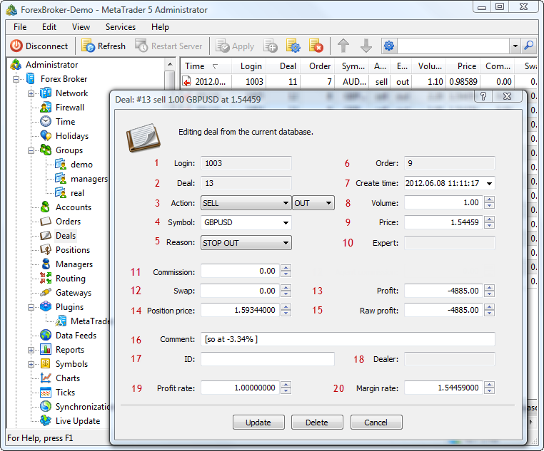

[🏠 Document Start](../../README.md) / [Database Interfaces](../README.md) / [Trade](../Trade.md) / Deals

[Previous](Orders/IMTHistorySink/OnHistorySync.md) | [Next](Deals/IMTDeal.md)

# Deals

The MetaTrader 5 API allows managing a database of deals on a trade server. Using the Manager API, you can modify and delete deals, as well as handle events of changes in the database of deals.

An important feature of working with deals is that they are bound to a certain trade server. Accordingly, an application can manage only those deals that belong to the server to which this application is connected.

The following deal interfaces are available:

  * [IMTDeal](Deals/IMTDeal.md)  
An interface that provides access to all the main parameters of deals.
  * [IMTDealArray](Deals/IMTDealArray.md)  
An interface for working with the arrays of deals.
  * [IMTDealSink](Deals/IMTDealSink.md)  
An interface for handling events associated with changes in the database of deals.

To help you understand the purpose of the interfaces intended for working with deals, the below figure shows their compliance with the elements in MetaTrader 5 Administrator:</t4>

The following elements are shown above:

1\. [The login of a client who has executed a deal](Deals/IMTDeal/Login.md).

2\. [The ticket of a deal](Deals/IMTDeal/Deal.md).

3\. [Type of action](Deals/IMTDeal/Action.md) and [direction](Deals/IMTDeal/Entry.md) of a deal.

4\. [The symbol, for which a deal is executed](Deals/IMTDeal/Symbol.md).

5\. [The reason for deal execution](Deals/IMTDeal/Reason.md).

6\. [The ticket of the order, as a result of which a deal was executed](Deals/IMTDeal/Order.md).

7\. [Time of a deal](Deals/IMTDeal/Time.md).

8\. [Volume of a deal](Deals/IMTDeal/Volume.md).

9\. [Price of a deal](Deals/IMTDeal/Price.md).

10\. [The identifier (magic number) of the Expert Advisor that has performed the trade in the client terminal.](Deals/IMTDeal/ExpertID.md)

11\. [Commission from a deal](Deals/IMTDeal/Commission.md).

12\. [Swap size](Deals/IMTDeal/Storage.md).

13\. [The amount of profit/loss of a deal](Deals/IMTDeal/Profit.md).

14\. [The price of the position that was closed by this deal](Deals/IMTDeal/PricePosition.md);

15\. [The profit/loss from a deal in the symbol profit currency](Deals/IMTDeal/ProfitRaw.md);

16\. [Comment to a deal](Deals/IMTDeal/Comment.md).

17\. [The ID of a deal in an external trading system](Deals/IMTDeal/ExternalID.md).

18\. [The login of a dealer, who has processed a deal](Deals/IMTDeal/Dealer.md).

19\. [Profit ratio](Deals/IMTDeal/RateProfit.md).

20\. [Margin ratio](Deals/IMTDeal/RateMargin.md).
