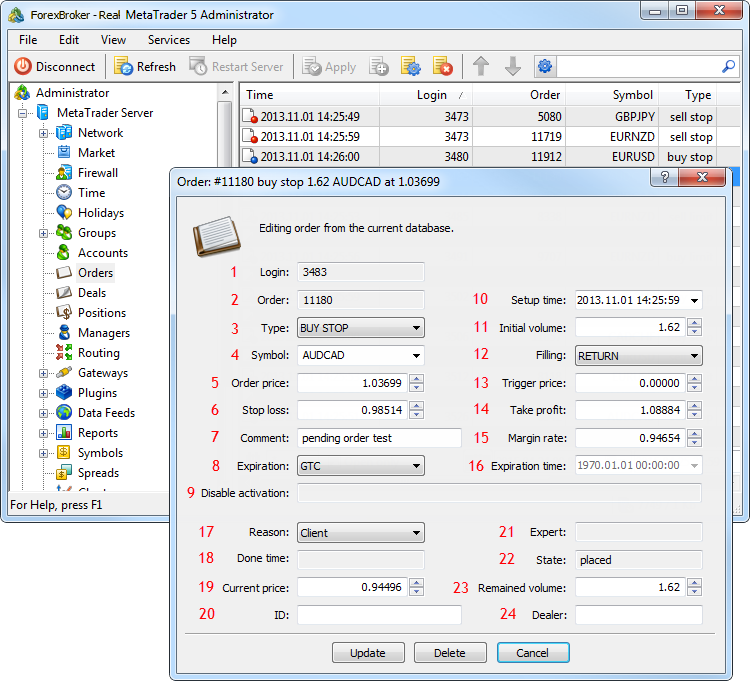

[🏠 Document Start](../../README.md) / [Database Interfaces](../README.md) / [Trade](../Trade.md) / Orders

[Previous](General-Principles/Position-Accounting-System.md) | [Next](Orders/IMTOrder.md)

# Orders

The MetaTrader 5 API allows managing a database of orders on a trade server. Using the API, you can modify and delete orders, as well as handle events of database modifications.

An important feature of working with orders is that they are bound to a certain trade server. Accordingly, an application can manage only those orders that belong to the server to which this application is connected.

The following order interfaces are available:

  * [IMTOrder](Orders/IMTOrder.md)  
An interface that provides access to all the main parameters of orders.
  * [IMTOrderArray](Orders/IMTOrderArray.md)  
An interface for working with the arrays of orders.
  * [IMTOrderSink](Orders/IMTOrderSink.md)  
An interface for handling events associated with change of a database of open (active) orders.
  * [IMTHistorySink](Orders/IMTHistorySink.md)  
An interface for handling events associated with change of a database of closed orders (history of orders).

To help you understand the purpose of interfaces intended for working with orders, the below figure shows their compliance with the elements in MetaTrader 5 Administrator:</t4>

The following elements are shown above:

1\. [The login of the client who has placed the order](Orders/IMTOrder/Login.md).

2\. [Ticket of the order](Orders/IMTOrder/Order.md).

3\. [Type of the order](Orders/IMTOrder/Type.md).

4\. [The symbol of an order](Orders/IMTOrder/Symbol.md).

5\. [The price, at which the order is placed](Orders/IMTOrder/PriceOrder.md).

6\. [The Stop Loss level](Orders/IMTOrder/PriceSL.md).

7\. [Comment to an order](Orders/IMTOrder/Comment.md).

8\. [Expiration type](Orders/IMTOrder/TypeTime.md).

9\. [Activation flags](Orders/IMTOrder/ActivationFlags.md).

10\. [Time of order placing](Orders/IMTOrder/TimeSetup.md).

11\. [Initial volume of the order](Orders/IMTOrder/VolumeInitial.md).

12\. [Type of filling](Orders/IMTOrder/TypeFill.md).

13\. [Order triggering price](Orders/IMTOrder/PriceTrigger.md).

14\. [The Take Profit level](Orders/IMTOrder/PriceTP.md).

15\. [Margin conversion rate](Orders/IMTOrder/RateMargin.md).

16\. [Expiry time](Orders/IMTOrder/TimeExpiration.md).

17\. [Reason for placing the order](Orders/IMTOrder/Reason.md).

18\. [Order execution time](Orders/IMTOrder/TimeDone.md).

19\. [The current price of the symbol, for which an order has been placed](Orders/IMTOrder/PriceCurrent.md).

20\. [The ID of the order in an external trading system](Orders/IMTOrder/ExternalID.md).

21\. [The identifier (magic number) of the Expert Advisor that has placed an order in the client terminal](Orders/IMTOrder/ExpertID.md).

22\. [Order state](Orders/IMTOrder/State.md).

23\. [Unfilled volume of the order](Orders/IMTOrder/VolumeCurrent.md).

24\. [The login of a dealer, who has processed the order](Orders/IMTOrder/Dealer.md).
