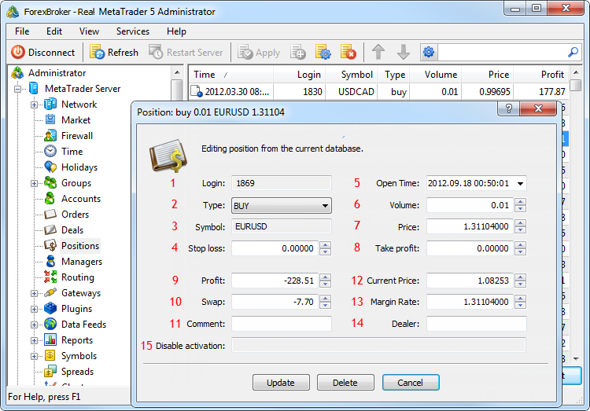

[🏠 Document Start](../../README.md) / [Database Interfaces](../README.md) / [Trade](../Trade.md) / Positions

[Previous](Deals/IMTDealSink/OnDealPerformCloseBy.md) | [Next](Positions/IMTPosition.md)

# Positions

The MetaTrader 5 API allows managing a database of positions on a trade server. Using the API, you can modify and delete positions, as well as handle events of changes in the database.

An important feature of working with positions is that they are bound to a certain trade server. Accordingly, an application can manage only those positions that belong to the server to which this application is connected.

> MetaTrader 5 API does not provide options for creating positions. That can lead to irreversible damage of the position database of a server.

The following position interfaces are available:

  * [IMTPosition](Positions/IMTPosition.md)  
An interface that provides access to all parameters of trade positions.
  * [IMTPositionArray](Positions/IMTPositionArray.md)  
An interface for working with the arrays of positions.
  * [IMTPositionSink](Positions/IMTPositionSink.md)  
An interface for handling events associated with change of a database of trade positions.

To help you understand the purpose of interfaces intended for working with positions, the below figure shows their compliance with the elements in MetaTrader 5 Administrator:

The following elements are shown above:

1\. [The login of the user who has opened the position](Positions/IMTPosition/Login.md).

2\. [Position type](Positions/IMTPosition/Action.md).

3\. [Symbol, for which the position is opened](Positions/IMTPosition/Symbol.md).

4\. [The Stop Loss level](Positions/IMTPosition/PriceSL.md).

5\. [Time of position opening](Positions/IMTPosition/TimeCreate.md).

6\. [Position volume](Positions/IMTPosition/Volume.md).

7\. [The weighted average price of a position](Positions/IMTPosition/PriceOpen.md).

8\. [The Take Profit level](Positions/IMTPosition/PriceTP.md).

9\. [The current profit/loss of a trade position](Positions/IMTPosition/Profit.md).

10\. [Position swap](Positions/IMTPosition/Storage.md).

11\. [A comment to a position](Positions/IMTPosition/Comment.md).

12\. [The current price of a position](Positions/IMTPosition/PriceCurrent.md).

13\. [The exchange rate of the margin currency to the deposit currency](Positions/IMTPosition/RateMargin.md).

14\. [The login of a dealer, who has processed the order that opened the position](Positions/IMTPosition/Dealer.md).

15\. [Activation flags](Positions/IMTPosition/ActivationFlags.md).
