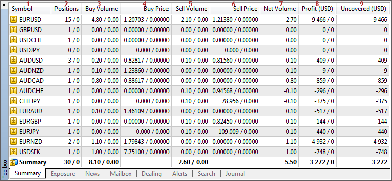

[🏠 Document Start](../../README.md) / [Database Interfaces](../README.md) / [Trade](../Trade.md) / Summary Positions

[Previous](Trade-Requests/IMTExecution/Requests-ExternalRetcode.md) | [Next](Summary-Positions/IMTSummary.md)

# Summary Positions

The MetaTrader 5 API allows receiving information about clients' summary positions, as well as summary hedging positions.

An important feature of working with summary positions is that they are bound to a certain trade server. Therefore, the application can only receive information about summary positions on the server to which this application is connected.

> Hedging positions apply to all accounts in coverage* groups.

The following summary position interfaces are available:

  * [IMTSummary](Summary-Positions/IMTSummary.md)  
An interface describing the summary position record of one symbol.
  * [IMTSummaryArray](Summary-Positions/IMTSummaryArray.md)  
An interface for working with the arrays of summary position records.
  * [IMTSummarySink](Summary-Positions/IMTSummarySink.md)  
An interface for handling events associated with changes in summary positions.

To help you understand the purpose of interfaces intended for working with positions, the below figure shows their compliance with the elements in the MetaTrader 5 Manager:

The following elements are shown above:

1\. Symbol.

2\. The number of [client](Summary-Positions/IMTSummary/PositionClients.md) and [hedging](Summary-Positions/IMTSummary/PositionCoverage.md) positions.

3\. The volume of [client](Summary-Positions/IMTSummary/VolumeBuyClients.md) and [hedging](Summary-Positions/IMTSummary/VolumeBuyCoverage.md) Buy positions.

4\. The weighted average price of [client](Summary-Positions/IMTSummary/PriceBuyClients.md) and [hedging](Summary-Positions/IMTSummary/PriceBuyCoverage.md) Sell positions.

5\. The volume of [client](Summary-Positions/IMTSummary/VolumeSellClients.md) and [hedging](Summary-Positions/IMTSummary/VolumeSellCoverage.md) Buy positions.

6\. The weighted average price of [client](Summary-Positions/IMTSummary/PriceSellClients.md) and [hedging](Summary-Positions/IMTSummary/PriceSellCoverage.md) Sell positions.

7\. The [difference](Summary-Positions/IMTSummary/VolumeNet.md) between the volumes of client Buy and Sell positions.

8\. The total profit (loss) of [client](Summary-Positions/IMTSummary/ProfitClients.md) and [hedging](Summary-Positions/IMTSummary/ProfitCoverage.md) positions.

9\. The [difference between total profits](Summary-Positions/IMTSummary/ProfitUncovered.md) (losses) of client and hedging positions.
