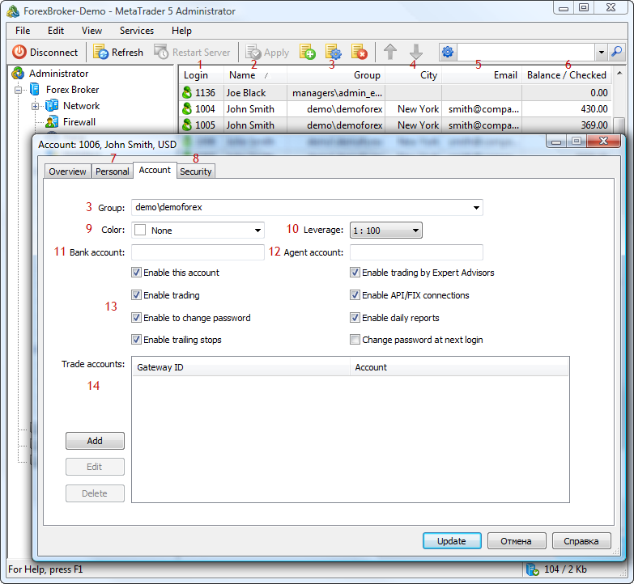

[🏠 Document Start](../README.md) / [Database Interfaces](README.md) / Users

[Previous](Clients/IMTAttachmentArray/SearchRight.md) | [Next](Users/IMTUser.md)

# Users

The MetaTrader 5 API allows managing a client base on a trade server. Using the API, you can add or remove users, edit their data and handle events of changes in the client base.

An important feature of a client base is that users are bound to a certain trade server. Accordingly, an application can manage only those user accounts that belong to the same server, on which the manager account used for connection has been created.

The following user interfaces are available:

  * [IMTUser](Users/IMTUser.md)  
An interface that provides access to all the main user settings.
  * [IMTUserArray](Users/IMTUserArray.md)  
An interface for working with the arrays of users.
  * [IMTUserSink](Users/IMTUserSink.md)  
An interface that contains handlers of events associated with changes in user settings.

To help you understand the purpose of interfaces intended for working with users, the below figure shows their compliance with the elements in MetaTrader 5 Administrator:

The following elements are shown above:

1\. [User login](Users/IMTUser/Login.md).

2\. [Username](Users/IMTUser/Name.md).

3\. [User group](Users/IMTUser/Group.md).

4\. [City of residence of a user](Users/IMTUser/City.md).

5\. [Email address of a user](Users/IMTUser/EMail.md).

6\. [The current balance of a user](Users/IMTUser/Balance.md).

7\. A tab of personal information, such as [Company](Users/IMTUser/Company.md), [City](Users/IMTUser/City.md), [Phone number](Users/IMTUser/Phone.md), [Address](Users/IMTUser/Address.md) etc.

8\. A tab of security settings for [passwords](../Manager-API/Administrator-Interface/Users/UserPasswordChange.md) and [certificates](../Manager-API/Manager-Interface/Users/UserCertDelete.md).

9\. [The color of trade requests](Users/IMTUser/Color.md) of a user in the manager terminal.

10\. [Leverage](Users/IMTUser/Leverage.md).

11\. [User account in an external bank](Users/IMTUser/Account.md).

12\. [Agent account](Users/IMTUser/Agent.md).

13\. [User permissions](Users/IMTUser/Rights.md).

14\. [Client's accounts in external systems](Users/IMTUser/ExternalAccountAdd.md).
