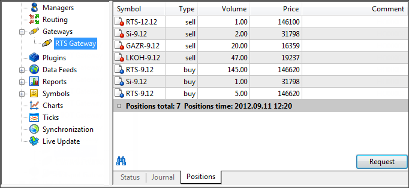

[🏠 Document Start](../../README.md) / [Gateway API](../README.md) / [Main Interface](../Main-Interface.md) / Controlling Positions in External System

[Previous](Processing-Trade-Requests/DealerExecuteAsync.md) | [Next](Controlling-Positions-in-External-System/GatewayParamArrayCreate.md)

# Controlling Positions in External System

MetaTrader 5 Gateway API provides possibility to control position states of the trading accounts, at which the gateway operates in an external system.

If the gateway has such a functionality, the platform administrator can request the state of positions on the trading accounts in an external system via MetaTrader 5 Administrator. The special tab is provided for that:

When clicking "Request", [IMTGatewaySink::HookGatewayPositionsRequest](../Event-Interface/HookGatewayPositionsRequest.md) hook is called in Gateway API. Positions are received and displayed using the hook and the functions described in this section.

Functions | Purpose  
---|---  
[GatewayParamArrayCreate](Controlling-Positions-in-External-System/GatewayParamArrayCreate.md) | Create an object of the array of parameters.  
[GatewayPositionArrayCreate](Controlling-Positions-in-External-System/GatewayPositionArrayCreate.md) | Create an object of the array of positions.  
[GatewayPositionsAnswer](Controlling-Positions-in-External-System/GatewayPositionsAnswer.md) | Display positions on external trading system accounts in MetaTrader 5 Administrator.  
[GatewayPositionsCheck](Controlling-Positions-in-External-System/GatewayPositionsCheck.md) | Verify positions. This method is reserved for future use.
