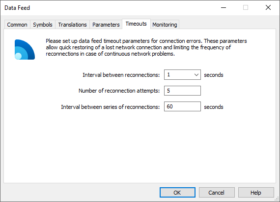
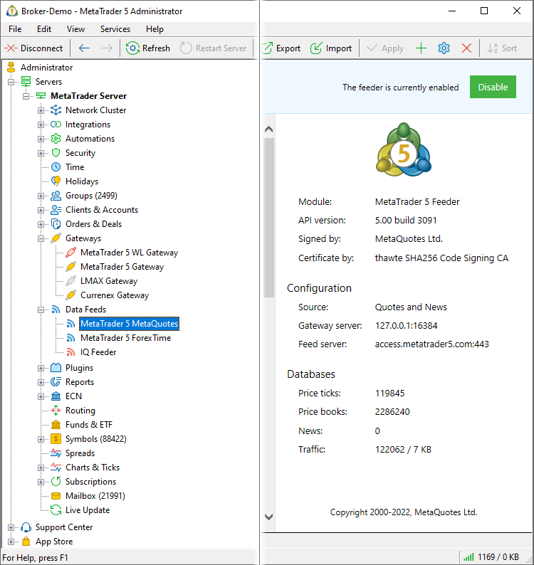

[🏠 Document Start](../../README.md) / [Gateway API](../README.md) / [Main Interface](../Main-Interface.md) / External Connection State

[Previous](Server/Connections.md) | [Next](External-Connection-State/StateConnect.md)

# External Connection Status

The implementation of the gateway/data feed connection to external systems, as well as the relevant connection management, is entirely the responsibility of the application developer. The Gateway API does not provide any specialized methods for this. However, it allows you to implement certain interaction with the end user:

  * Receive and use custom settings for reconnecting to an external server in case of connection loss
  * Display connection status and traffic

Gateway and data feed configurations provide settings for reconnecting in case of connection loss. The settings affect the logic of reconnecting cluster servers to gateways/data feeds (local and remote), but you can also use them to work with an external connection.

The settings can be obtained using the following methods:

  * [IMTConGateway::TimeoutReconnect](../../Configuration-Interfaces/Gateways/IMTConGateway/TimeoutReconnect.md) — time period between attempts to reconnect the gateway to an external server.
  * [IMTConGateway::TimeoutAttempts](../../Configuration-Interfaces/Gateways/IMTConGateway/TimeoutAttempts.md) — the number of attempts in a series of gateway reconnections to an external server.
  * [IMTConGateway::TimeoutSleep](../../Configuration-Interfaces/Gateways/IMTConGateway/TimeoutSleep.md) — time period between series of gateway reconnections to an external server.
  * [IMTConFeeder::TimeoutReconnect](../../Configuration-Interfaces/Data-Feeds/IMTConFeeder/TimeoutReconnect.md) — time period between attempts to reconnect the data feed to an external server.
  * [IMTConFeeder::TimeoutAttempts](../../Configuration-Interfaces/Data-Feeds/IMTConFeeder/TimeoutAttempts.md) — the number of attempts in a series of data feed reconnections to an external server.
  * [IMTConFeeder::TimeoutSleep](../../Configuration-Interfaces/Data-Feeds/IMTConFeeder/TimeoutSleep.md) — time period between series of data feed reconnections to an external server.

They are described in detail in the "[Interaction with Quote Provider](https://support.metaquotes.net/ru/docs/mt5/platform/components/history_server/history_server_datafeeds)" section of the MetaTrader 5 Administrator Help. You can implement similar logic for reconnecting to an external server in your app.

Status of gateway/data feed connection to external servers is displayed in MetaTrader 5 Administrator:

  * The connection status is shown by the gateway/data feed icon in the tree
  * The amount of transmitted traffic is displayed on the "Status" page of the selected gateway/data feed

The Gateway API provides the following functions to pass these parameters to the server and then to display the relevant information to the user:

Function | Purpose  
---|---  
[StateConnect](External-Connection-State/StateConnect.md) | Set the state of the gateway/data feed external connection.  
[StateTraffic](External-Connection-State/StateTraffic.md) | Add the value to the external connection traffic counter.  
  
Statistical data on the number of the passed ticks, Depth of Market changes and news is counted automatically.
