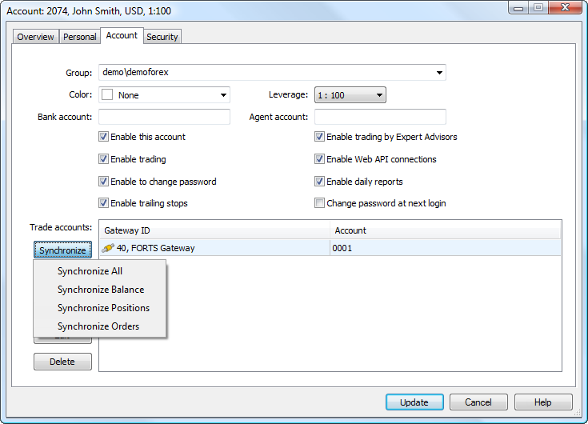

[🏠 Document Start](../../README.md) / [Gateway API](../README.md) / [Main Interface](../Main-Interface.md) / Synchronizing Trading Data

[Previous](Controlling-Orders-in-External-System/GatewayOrdersAnswer.md) | [Next](Synchronizing-Trading-Data/GatewayAccountAnswer.md)

# Synchronizing Trading Data

MetaTrader 5 Gateway API provides possibility to synchronize MetaTrader 5 client trading data with an external trading system.

## Synchronizing on Request from MetaTrader 5

If the gateway has such a functionality, the platform administrator can synchronize this data on the account management page via MetaTrader 5 Administrator:

When clicking "Synchronize" in MetaTrader 5 Administrator or when calling IMTAdminAPI::UserExternalSync and IMTManagerAPI::UserExternalSync methods from MetaTrader 5 Manager API, [IMTGatewaySink::HookGatewayAccountRequest](../Event-Interface/HookGatewayAccountRequest.md) hook is called. Pending orders, positions and client balances are synchronized with an external system using the hook and [GatewayAccountAnswer](Synchronizing-Trading-Data/GatewayAccountAnswer.md) function.

## Synchronizing on Request from an External System

There is also the possibility to change the client data on MetaTrader 5 side without requesting the platform administrator. The complete structure looks as follows:

  * The gateway receives information that the data of some users in an external system has changed. These users have certain account number in that external system.
  * In order to define the users present in MetaTrader 5, [IMTGaewayAPI::User*](Users.md) methods should be used. They allow you to receive the list of the users available to the gateway on MetaTrader 5 side, as well as the account numbers in the external trading system specified for these users.
  * After receiving the list of users, it is possible to request their status on MetaTrader 5 side. This will allow you to define if their status should be synchronized with MetaTrader 5. Request for users' status is performed using [IMTGatewayAPI::GatewayAccountRequest](Synchronizing-Trading-Data/GatewayAccountRequest.md) method. The data requested using such method is passed to [IMTGatewaySink::OnGatewayAccountAnswer](../Event-Interface/OnGatewayAccountAnswer.md) handler.
  * [IMTGatewayAPI::GatewayAccountSet](Synchronizing-Trading-Data/GatewayAccountSet.md) method should be used to synchronize the status of the external trading system's users with MetaTrader 5. Execution result, as well as the final status of client entries after the synchronization are passed to [IMTGatewaySink::OnGatewayAccountSet](../Event-Interface/OnGatewayAccountSet.md) handler.

