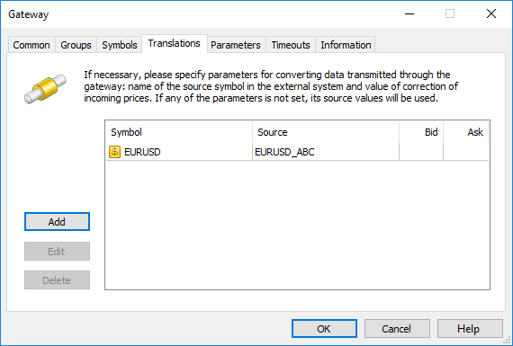
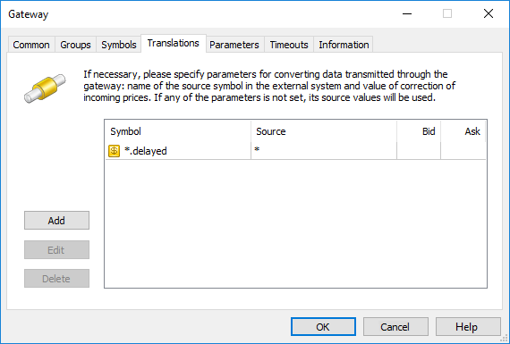
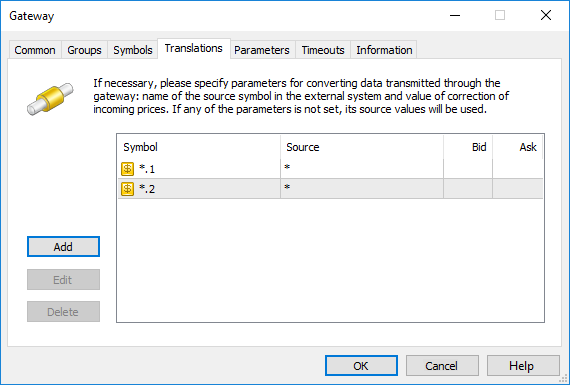
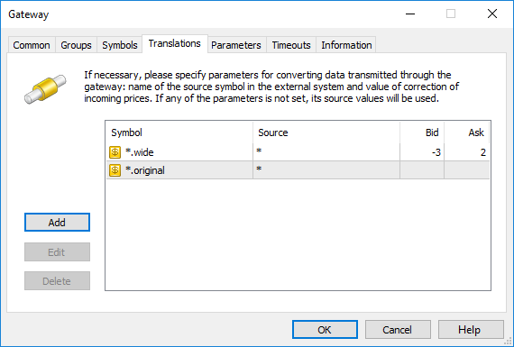
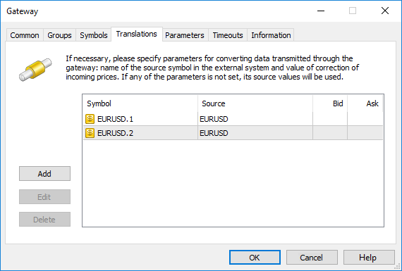

[🏠 Document Start](../README.md) / [Gateway API](README.md) / Symbol and Price Translation

[Previous](Development-and-Debugging-of-Gateways.md) | [Next](Development-of-Data-Feeds.md)

# Symbol and Price Translation

Gateways are able to import necessary sets of trading symbols, manage their settings, update them if necessary and provide quotes. Gateway settings allow you to easily change data passed from the external system:

  * Rename trading symbols
  * Convert quotes
  * Copy price data to different symbols

The settings are available on the Translations tab of each gateway in the administrator terminal. In API, they are represented by the [IMTConGatewayTranslate](../Configuration-Interfaces/Gateways/IMTConGatewayTranslate.md) interface.

> To let a gateway manage the settings of trading tools on MetaTrader 5 side, enable the "Allow importing symbols settings" option ([IMTConGateway::GATEWAY_FLAG_IMPORT_SYMBOLS (#engatewayflags)](../Configuration-Interfaces/Gateways/IMTConGateway/Enumerations.md#engatewayflags)).

## Renaming trading symbols

Data on any symbol can be passed from an external system to the MetaTrader 5 platform under any name. For example, if the symbol name in an external system is EURUSD_ABC, and it is called EURUSD in the MetaTrader 5, enter EURUSD in the "Symbol" field and EURUSD_ABC in the "Source" field.

> If another source of quotes is already specified in symbol settings ([IMTConSymbol::Source](../Configuration-Interfaces/Symbols/IMTConSymbol/Source.md)), this symbol cannot be specified as the receiver symbol. Also symbols with the disabled delivery of real-time quotes from data feeds ([IMTConSymbol::TICK_REALTIME (#entickflags)](../Configuration-Interfaces/Symbols/IMTConSymbol/Enumerations.md#entickflags)) cannot be specified as receivers. Conversion settings containing such symbols will be ignored by the platform.

Use the * mask for renaming multiple symbols. For example, in order to add the .delayed suffix to all gateway symbols, specify:

> Only simple masks with a single * symbol are supported. Settings with more complicated masks (for example, having two * or ! negation symbol) are ignored.

In order to duplicate data to different symbols on the MetaTrader 5 side, create several entries in the Translations section. In the example below, the entire available set of gateway symbols is passed to the platform in two instances: with the .1 and .2 suffixes.

> A gateway behavior changes depending on the translations configuration phase:

## Price translation

A gateway broadcasts a flow of quotes from an external trading system to the MetaTrader 5 platform and is able to change it on the fly. Clients receive prices according to the translation settings. However, while processing trading operations on the gateway and passing them back to the external system, initial (not transformed) prices are used.

If trading tool names in the platform are not different from the ones in the external system, simply specify a symbol name in the platform and translation value for Bid and Ask prices.

The above screenshot shows price conversion: at every tick, the Bid price will be reduced by 3 points, and the Ask price will be increased by 2 points. Below is a schematic example of the conversion:

External system | >>> | ask price | EURGBP 0.83004 | >>> | MetaTrader 5 server  
---|---|---|---|---|---  
MetaTrader 5 server | >>> | ask price | EURGBP 0.83006 | >>> | Client terminal  
Client terminal | >>> | buy limit | EURGBP 0.83006 | >>> | MetaTrader 5 server  
MetaTrader 5 server | >>> | buy limit | EURGBP 0.83004 | >>> | External system  
External system | >>> | buy limit execution | EURGBP 0.83004 | >>> | MetaTrader 5 server  
MetaTrader 5 server | >>> | buy limit execution | EURGBP 0.83006 | >>> | Client terminal  
  
A broker gains 2 pips of profit in this example. The price is sent to the client terminal only after the correction, so the clients work only with the corrected prices. If no correction is set for a symbol, the client will work with the original prices submitted by an external system.

Using the previously described possibilities of symbols mass renaming and duplication, you are able to customize different flows of quotes. For example, original and converted ones:

The .wide suffix stands for converted quotes, while the .original stands for non-converted ones.

## Features of trade operations

If only one translation parameter or no parameters at all are set for a gateway, trades are conducted without any peculiarities since the platform is able to match symbols on its side with the ones at the external trading system.

If more than one translation parameter is set for the gateway, the platform attempts to match the symbols correctly. For example, the two translation parameters are set for the gateway:

If an order is placed on the platform side, a symbol in the external system response is defined by the original order ticket. For example, a trader places an order #145269 Buy 1.00 EURUSD.2. It is sent to the external system as #145269 Buy 1.00 EURUSD. When receiving a response, the platform converts the symbol back to EURUSD.2 by the original order ticket.

However, there are some trading operations/events that are not preceded by placing an order on the trading platform side. For example, charging a variation margin in an external system. In that case, the platform cannot clearly define which of the two symbols the event is related to: EURUSD.1 or EURUSD.2.

In this situation, the platform attempts to select the correct symbol by its availability to certain accounts the event is related to. For example, if only EURUSD.2 is available for an account, the platform performs an operation for it. Availability of symbols for clients is defined on the Symbols tab of the group settings ([IMTConGroup::Symbol*](../Configuration-Interfaces/Groups/IMTConGroup/SymbolAdd.md)).

If both symbols are available for the account, the operation is performed for the first one in the translation list. It is EURUSD.1 in our example.

Thus, if there are multiple translation settings, the following rule is used: trading operations are performed for the first symbol available for a client group. All subsequent translation settings are used only to pass price data.

The table below contains trading operations and events ([trade execution types (#entradeexecutions)](../Database-Interfaces/Trade/Trade-Requests/IMTExecution/Requests-Enumerations.md#entradeexecutions)) preceded by placing an order on MetaTrader 5 side, which means that symbols can be accurately matched for them regardless of the number of translation settings. For other operations, the platform attempts to define the necessary symbol by its availability for a client group.

A symbol is accurately matched by an original order | A symbol is defined by its availability for a client  
---|---  
TE_ORDER_NEW_REQUEST TE_ORDER_NEW TE_ORDER_FILL TE_ORDER_REJECT TE_ORDER_MODIFY_REQUEST TE_ORDER_MODIFY TE_ORDER_MODIFY_REJECT TE_ORDER_CANCEL_REQUEST TE_ORDER_CANCEL TE_ORDER_CANCEL_REJECT TE_ORDER_CHANGE_ID TE_ORDER_CLOSE_BY | TE_DEAL_EXTERNAL TE_DEAL_REPO TE_EOS_CANCEL_DAILY_ORDERS TE_EOS_VARIATION_MARGIN TE_EOS_VARIATION_MARGIN TE_EOS_SETTLEMENT TE_EOS_TRANSFER TE_EOS_CANCEL_ALL_ORDERS TE_EOS_ROLLOVER
