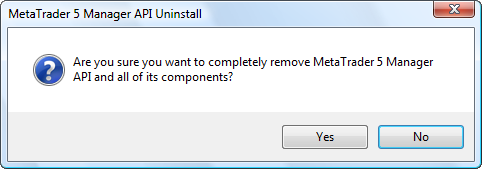

[🏠 Document Start](../README.md) / [Getting Started](../Getting-Started.md) / Delete

[Previous](Files-and-Folders.md) | [Next](../Server-API/README.md)

# Delete

In order to start the process of uninstallation of MetaTrader 5 API, go to its [installation](Setup.md) directory and run "unins000.exe".

To uninstall it, you must confirm your choice.

> Uninstalling the MetaTrader 5 API from a computer does not cause removal of custom files created in its installation folder (for example, custom projects in the /Manager/Examples folder).
