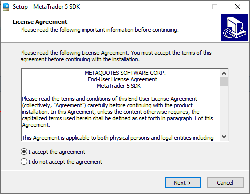
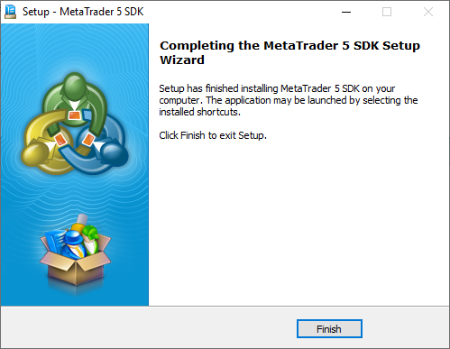

[🏠 Document Start](../README.md) / [Getting Started](../Getting-Started.md) / Setup

[Previous](System-Requirements.md) | [Next](Files-and-Folders.md)

# Setup

A single installation file is used for all five MetaTrader 5 APIs. Download it from the [MetaQuotes Software Corp. support site](https://support.metaquotes.net/en/download/mt5 "Download MetaTrader 5 Manager API"). Run the file and follow the instructions.

At the first step you should read the End User License Agreement. If you agree with the terms of the agreement, select "I accept the agreement terms" and click "Next."

After that all APIs will be installed in the [directory](Files-and-Folders.md) [system drive letter]:\MetaTrader5SDK\\. Wait for the installation to complete and click "Finish".

Now you can start working with the MetaTrader 5 API.
