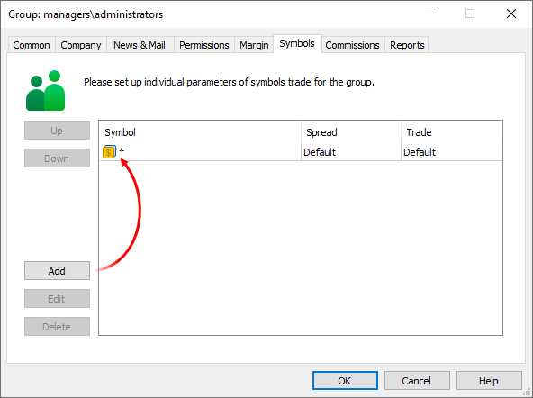
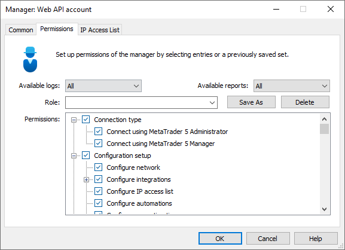
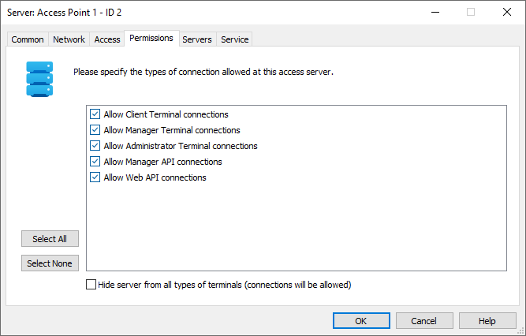

[🏠 Document Start](../README.md) / [Manager API](README.md) / Getting Started

[Previous](Recommendations-for-Developers.md) | [Next](Ready-made-Examples.md)

# Preparation for work (#preparation-for-work)

To work through the MetaTrader 5 Manager API, prepare a special account on the trade server. The account be used to authorize the Manager API client using the [IMTAdmin::Connect](Administrator-Interface/Connection-to-the-Server/Connect.md) and[IMTManager::Connect](Manager-Interface/Connection-to-the-Server/Connect.md) methods.

  * [Creating an account (#account-create)](Getting-Started.md#account-create)
  * [Configure access to symbols (#symbols)](Getting-Started.md#symbols)
  * [Manager configuration (#manager-configuration)](Getting-Started.md#manager-configuration)
  * [Configuring the Access Server (#access)](Getting-Started.md#access)

## Creating an account (#account-create)

To create an account, navigate to the relevant MetaTrader 5 Administrator section and click "Add". The account must be created in the Managers group.

> Operation with the [debug server version](../Server-API/Debugging.md) always uses password "Manager" regardless of the password actually set for the account.

## Configure access to symbols (#symbols)

The list of [symbols](../Web-API/Manager-Interface-(Rest-API)/Configuration-Databases/Symbols.md) for which the Manager API client can receive information is determined by the settings of the group to which the manager account belongs.

## Manager configuration (#manager-configuration)

When creating an account in the Managers group, MetaTrader 5 Administrator immediately creates a manager configuration based on this account. This is a special account add-on over extending account permissions.

Open this configuration under the "Clients and accounts \ Managers" section. The configuration can be found by the account number or by name.

On the Common tab, specify [groups](../Web-API/Manager-Interface-(Rest-API)/Configuration-Databases/Groups.md) with which the Manager API client can work. In fact, they define access to accounts and trading operations.

On the Permissions tab, configure access restrictions for the Manager API client.

The manager account used for the Manager API client has the following permissions:

  * Connect using MetaTrader 5 Administrator — allows [administrator connection](Administrator-Interface.md) to the trading server, used in the Manager API.
  * Connect using MetaTrader 5 Manager — allows [manager connection](Manager-Interface.md) to the trading server, used in the Manager API. The permission must be enabled.
  * Configuration setup — determines the type of configurations which can be changed via the Manager API.
  * Send email — allows the account to [send emails](Manager-Interface/Mail-Database.md) via the internal mail system.
  * Send news — allows the account to [send newsletters](Manager-Interface/News-Database.md).
  * Accountant — enables access to perform [balance operations](Manager-Interface/Trade-Activity/Dealing/DealerBalance.md) on client account.
  * Access accounts — permission to [request account information](Manager-Interface/Users.md) (without access to personal data).
  * Access account personal details — permission to view the following personal details of accounts:

  * Name
  * Bank Account
  * Phone Password
  * Country
  * City
  * State
  * Zip/Postal code
  * Address
  * Phone
  * Email
  * Comments
  * ID
  * Status
  * API User Data
  * Trading account numbers in external systems
  * Change accounts — permission to [add](Manager-Interface/Users/UserAdd.md) and [edit](Manager-Interface/Users/UserUpdate.md) accounts.
  * Delete accounts — permission to [delete](Manager-Interface/Users/UserDelete.md) accounts.
  * Access orders and positions — permission to view client [orders](Manager-Interface/Trade-Databases/Orders.md), [deals](Manager-Interface/Trade-Databases/Deals.md) and [positions](Manager-Interface/Trade-Databases/Positions.md).
  * Edit orders, positions and deals — permission to edit the relevant trading operations.
  * Delete orders, positions and deals — permission to edit the relevant trading operations.
  * Back Office — access to the [client](Manager-Interface/Clients.md) database.
  * Subscriptions — access to the [subscriptions](Manager-Interface/Subscriptions.md) service.

On the "List of allowed IP addresses" tab, you can further restrict the Manager API client connection by IP addresses.

# Configuring the Access Server (#access)

To allow connections to the trading platform via the Manager API, enable the corresponding option in the access server settings:

