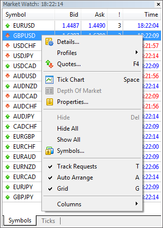

[🏠 Document Start](../../README.md) / [Manager API](../README.md) / [Manager Interface](../Manager-Interface.md) / Selected Symbols

[Previous](Configuration-Databases/Subscriptions/SubscriptionCfgRequestByID.md) | [Next](Selected-Symbols/SelectedAdd.md)

# Functions for Operations with Selected Symbols

The functions described in this section allow users to create an analogue of the "Market Watch" window in applications developed using the Manager API. The main purpose of managing the list of selected symbols is a control of the incoming price stream delivered to the application. In other words, the application only receives prices of selected symbols.

The functions for managing the list of selected symbols perform the same actions as the context menu commands of Market Watch:

Function | Purpose  
---|---  
[SelectedAdd](Selected-Symbols/SelectedAdd.md) | Add a symbol to the list by the name.  
[SelectedAddBatch](Selected-Symbols/SelectedAddBatch.md) | Add a batch of symbols to the list of selected symbols.  
[SelectedAddAll](Selected-Symbols/SelectedAddAll.md) | Add all available symbols to the list of selected symbols.  
[SelectedDelete](Selected-Symbols/SelectedDelete.md) | Remove a symbol from the list of selected symbols by the name or index.  
[SelectedDeleteBatch](Selected-Symbols/SelectedDeleteBatch.md) | Delete a batch of symbols from the list of selected symbols.  
[SelectedDeleteAll](Selected-Symbols/SelectedDeleteAll.md) | Delete all symbols from the list of selected symbols  
[SelectedShift](Selected-Symbols/SelectedShift.md) | Shift a symbol in the list of selected symbols  
[SelectedTotal](Selected-Symbols/SelectedTotal.md) | Get the total number of symbols in the list of selected symbols.  
[SelectedNext](Selected-Symbols/SelectedNext.md) | Get the name of a symbol by a position in the list of selected symbols.  
  
  * To work with the list of selected symbols, an application should be connected in the PUMP_MODE_SYMBOLS [pumping mode](Connection-to-the-Server/Pumping-Modes.md).
  * When enabling PUMP_MODE_ORDERS and PUMP_MODE_POSITIONS pumping modes, pumping of symbols is automatically enabled, while the symbols, for which there are orders and positions, are automatically added to the list of selected symbols.

  
---
