[🏠 Document Start](../README.md) / [Report API](README.md) / Creating a Simple Report

[Previous](Requirements-for-Modules.md) | [Next](Tabular-Reports.md)

# Creating a Simple Report (#creating-a-simple-report)

Reports module written with the help of MetaTrader 5 Report API is a common dynamically downloaded library (DLL). The library can be 32-bit and 64-bit, depending on the bit characteristics of the server it is developed for.

Preparation for the plugin creation includes several stages:

  * [Creating a project in Microsoft Visual Studio (#new-project)](Creating-a-Simple-Report.md#new-project)
  * [Project setup (#settings)](Creating-a-Simple-Report.md#settings)
  * [Specifying the information on the project (#info)](Creating-a-Simple-Report.md#info)
  * [Including Report API in the project (#include)](Creating-a-Simple-Report.md#include)
  * Entry Points
  * Report Class

## Creating a project in Microsoft Visual Studio (#new-project)

The first step towards creating a plugin is to create a project in Microsoft Visual Studio. To do this, click New from the File menu:

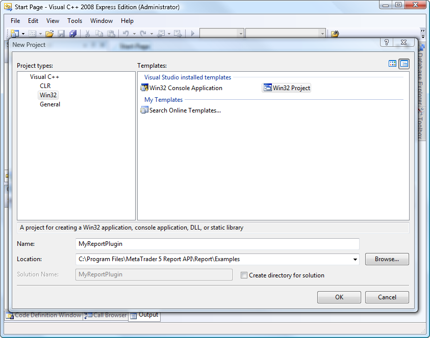

The main parameters that you need to enter in the new project creation dialog:

  * Project types: Visual C++\Win32;
  * Name: name of the plugin (in our example MyReportPlugin);
  * Location: directory where the project will be created. A project should be created close to the MetaTrader 5 Report API installation place, since later you will need to include its files in the project.

After you click OK, Application Wizard will open:

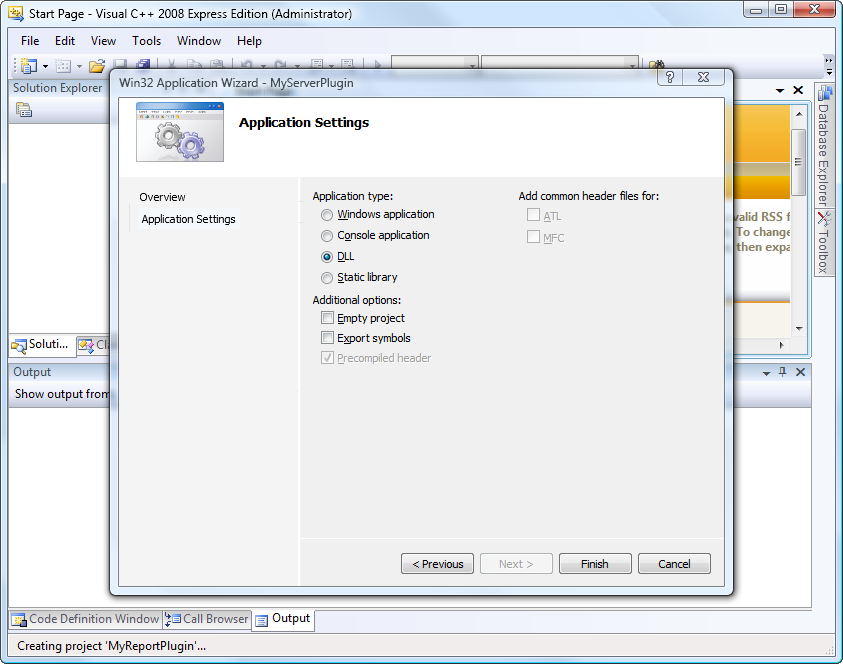

In the Wizard, go to the "Application Settings" tab. In this type, select "DLL" as the Application type. After you click "Finish", the project will be generated.

## Project setup (#settings)

Before you begin to develop the report module, you must configure the project. To do this, click Properties in the Project menu.

> The project is set up for version Release, Active (Win32).

### General (#general)

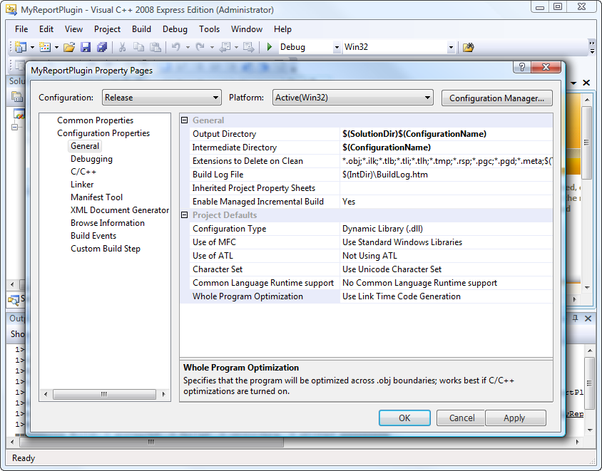

The following key settings must be specified in the "General" section:

  * Character Set: Use Unicode Character Set. The Unicode symbols set must be selected, as MetaTrader 5 servers support only such projects.
  * Whole Program Optimization: Use Link Time Code Generation. This option should be used to speed up the application.

### C/C++ (#cc)

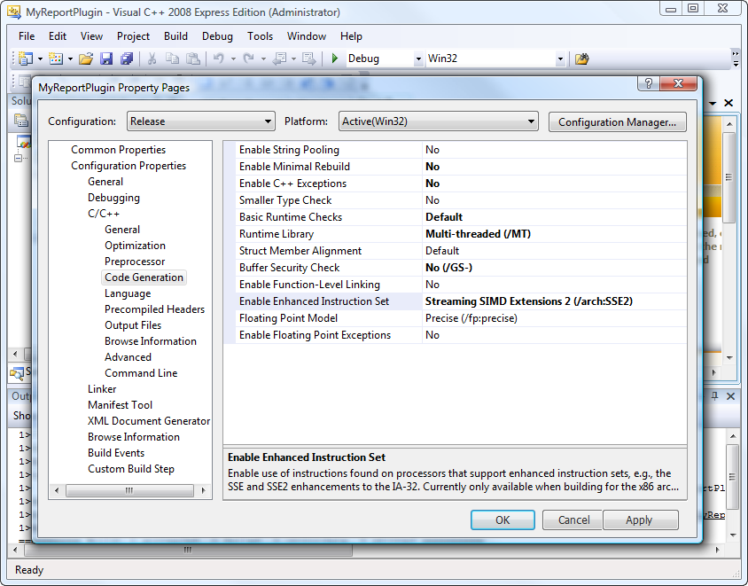

The following key settings must be specified in the "C/C++" section:

  * Debug Information Format: Disabled. Debugging data must be turned off, as the Release-project is being configured.

### C/C++ | Optimization (#cc-optimization)

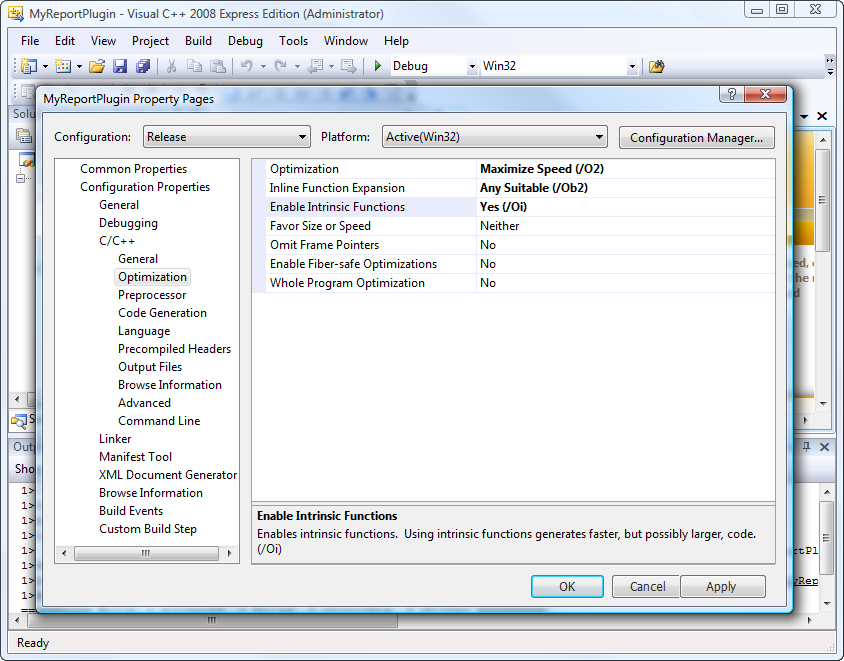

The following key settings must be specified in the "Optimization" subsection of the "C/C++" section:

  * Optimization: Maximum Speed (/O2). Install this option to speed up the application.
  * Inline Function Expansion: Any Suitable (/Ob2). Install this option to speed up the application.
  * Enable Intrinsic Functions: Yes (/Oi). Install this option to speed up the application.

### C/C++ | Code Generation (#cc-code-generation)

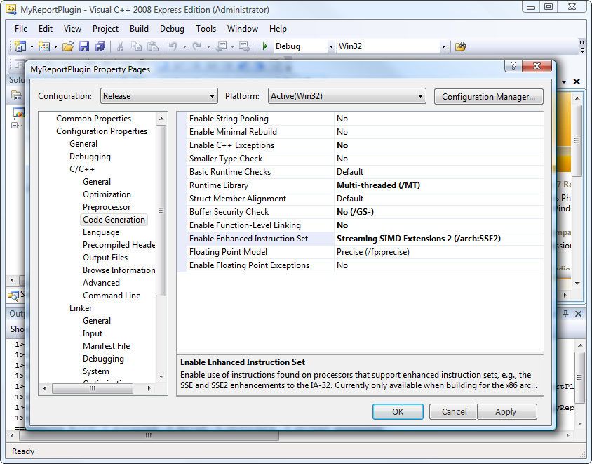

The following settings must be specified in the "Code Generation" subsection of the "C/C++" section:

  * Enable C++ Exceptions: No. It is recommended to disable exceptions, to prevent the appearance of unhandled exceptions that lead to crash of the trading server.
  * Runtime Library: Multi-thread (/MT). To avoid problems, connected with different version of the CRT library (Common Runtime Library) or its absence, it is recommended to use the static linking of CRT - /MT. When debugging, use the Multi-threaded Debug (/MTd) parameter.
  * Buffer Security Check: No (/GS-). This option must be turned off to speed up the application.
  * Enable Function-Level Linking: No. This option must be turned off to speed up the application.
  * Enable Enhanced Instruction Set: Streaming SIMD Extension 2 (/arch:SSE2). SSE2 instructions set must be turned on to considerably speed up the application. This instructions set is supported by the most of the modern CPUs.

### C/C++ | Language (#cc-language)

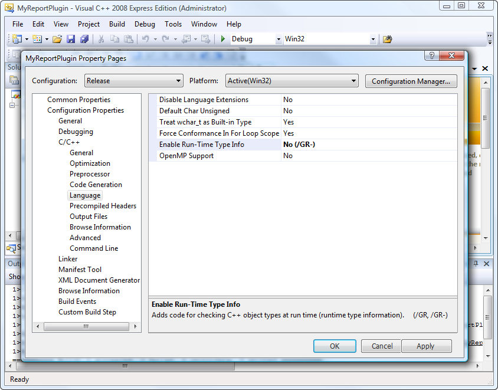

The following key settings must be specified in the "Language" subsection of the "C/C++" section:

  * Enable Run-Time Type Info: No (/GR-). This option must be turned off, as in most cases runtime type identification (RTTI) is not used. RTTI support may slow down the program code execution.

### Linker | Debugging (#linker-debugging)

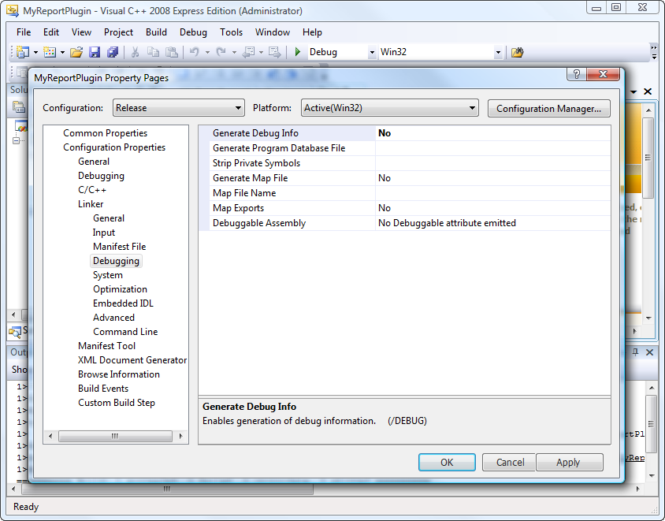

The following key settings must be specified in the "Debugging" subsection of the "Linker" section:

  * Generate Debug Info: No. Debugging data generation must be turned off, as the Release version is being configured.

### Additional options for creating 64-bit plugins (#additional-options-for-creating-64-bit-plugins)

If in addition to 32-bit version you are going to developed also a 64-bit plugin, you need to make additional configuration of the project. For this purpose, run Configuration Manager in the Build menu.

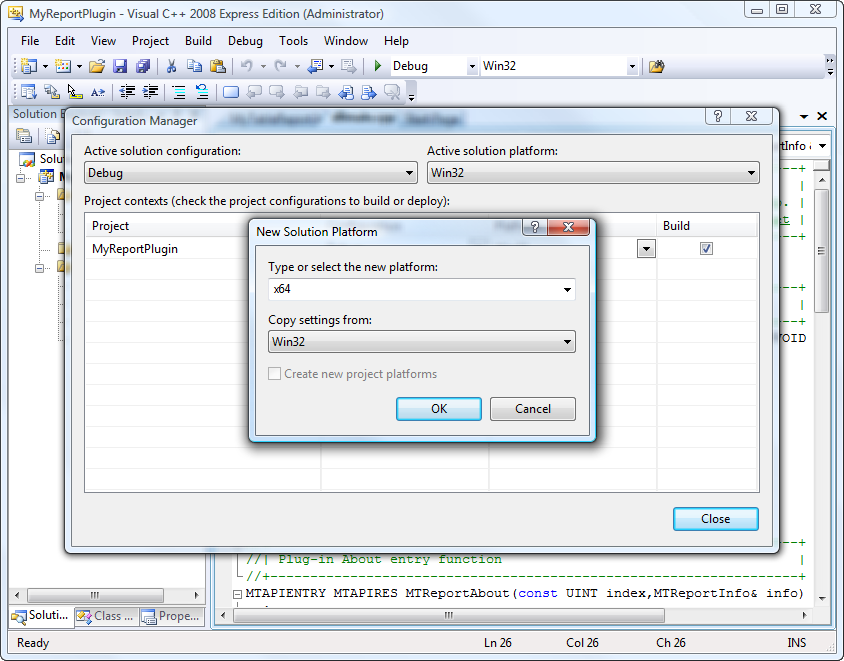

In the window that appears, do the following:

  * In the "Active solution platform" field choose <New> .
  * In the resulting window, select x64 in the "Type or select the new platform" field, as shown above.
  * Press the OK button.

## Specifying the information on the project (#info)

It is recommended to specify detailed information on the project plugin for your own convenience and also for the convenience of the future reports module users. To achieve this create the resource file using the "Add Resource" command in the "Project" menu. "Version" must be specified as the created resource type. After the "New" command execution the file will be opened where the information on a plugin and its developer must be specified.

## Including Report API in the project (#include)

To work with the server API, you need to include its header file [MT5ReportAPI.h (#include)](../Getting-Started/Files-and-Folders.md#include) in the project.

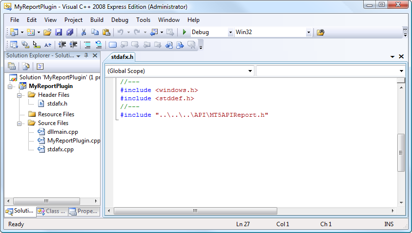

To do this, in the file stdafx.h of the project, set a relative path to it in the #include directive. In the example shown in the figure, the path "..\\..\\..\API\MT5APIReport.h" means that to find the header file, it is necessary to go three levels up and go to the API folder.

## Entry Points (#entry)

The server plugin DLL must have two entry points (exported functions):

  * [MTReportAbout (#mtreportabout)](Creating-a-Simple-Report.md#mtreportabout)
  * [MTReportCreate (#mtreportcreate)](Creating-a-Simple-Report.md#mtreportcreate)

### MTReportAbout (#mtreportabout)

Point [MTReportAbout](Entry-Points/MTReportAbout.md) provides the initial information about the report module to the server. It should be added to the file dllmain.cpp:

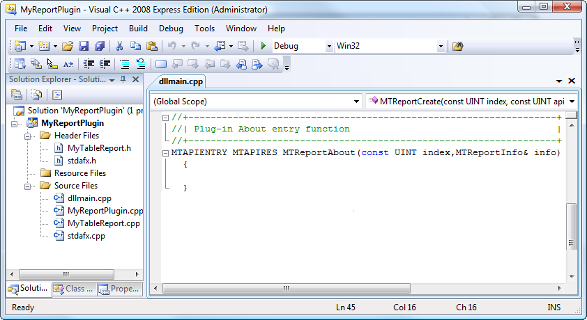

The entry point is empty at the moment. Henceforth, this point must transfer the data (the [MTReportInfo](../Structures/MTReportInfo.md) filled structure) on each report requested by an index.

### MTReportCreate (#mtreportcreate)

Create an empty entry point [MTReportCreate](Entry-Points/MTReportCreate.md) like the previous one:
    
    
    //+------------------------------------------------------------------+
    //| Entry point MTReportCreate                                       |
    //+------------------------------------------------------------------+
    MTAPIENTRY MTAPIRES  MTReportCreate(const UINT index,const UINT apiversion,IMTReportContext** context)
      {
      }
    //+------------------------------------------------------------------+

Next, in the [MTReportCreate](Entry-Points/MTReportCreate.md) method, we need to create a report API class object that implements the [IMTReportContext](Report-Plugin-Interface.md) interface. Description of this process is available in the next section — ["Report Class" (#report-class)](Creating-a-Simple-Report.md#report-class).

## Report Class (#report-class)

After the [entry points (#entry)](Creating-a-Simple-Report.md#entry) are implemented create the report class that will implement the [IMTReportContext](Report-Plugin-Interface.md) interface responsible for the report generation.

### Adding a Class (#adding-a-class)

Add a C++ class using the command "Add Class" in the "Project" menu:

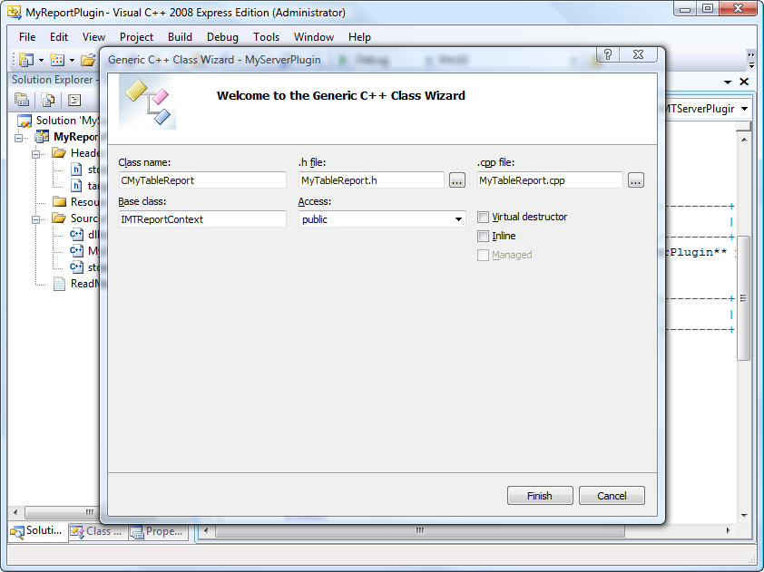

Specify the following parameters in the class creation wizard:

  * Class name: CMyTableReport;
  * .h file: MyTableReport.h;
  * .cpp file: MyTableReport.cpp;
  * Base class: IMTReportContext;
  * Access: public.

The key point here is to specify the [IMTReportContext](Report-Plugin-Interface.md) base class.

### Class Implementation (#implementation)

Two IMTReportContext interface methods must be set in the class:

  * [Release](Report-Plugin-Interface/Release.md) — responsible for deleting a report object;
  * [Generate](Report-Plugin-Interface/Generate.md) — responsible for a report generation.

Besides, the report data must be described in the class using the [MTReportInfo](../Structures/MTReportInfo.md) structure.

Describe necessary structures and methods in the MyTableReport.h file:
    
    
    //+------------------------------------------------------------------+
    //|                                                                  |
    //+------------------------------------------------------------------+
    #pragma once
    //+------------------------------------------------------------------+
    //|                                                                  |
    //+------------------------------------------------------------------+
    class CMyTableReport : public IMTReportContext
      {
    private:
       static const MTReportInfo s_info;            // Report data
       
    public:
       //--- Constructor/destructor
                         CMyTableReport(void);
       virtual          ~CMyTableReport(void);
       //--- Get the report data
       static void       Info(MTReportInfo& info) { info=s_info; }
       //--- 
       virtual void      Release(void);
       //--- Report generation method
       virtual MTAPIRES  Generate(const UINT type,IMTReportAPI *api);
      };
    //+------------------------------------------------------------------+

As seen in the above listing, in addition to the virtual Release and Generate methods we have created a private class member s_info where the report data will be stored.

Besides, the additional Info method has been declared to transfer the report data to the server. This method will further be [called (#info-call)](Creating-a-Simple-Report.md#info-call) in the dllmain.cpp file.

The next step is the filling the [MTReportInfo](../Structures/MTReportInfo.md) structure and description of the abovementioned methods in the MyTableReport.cpp file:
    
    
    //+------------------------------------------------------------------+
    //| Plugin description structure                                       |
    //+------------------------------------------------------------------+
    const MTReportInfo CMyTableReport::s_info=
      {
       100,
       MTReportAPIVersion,
       MTReportInfo::IE_VERSION_ANY,
       L"My Table Report",
       L"Copyright 2001-2011, MetaQuotes Software Corp.",
       L"MetaTrader 5 Report API plug-in",
       0,
       MTReportInfo::TYPE_TABLE,
         { 0 },
         {              // Parameters
          { MTReportParam::TYPE_GROUPS, MTAPI_PARAM_GROUPS, L"*" },
         },1            // Number of parameters
      };
    //+------------------------------------------------------------------+
    //| Constructor                                                      |
    //+------------------------------------------------------------------+
    CMyTableReport::CMyTableReport(void)
      {
      }
    //+------------------------------------------------------------------+
    //| Destructor                                                       |
    //+------------------------------------------------------------------+
    CMyTableReport::~CMyTableReport(void)
      {
      }
    //+------------------------------------------------------------------+
    //| Plugin release method                                            |
    //+------------------------------------------------------------------+
    void CMyTableReport::Release(void)
      {
       delete this;
      }
    //+------------------------------------------------------------------+
    //| Report generation method                                         |
    //+------------------------------------------------------------------+
    MTAPIRES CMyTableReport::Generate(const UINT type,IMTReportAPI *api)
      {
    //--- Checking for a pointer
       if(!api) 
         return(MT_RET_ERR_PARAMS);
      }
    //+------------------------------------------------------------------+

### The MTRepotInfo structure description (#mtreportinfo)

Let's observe in details how the [MTReportInfo](../Structures/MTReportInfo.md) structure is filled:

  * 100 — report module version;
  * MTReportAPIVersion — MetaTrader 5 Report API version where the report module is compiled is transferred by this parameter;
  * MTReportInfo::IE_VERSION_ANY — Internet Explorer version necessary for the report operation. In the current case it is indicated that any version is suitable.
  * L"My Table Report" — reports module name;
  * L"Copyright 2001-2011, MetaQuotes Software Corp." — copyright;
  * L"MetaTrader 5 Report API plug-in" — reports module description;
  * 0 — [databases snapshots (#ensnapshots)](../Structures/MTReportInfo.md#ensnapshots) modes are not used in the current example;
  * MTReportInfo::TYPE_TABLE — type of report. In our case the chart is tabular;
  * { 0 } — reserved structure parameter, not filled;
  * { MTReportParam::TYPE_GROUPS, MTAPI_PARAM_GROUPS, L"*" } — [external parameters](../Structures/MTReportParam.md) of a report generation that are set during a report request in MetaTrader 5 Manager. In the current case a list of groups may be set for a report. All groups is a default value (indicated by the "*" symbol);
  * 1 — number of parameters.

The type of a report and its parameters are indicated as such for further use in the [tabular report](Tabular-Reports.md) generation example.

Class constructor and destructor are implemented further.

### Implementation of the Release method (#release)

Implementation of the Release method is simple, there is only deleting of an object using delete this.

### Implementation of the Generate method (#generate)

At this stage Generate method realization contains only the checking of the transferred pointer to the [IMTReportAPI](Main-Interface-of-Reports.md) copy. In case the pointer is not valid, the [MT_RET_ERR_PARAMS](../Return-Codes/Common-errors.md) error code is returned.

Further, direct generation and requested report output will be implemented in this method.

### Filling of the exported functions (#filling-of-the-exported-functions)

After the report class implementation the data on it must be transferred to the [MTReportAbout (#mtreportabout)](Creating-a-Simple-Report.md#mtreportabout) exported function. Also, a report module object copy in the [MTReportCreate (#mtreportcreate)](Creating-a-Simple-Report.md#mtreportcreate) function must be created.

### Calling the Info method (#info-call)

Calling the previously described Info virtual method must be described in the previously empty [MTReportAbout (#mtreportabout)](Creating-a-Simple-Report.md#mtreportabout) entry point of the dllmain.cpp file:
    
    
    //+------------------------------------------------------------------+
    //| The MTReportAbout entry point                                    |
    //+------------------------------------------------------------------+
    MTAPIENTRY MTAPIRES MTReportAbout(const UINT index,MTReportInfo& info)
      {
    //--- Checking the index
       if(index==0)
         {
          CMyTableReport::Info(info);
          return(MT_RET_OK);
         }
    //--- Not found
       return(MT_RET_ERR_NOTFOUND);
      }
    //+------------------------------------------------------------------+

Therefore, the CMyTableReport::Info method that transfers previously filled [report data (#mtreportinfo)](Creating-a-Simple-Report.md#mtreportinfo) is executed by a server during the exported function calling.

> The feature is that each dll report library may contain several reports numbered beginning from 0. When downloading the module, the MTReportAbout function is called by a server for each report transferring its index in the const UINT index parameter until the [MT_RET_ERR_NOTFOUND](../Return-Codes/Common-errors.md) answer code is returned.

### Create a copy of a reports module object (#report-instance)

Report module object must be created in the [MTReportCreate (#mtreportcreate)](Creating-a-Simple-Report.md#mtreportcreate) exported function of the dllmain.cpp file:
    
    
    //+------------------------------------------------------------------+
    //| The MTReportCreate entry point                                   |
    //+------------------------------------------------------------------+
    MTAPIENTRY MTAPIRES MTReportCreate(const UINT index,const UINT apiversion,IMTReportContext **context)
      {
    //--- Check of parameters
       if(!context) return(MT_RET_ERR_PARAMS);
    //--- checking the report index
       if(index==0)
         {
          //--- Creation of a copy
          if((*context=new(std::nothrow) CMyTableReport())==NULL)
             return(MT_RET_ERR_MEM);
          //--- Successful
          return(MT_RET_OK);
         }  
    //--- Not found
       return(MT_RET_ERR_NOTFOUND);
      }
     
    //+------------------------------------------------------------------+

Explanation to the code:

  * The first step is a verification if there is a pointer where the pointer to the [IMTReportContext](Report-Plugin-Interface.md) resulting interface must be placed.
  * Then a copy of a reports module object is created for the report having the index 0 using the new command.
  * In case of a successful creation, [MT_RET_OK](../Return-Codes/Successful-completion.md) answer code is returned.
  * The server calls this entry point by the index for each report within the module during the generation start. Indexes of the available reports are specified by the [MTReportAbout (#mtreportabout)](Creating-a-Simple-Report.md#mtreportabout) entry point.

> Note: when calling the new statement the std::nothrow argument is indicated. That allows to avoid an unprocessed exception in case of memory shortage for an object creation.
