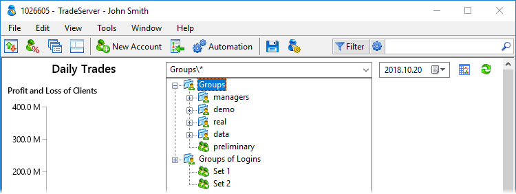

[🏠 Document Start](../README.md) / [Report API](README.md) / Request for Reports

[Previous](Configuration-of-Reports.md) | [Next](Requirements-for-Modules.md)

# Request for Reports (#request-for-reports)

Reports are requested from the Manager terminal. When a manager requests a report, the corresponding command is sent to the trading server. The trading server generates a report and sends it to the Manager terminal where it is displayed as a table, HTML page or dashboard.

> The reports are generated in accordance with the permissions granted to the [manager account](../Configuration-Interfaces/Managers/IMTConManager.md). It is not possible to request a report on accounts, symbols, clients or trading operations if the manager account does not have the necessary access permissions.

Using the context menu commands, you can save the report in CSV, Open XML, MHT or HTML file. Diagram settings are available in the context menu for dashboard reports:

  * Title — show/hide the chart title.
  * Legend — show/hide the chart legend.
  * Details — show/hide the chart details.
  * Color — switch color. The option is used for charts displaying information about an entity.
  * Type — switch the chart view: Bar chart, Line chart, Area chart, Donut chart, value (shows the total variable value).
  * Stacking — switch chart stacking type. Used for charts, which compare several entities and their contribution to the overall value. For example, you may distribute positions by symbols and market sentiment. Available options:

  * None — data series are displayed separately
  * With negative values — data series are combined, values are not summed up
  * Regular — data series are combined, values are summed up
  * 100% — rows are combined, the general contribution of each series to the total value in percentage is shown

## Requesting a Report (#request)

A report is requested from the server automatically when you select it from the list or change its parameters. To force a report refresh, click the  button in the upper right corner.

Reports may have settings: filters by groups, dates and symbols. They can be changed in the upper right corner of the section.

The availability of the settings depends on the specific report.

  * Groups — group of users, on which the report is generated. When making a request, you may specify:

  * One of the trading groups or subgroups, for example, "demo\*.
  * User logins are comma-separated, for example "10011, 10012, 10015".
  * Create or use a previously saved [custom set of accounts](Request-for-Reports.md).

  * Symbols — symbol, for which the report will be generated (for example, report on operation on a certain symbol). Possibility to filter by symbols depends on the report type.
  * Period — custom period for report generation (for example, report on trading operations for the last week). Dates can be specified both manually and using a calendar that is opened when you press . Using the  allows to select one of predefined time periods to generate a report for.
  * / — switch between report types: regular and dashboard. Depending on the implementation of the report by its developer, it can support both types or only one of them.

