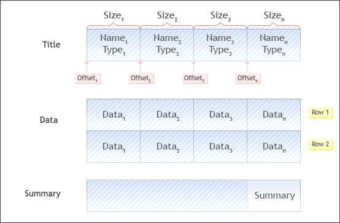

[🏠 Document Start](../README.md) / [Report API](README.md) / Tabular Reports

[Previous](Creating-a-Simple-Report.md) | [Next](HTML-Reports.md)

# Tabular Reports (#tabular-reports)

Tabular reports are transferred to the MetaTrader 5 Manager terminal as the binary data structured in a certain way. Such a table consists of three basic elements:

  * Header — names of the table columns. During a header formation the size (in bytes) and the type of each table column are specified. According to this parameters the data will be formed;
  * Data — the data is described by separate lines divided into fields according to the types and sizes of the columns specified in the header.
  * Summary — a cell displaying any table column result.

> The total size of a generated tabular report must not exceed 4GB.

## Tabular report creation example (#tabular-report-creation-example)

Generate a simple tabular report that will display clients names and their leverage sizes using the previously [created report example](Creating-a-Simple-Report.md). Generation process can be divided into the following steps:

  * [Report description (#description)](Tabular-Reports.md#description)
  * [Table record description (#table-record)](Tabular-Reports.md#table-record)
  * [Report generation and output (#implementation)](Tabular-Reports.md#implementation)

### Report description (#description)

Before the start of a request implementation and data output we must return to the reports type and its parameters described in the [MTReportInfo (#mtreportinfo)](Creating-a-Simple-Report.md#mtreportinfo) structure.
    
    
    //+------------------------------------------------------------------+
    //| Module description structure                                     |
    //+------------------------------------------------------------------+
    const MTReportInfo CMyTableReport::s_info=
      {
       100,
       MTReportAPIVersion,
       MTReportInfo::IE_VERSION_ANY,
       L"My Table Report",
       L"Copyright 2001-2011, MetaQuotes Software Corp.",
       L"MetaTrader 5 Report API plug-in",
       0,
       MTReportInfo::TYPE_TABLE,
         { 0 },
         {              // Parameters
          { MTReportParam::TYPE_GROUPS, MTAPI_PARAM_GROUPS, L"*" },
         },1            // Number of parameters
      };
    //+------------------------------------------------------------------+

The key parameters here are:

  * MTReportInfo::TYPE_TABLE — [report tabular type (#entypes)](../Structures/MTReportInfo.md#entypes);
  * { MTReportParam::TYPE_GROUPS, MTAPI_PARAM_GROUPS, L"*" } — [external parameters](../Structures/MTReportParam.md) of a report generation (type, name and value by default) that are set during a report request in MetaTrader 5 Manager. A list of the groups, from which the clients will be requested, may be set for that report. All groups is a default value (the symbol "*" is indicated);
  * 1 — number of parameters.

> The [MTAPI_PARAM_GROUPS (#parameters)](../Structures/MTReportParam.md#parameters) macros is used as the parameter name. This macros inserts a name of a field where the groups in the manager terminal are selected.

### Table record description (#table-record)

Also, the structure of a tabular report record that will be created must be described before the generation process starts. Name the structure "TableRecord and add its description into the MyTableReport.h file to the [CMyTableReport (#implementation)](Creating-a-Simple-Report.md#implementation) class private part:
    
    
    class CMyTableReport : public IMTReportContext
      {
    private:
       static const MTReportInfo s_info;            // Report data
       //--- table record
       #pragma pack(push,1)
       struct TableRecord
         {
          wchar_t        name[32];
          UINT           leverage;
         };
       #pragma pack(pop)     
    //--- ...
      };
    //+------------------------------------------------------------------+

### Report generation and output process (#implementation)

Report generation and output are performed in the [CMyTableReport::Generate (#generate)](Creating-a-Simple-Report.md#generate) method.
    
    
    //+------------------------------------------------------------------+
    //| Report generation method                                         |
    //+------------------------------------------------------------------+
    MTAPIRES CMyTableReport::Generate(const UINT type,IMTReportAPI *api)
      {
       IMTDatasetColumn *column=NULL;
       IMTUser          *user=NULL;
       UINT64           *logins=NULL;
       UINT              logins_total=0;
       MTAPIRES          res;
    //--- Checking for a pointer
       if(!api) 
         return(MT_RET_ERR_PARAMS);
    //--- Checking the type of a requested report
       if(type!=MTReportInfo::TYPE_TABLE) 
          return(MT_RET_ERR_PARAMS);
    //--- creating a column object
       if((column=api->TableColumnCreate())==NULL)
         {
          return(MT_RET_ERR_MEM);
         }
    //--- Preparing the first column
       column->Clear();
       column->Name(L"Name");
       column->ColumnID(1);
       column->Offset(offsetof(TableRecord,name));
       column->Type(IMTDatasetColumn::TYPE_STRING);
       column->Size(MtFieldSize(TableRecord,name));
       if((res=api->TableColumnAdd(column))!=MT_RET_OK)
         {
          column->Release();
          return(res);
         }
    //--- preparing the second column
       column->Clear();
       column->Name(L"Leverage");
       column->ColumnID(2);
       column->Offset(offsetof(TableRecord,leverage));
       column->Type(IMTDatasetColumn::TYPE_UINT32);
    //---
       if((res=api->TableColumnAdd(column))!=MT_RET_OK)
         {
          column->Release();
          return(res);
         }
    //---
       column->Release();     
    //--- Get the list of users
       if((res=api->ParamLogins(logins,logins_total))!=MT_RET_OK)
          return(res);
    //--- Check whether the data has been received?
       if(logins && logins_total)
         {
          //--- Create an object of a client record
          if((user=api->UserCreate())==NULL)
            {
             api->Free(logins);
             return(MT_RET_ERR_MEM);
            }
          //--- Table generation
          for(UINT i=0;i<logins_total;i++)
            {
             //---
             if(api->UserGet(logins[i],user)!=MT_RET_OK) continue;
             //---
             TableRecord record={0};
             //---
             CMTStr::Copy(record.name,user->Name());
             record.leverage=user->Leverage();
             //---
             if((res=api->TableRowWrite(&record,sizeof(record)))!=MT_RET_OK)
               {
                api->Free(logins);
                user->Release();
                return(res);
               }
            }
          //--- Release of the logins list
          api->Free(logins);
          //---
          user->Release();     
         }
    //--- Successful
       return(MT_RET_OK);   
      }
    //+------------------------------------------------------------------+

Now, let's thoroughly examine this example by dividing it into blocks:

  * [Variables (#variables)](Tabular-Reports.md#variables)
  * [Checks (#checks)](Tabular-Reports.md#checks)
  * [A column object creation (#column-create)](Tabular-Reports.md#column-create)
  * [Preparing the first column (#first-column)](Tabular-Reports.md#first-column)
  * [Preparing the second column (#second-column)](Tabular-Reports.md#second-column)
  * [Get the list of users (#list)](Tabular-Reports.md#list)
  * [Report generation (#generation)](Tabular-Reports.md#generation)

Variables

Essential variables are declared at first:
    
    
    IMTDatasetColumn *column=NULL;
       IMTUser          *user=NULL;
       UINT64           *logins=NULL;
       UINT              logins_total=0;
       MTAPIRES          res;

It is recommended to null all variables during the declaration.

Checks
    
    
    //--- Checking for a pointer
       if(!api) 
         return(MT_RET_ERR_PARAMS);
    //--- Checking the type of a requested report
       if(type!=MTReportInfo::TYPE_TABLE) 
          return(MT_RET_ERR_PARAMS);

Checking the pointer validity at the [IMTReportAPI](Main-Interface-of-Reports.md) and also verification of the requested report type (transferred by the type parameter into the CMyTableReport::Generate function) are performed in this block.

A column object creation
    
    
    //--- creating a column object
       if((column=api->TableColumnCreate())==NULL)
         {
          return(MT_RET_ERR_MEM);
         }

The [TableColumnCreate](Main-Interface-of-Reports/Tabular-Reports/Columns/TableColumnCreate.md) method of the IMTReportAPI interface is used for a column object creation.

Preparing the first column

The first column will contain user names. The column preparation practically means specifying a cell with its header.
    
    
    //--- Preparing the first column
       column->Clear();
       column->Name(L"Name");
       column->ColumnID(1);
       column->Offset(offsetof(TableRecord,name));
       column->Type(IMTDatasetColumn::TYPE_STRING);
       column->Size(MtFieldSize(TableRecord,name));
       if((res=api->TableColumnAdd(column))!=MT_RET_OK)
         {
          column->Release();
          return(res);
         }

Procedure:

  * The column is cleared using the [IMTDatasetColumn::Clear](Dataset-Interfaces/IMTDatasetColumn/Clear.md) method;
  * The "Name" is assigned to the column using the [IMTDatasetColumn::Name](Dataset-Interfaces/IMTDatasetColumn/Name.md) method;
  * ID "1" is assigned to the column using the [IMTDatasetColumn::ColumnID](Dataset-Interfaces/IMTDatasetColumn/ColumnID.md) method;
  * A shift in bytes is assigned to the column using the [IMTDatasetColumn::Offset](Dataset-Interfaces/IMTDatasetColumn/Offset.md) method. "Offsetof" macros is used in the example to avoid calculation of a shift for each column (calculated as previous columns size). The stddef.h file must be included into the project to use the macros. The name of a field from the previously described table record structure ([TableRecord (#table-record)](Tabular-Reports.md#table-record)) is transferred to the macros.
  * "String" type is assigned to the column using the [IMTDatasetColumn::Type](Dataset-Interfaces/IMTDatasetColumn/Type.md) method;
  * A size in bytes is assigned to the column using the [IMTDatasetColumn::Size](Dataset-Interfaces/IMTDatasetColumn/Size.md) method. The MtFieldSize macros is used to simplify the defining a column size. The name of a field from the previously described table record structure (TableRecord) is also transferred to the macros. This macros is not standard. Its realization must be added to the stdafx.h file.
  * The generated column is then added to the IMTReportAPI object copy with the help of the [IMTReportAPI::TableColumnAdd](Main-Interface-of-Reports/Tabular-Reports/Columns/TableColumnAdd.md) method.
  * In case of an adding error, the column object must be necessarily freed by using the Release method ([IMTDatasetColumn::Release](Dataset-Interfaces/IMTDatasetColumn/Release.md)).

MtFieldSize macros realization:
    
    
    //+------------------------------------------------------------------+
    //| Macros for a size calculation                                    |
    //+------------------------------------------------------------------+
    #define MtFieldSize(type,member) (sizeof(((type*)(0))->member))
    //+------------------------------------------------------------------+

Preparing the second column

The column for a leverage size recording must be prepared similar to the previous column:
    
    
    //--- preparing the second column
       column->Clear();
       column->Name(L"Leverage");
       column->ColumnID(2);
       column->Offset(offsetof(TableRecord,leverage));
       column->Type(IMTDatasetColumn::TYPE_UINT32);
    //---
       if((res=api->TableColumnAdd(column))!=MT_RET_OK)
         {
          column->Release();
          return(res);
         }
    //---
       column->Release();

In all cases except strings data size is specified by its type ([IMTDatasetColumn::EnType (#entype)](Dataset-Interfaces/IMTDatasetColumn/Enumerations.md#entype)). Therefore, the [IMTDatasetColumn::Size](Dataset-Interfaces/IMTDatasetColumn/Size.md) method is not called during the second column preparation.

The column object must be freed by calling the Release method ([IMTDatasetColumn::Release](Dataset-Interfaces/IMTDatasetColumn/Release.md)) after the second column preparation is finished.

Get the list of users
    
    
    //--- Get the list of users
       if((res=api->ParamLogins(logins,logins_total))!=MT_RET_OK)
          return(res);

The [IMTReportAPI::ParamLogins](Main-Interface-of-Reports/Report-Parameters/ParamLogins.md) method is used to get the list of users. To make the method work, the [report description (#description)](Tabular-Reports.md#description) contains the [MTReportParam::TYPE_GROUPS](../Structures/MTReportParam.md) parameter that has been turned on.

Report generation

After a user list is received the name and the leverage must be requested for each of them in the loop.
    
    
    //--- check whether the data has been received
       if(logins && logins_total)
         {
          //--- Create an object of a client record
          if((user=api->UserCreate())==NULL)
            {
             api->Free(logins);
             return(MT_RET_ERR_MEM);
            }
          //--- Table generation
          for(UINT i=0;i<logins_total;i++)
            {
             //---
             if(api->UserGet(logins[i],user)!=MT_RET_OK) continue;
             //---
             TableRecord record={0};
             //---
             CMTStr::Copy(record.name,user->Name());
             record.leverage=user->Leverage();
             //---
             if((res=api->TableRowWrite(&record,sizeof(record)))!=MT_RET_OK)
               {
                api->Free(logins);
                user->Release();
                return(res);
               }
            }
          //--- Release of the logins list
          api->Free(logins);
          //---
          user->Release();     
         }
    //--- Successful
       return(MT_RET_OK);   
      }
    //+------------------------------------------------------------------+

Procedure:

  * Whether the list of logins is received is checked in the if statement.
  * A client record object is then created by using the [IMTReportAPI::UserCreate](Main-Interface-of-Reports/Users/UserCreate.md) method. In case of a creation error, received list of logins is freed by using the [IMTReportAPI::Free](Main-Interface-of-Reports/Common-Functions/Free.md) method.
  * Client records (IMTUser) for each of the received logins are requested in the for loop using the [IMTReportAPI::UserGet](Main-Interface-of-Reports/Users/UserGet.md) method.
  * Record table record structure ([TableRecord (#table-record)](Tabular-Reports.md#table-record)) sets to zero.
  * A name from a client record is copied to an appropriate record structure field using the auxiliary CMTStr::Copy method.
  * A leverage value is copied from a client record to an appropriate record structure field.
  * Received row is assigned to the api report object using the [IMTReportAPI::TableRowWrite](Main-Interface-of-Reports/Tabular-Reports/Rows/TableRowWrite.md) method. In case of a record error, received list of logins is freed by using the [IMTReportAPI::Free](Main-Interface-of-Reports/Common-Functions/Free.md) method.
  * After the report generation is complete the previously received array of logins is freed using the [IMTReportAPI::Free](Main-Interface-of-Reports/Common-Functions/Free.md) method.
  * The client record object is freed by the Release method ([IMTUser::Release](../Database-Interfaces/Users/IMTUser/Release.md)).
  * [MT_RET_OK](../Return-Codes/Successful-completion.md) operation successful accomplishment code is returned at the end of the report generation.

