[🏠 Document Start](../README.md) / [Server API](README.md) / Creating a Simple Plugin

[Previous](Requirements-for-Plugins.md) | [Next](Hooks.md)

# Creating a Simple Plugin (#creating-a-simple-plugin)

The plugin of the server API MetaTrader 5 is a normal dynamic link library (DLL). The library can be 32-bit and 64-bit, depending on the bit characteristics of the server it is developed for.

Preparation for the plugin creation includes several stages:

  * [Creating a project in Microsoft Visual Studio (#new-project)](Creating-a-Simple-Plugin.md#new-project)
  * [Project setup (#settings)](Creating-a-Simple-Plugin.md#settings)
  * [Specifying the information on the project (#info)](Creating-a-Simple-Plugin.md#info)
  * [Adding Server API to the Project (#include)](Creating-a-Simple-Plugin.md#include)
  * [Entry Points (#entry)](Creating-a-Simple-Plugin.md#entry)
  * [Interfaces (#interface)](Creating-a-Simple-Plugin.md#interface)
  * [Event Handling (#events)](Creating-a-Simple-Plugin.md#events)

## Creating a project in Microsoft Visual Studio (#new-project)

The first step towards creating a plugin is to create a project in Microsoft Visual Studio. To do this, click New from the File menu:

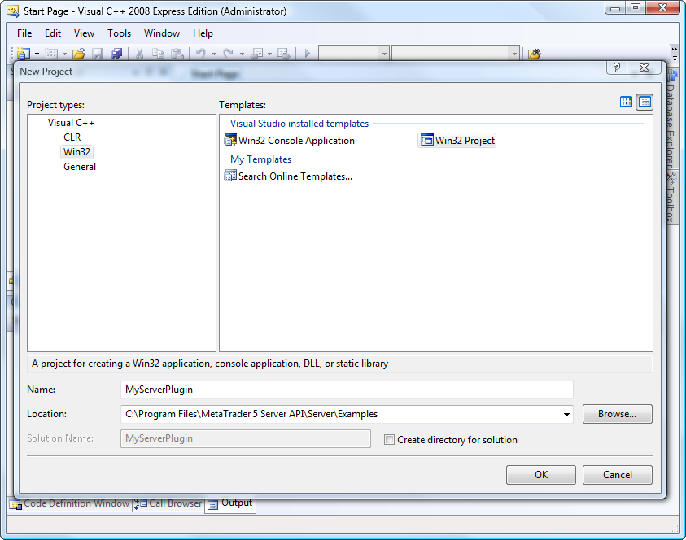

The main parameters that you need to enter in the new project creation dialog:

  * Project types: Visual C++\Win32;
  * Name: name of the plugin (in our example MyServerPlugin);
  * Location: directory where the project will be created. A project should be created close to the MetaTrader 5 Server API installation place, since later you will need to include its files in the project.

After you click OK, Application Wizard will open:

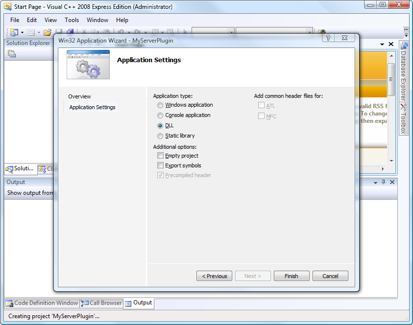

In the Wizard, go to the "Application Settings" tab. In this type, select "DLL" as the Application type. After you click "Finish", the project will be generated.

## Project setup (#settings)

Before you begin to develop the plugin, you must configure the project. To do this, click Properties in the Project menu.

> The project is set up for version Release, Active (Win32).

### General (#general)

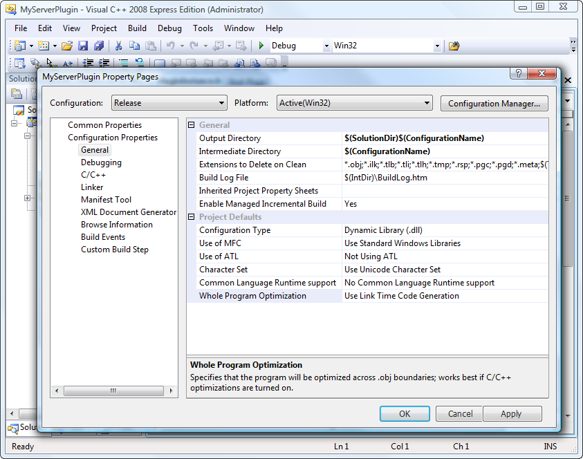

The following key settings must be specified in the "General" section:

  * Character Set: Use Unicode Character Set. The Unicode symbols set must be selected, as MetaTrader 5 servers support only such projects.
  * Whole Program Optimization: Use Link Time Code Generation. This option should be used to speed up the application.

### C/C++ (#cc)

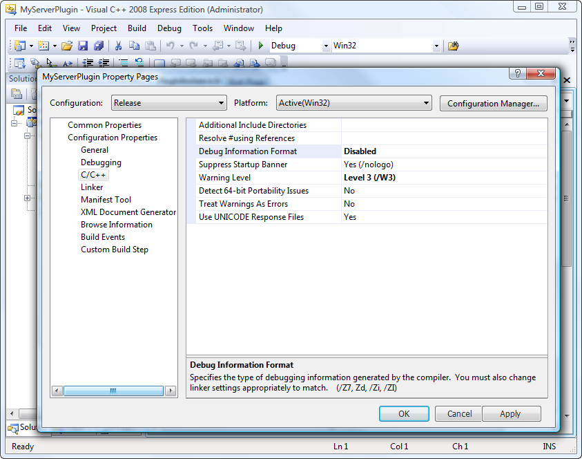

The following key settings must be specified in the "C/C++" section:

  * Debug Information Format: Disabled. Debugging data must be turned off, as the Release-project is being configured.

### C/C++ | Optimization (#cc-optimization)

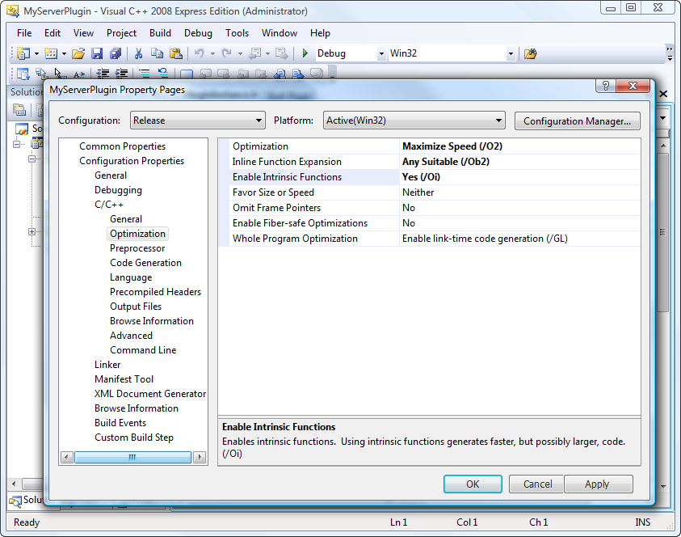

The following key settings must be specified in the "Optimization" subsection of the "C/C++" section:

  * Optimization: Maximum Speed (/O2). Install this option to speed up the application.
  * Inline Function Expansion: Any Suitable (/Ob2). Install this option to speed up the application.
  * Enable Intrinsic Functions: Yes (/Oi). Install this option to speed up the application.

### C/C++ | Code Generation (#cc-code-generation)

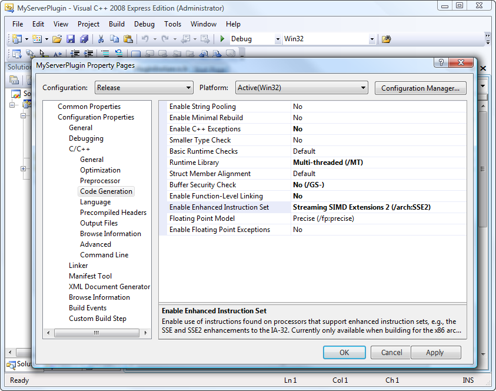

The following settings must be specified in the "Code Generation" subsection of the "C/C++" section:

  * Enable C++ Exceptions: No. It is recommended to disable exceptions, to prevent the appearance of unhandled exceptions that lead to crash of the trading server.
  * Runtime Library: Multi-threaded (/MT). To avoid problems, connected with different version of the CRT library (Common Runtime Library) or its absence, it is recommended to use the static linking of CRT - /MT. When debugging, use the Multi-threaded Debug (/MTd) parameter.
  * Buffer Security Check: No (/GS-). This option must be turned off to speed up the application.
  * Enable Function-Level Linking: No. This option must be turned off to speed up the application.
  * Enable Enhanced Instruction Set: Streaming SIMD Extension 2 (/arch:SSE2). SSE2 instructions set must be turned on to considerably speed up the application. This instructions set is supported by the most of the modern CPUs.

### C/C++ | Language (#cc-language)

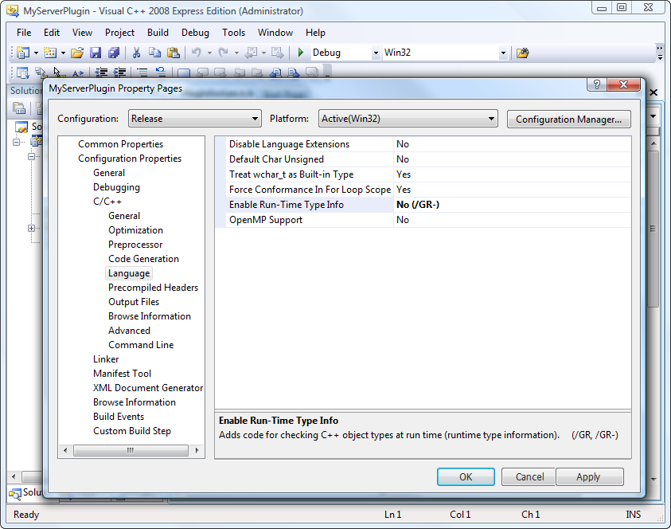

The following key settings must be specified in the "Language" subsection of the "C/C++" section:

  * Enable Run-Time Type Info: No (/GR-). This option must be turned off, as in most cases runtime type identification (RTTI) is not used. RTTI support may slow down the program code execution.

### Linker | Debugging (#linker-debugging)

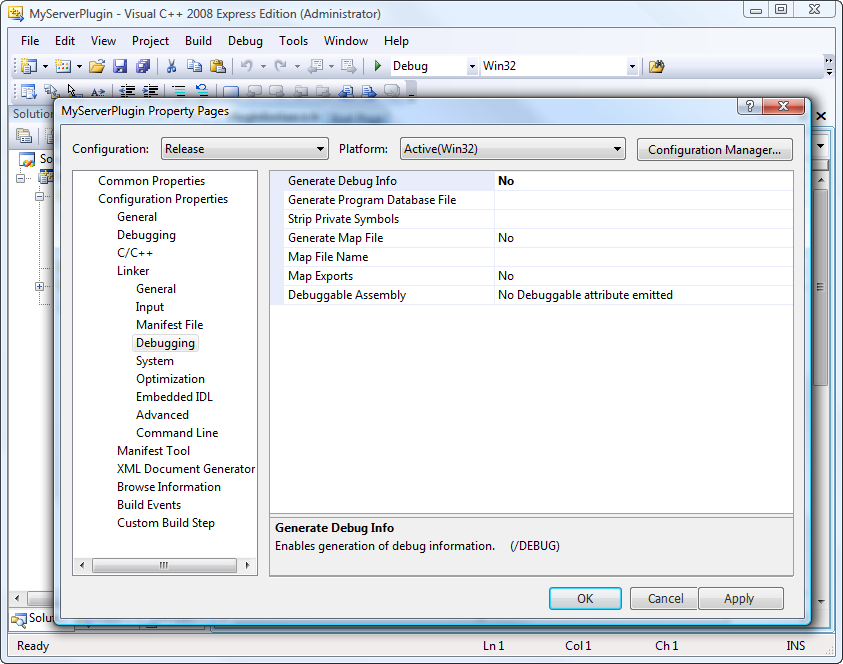

The following key settings must be specified in the "Debugging" subsection of the "Linker" section:

  * Generate Debug Info: No. Debugging data generation must be turned off, as the Release version is being configured.

### Additional options for creating 64-bit plugins (#additional-options-for-creating-64-bit-plugins)

If in addition to 32-bit version you are going to developed also a 64-bit plugin, you need to make additional configuration of the project. For this purpose, run Configuration Manager in the Build menu.

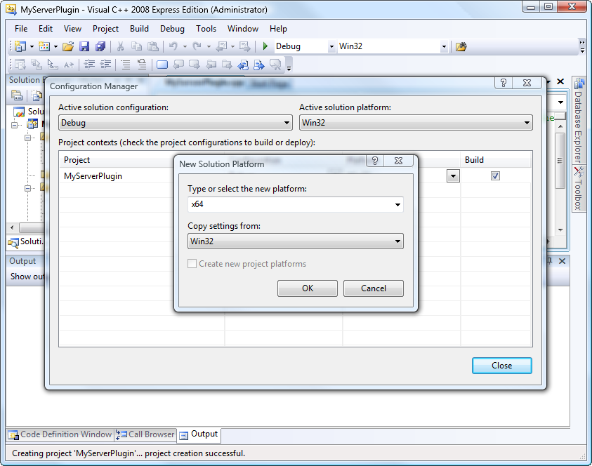

In the window that appears, do the following:

  * In the "Active solution platform" field choose <New> .
  * In the resulting window, select x64 in the "Type or select the new platform" field, as shown above.
  * Press the OK button.

## Specifying the information on the project (#info)

For you convenience, and for convenience of future users of the plugin, it is recommended to specify a detailed information about the plugin in the project. To achieve this create the resource file using the "Add Resource" command in the "Project" menu. "Version" must be specified as the created resource type. After the "New" command execution the file will be opened where the information on a plugin and its developer must be specified.

## Adding Server API to the Project (#include)

To work with the server API, you need to include its header file [MT5ServerAPI.h (#include)](../Getting-Started/Files-and-Folders.md#include) in the project.

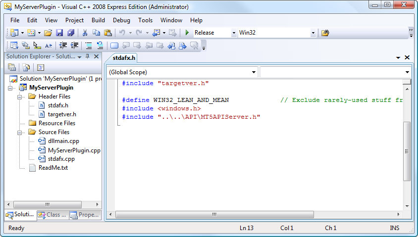

To do this, in the file stdafx.h of the project, set a relative path to it in the #include directive. In the example shown in the figure, the path "..\\..\API\MT5APIServer.h" means that to find the header file, it is necessary to go two levels up and go to the API folder.

## Entry Points (#entry)

The server plugin DLL must have two entry points (exported functions):

  * [MTServerAbout (#mtserverabout)](Creating-a-Simple-Plugin.md#mtserverabout)
  * [MTServerCreate (#mtservercreate)](Creating-a-Simple-Plugin.md#mtservercreate)

### MTServerAbout (#mtserverabout)

Point [MTServerAbout](Entry-Points/MTServerAbout.md) provides the initial information about the plugin to the server. It should be added to the file dllmain.cpp:

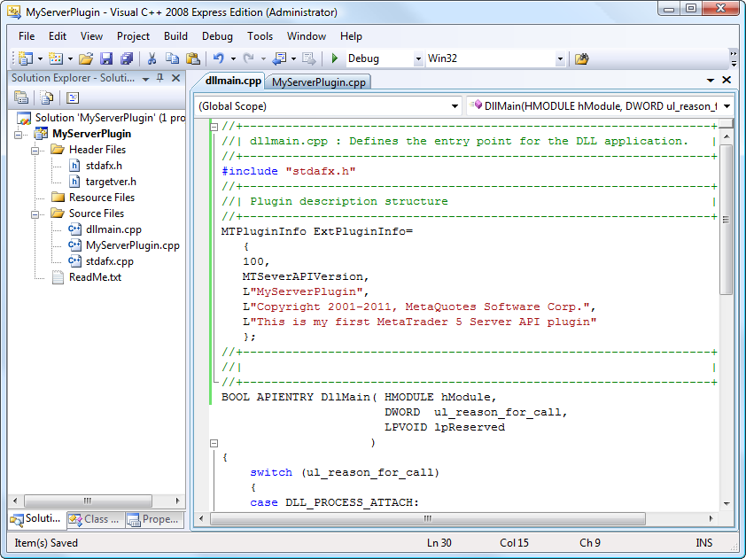

Add a global structure of [MTPluginInfo](../Structures/MTPluginInfo.md) type named ExtPluginInfo, which describes the plugin:
    
    
    MTPluginInfo ExtPluginInfo=
       {
       100,
       MTServerAPIVersion,
       L"MyServerPlugin",
       L"Copyright 2001-2011, MetaQuotes Software Corp.",
       L"This is my first MetaTrader 5 Server API plugin"
       };

This structure will be passed from the [MTServerAbout](Entry-Points/MTServerAbout.md) function.

Then in dllmain.cpp implement the entry point [MTServerAbout](Entry-Points/MTServerAbout.md). he indication that the function is an entry point, is the internal macro MTAPIEntry: 
    
    
    MTAPIENTRY MTAPIRES MTServerAbout (MTPluginInfo& info)
       {
       info=ExtPluginInfo;
       return(MT_RET_OK);
       }

In this function, fill in the plugin description using the newly created structure. Information is written in variable info.

### MTServerCreate (#mtservercreate)

Create an empty entry point [MTServerCreate](Entry-Points/MTServerCreate.md) like the previous one:
    
    
    //+------------------------------------------------------------------+
    //|                                                                  |
    //+------------------------------------------------------------------+
    MTAPIENTRY MTAPIRES  MTServerCreate(UINT apiversion,IMTServerPlugin** plugin)
      {
      }
    //+------------------------------------------------------------------+

Next, in the [MTServerCreate](Entry-Points/MTServerCreate.md) method, we need to create a server API class object that implements the [IMTServerPlugin](Plugin-Interface/Release.md) interface. Description of this process is available in the next section — ["Interfaces" (#interface)](Creating-a-Simple-Plugin.md#interface).

## Interfaces (#interface)

Interface is a set of ready-made classes, functions, structures and constants provided in the application (in this case by the MetaTrader 5 server) for use in external software (plugins). Interaction of a plugin with a server is carried out through special interfaces of server API.

  * In MetaTrader 5 Server API, to obtain copies of data stored in the database, you must first create an instance of the corresponding object. For this purpose, the Create methods of the server API are used.
  * All created objects must be released by explicit call of their Release method.

  
---  
  
In this section:

  * [Creating a class (#class-create)](Creating-a-Simple-Plugin.md#class-create) for the implementation of the plugin interface [IMTServerPlugin](Plugin-Interface.md);
  * [Class implementation (#class-implement)](Creating-a-Simple-Plugin.md#class-implement);
  * [How to work with interfaces (#interface-example)](Creating-a-Simple-Plugin.md#interface-example).

### Creating a Class (#class-create)

Create a class that implements the plugin interface [IMTServerPlugin](Plugin-Interface.md). Add a C++ class using the command "Add Class" in the "Project" menu:

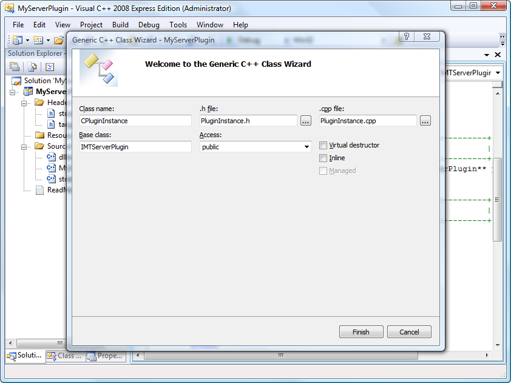

Specify the following parameters of the class in the class creation wizard:

  * Class name: CPluginInstance;
  * .h file: PluginInstance.h;
  * .cpp: PluginInstance.cpp;
  * Base class: IMTServerPlugin;
  * Access: public.

The key point here is to specify the base class [IMTServerPlugin](Plugin-Interface.md).

### Class Implementation (#class-implement)

The CPluginInstance class must implement at least three virtual methods:

  * [Release](Plugin-Interface/Release.md)  
This method is called by the Server API to remove the plugin object. Respectively, inside the method call, the plugin should remove itself.
  * [Start](Plugin-Interface/Start.md)  
The Start method notifies the plugin on getting started and passes as a parameter the interface of Server API.
  * [Stop](Plugin-Interface/Stop.md)  
When you call the Stop method, the plugin should deinitialize, release all the resources it occupied and clear the pointer to the server API. In other words, the plugin should be ready to the call of the Release method.

Add the following code in the header file PluginInstance.h:
    
    
    //+------------------------------------------------------------------+
    //|                                                                  |
    //+------------------------------------------------------------------+
    #pragma once
    #include "..\..\API\MT5APIServer.h"
    //+------------------------------------------------------------------+
    //| Plugin implementation                                            |
    //+------------------------------------------------------------------+
    class CPluginInstance : public IMTServerPlugin
      {
    private:
       IMTServerAPI*     m_api;  
    public:
                         CPluginInstance(void);
                        ~CPluginInstance(void);
       //--- IMTServerPlugin methods
       virtual void      Release(void);
       virtual MTAPIRES  Start(IMTServerAPI* server);
       virtual MTAPIRES  Stop(void);
      };
    //+------------------------------------------------------------------+

As seen in the above listing, in addition to virtual classes, we have created a private class member m_api in order to keep a pointer to the interface of the server API.

Immediate implementation of methods Release, Start and Stop is performed in the file PluginInstance.cpp:
    
    
    //+------------------------------------------------------------------+
    //|                                                                  |
    //+------------------------------------------------------------------+
    #include "StdAfx.h"
    #include "PluginInstance.h"
    //+------------------------------------------------------------------+
    //|                                                                  |
    //+------------------------------------------------------------------+
    CPluginInstance::CPluginInstance(void) : m_api(NULL)
      {
      }
    //+------------------------------------------------------------------+
    //|                                                                  |
    //+------------------------------------------------------------------+
    CPluginInstance::~CPluginInstance(void)
      {
      }
    //+------------------------------------------------------------------+
    //| Plugin release                                                   |
    //+------------------------------------------------------------------+
    void CPluginInstance::Release(void)
      {
       delete this;
      }
    //+------------------------------------------------------------------+
    //| Plugin start                                                     |
    //+------------------------------------------------------------------+
    MTAPIRES CPluginInstance::Start(IMTServerAPI* api)
      {
    //--- check pointer
       if(!api) 
         return(MT_RET_ERR_PARAMS);
    //--- save pointer to Server API interface
       m_api=api;
    //--- additional initialization
    //--- ...
    //--- ok
       return(MT_RET_OK);   
      }
    //+------------------------------------------------------------------+
    //|                                                                  |
    //+------------------------------------------------------------------+
    MTAPIRES CPluginInstance::Stop(void)
      {
    //--- deinitialize plugin
    //--- ...
    //--- clear Server API pointer
       m_api=NULL;
    //--- ok
       return(MT_RET_OK);   
      }
    //+------------------------------------------------------------------+

Now let us explain some of the points of the code above:

  * Implementation of the Release method is simple, there is only deleting of an object using delete this.
  * In the Start method we receive a pointer to the server API and save it in m_api. After that further initialization can be performed;
  * In the Stop method, the pointer to the server API is deinitialized and nulled.

Now we need to go back to the method [MTServerCreate](Entry-Points/MTServerCreate.md) and implement the following actions:

  * Check the parameters (passed pointer);
  * Create an object of the plugin.

To do this, write the following code inside [MTServerCreate](Entry-Points/MTServerCreate.md):
    
    
    //+------------------------------------------------------------------+
    //|                                                                  |
    //+------------------------------------------------------------------+
    MTAPIENTRY MTAPIRES  MTServerCreate(UINT apiversion,IMTServerPlugin** plugin)
      {
    //--- check parameters
       if(!plugin) return(MT_RET_ERR_PARAMS);
    //--- create plugin object
       if(((*plugin)=new CPluginInstance())==NULL)
          return(MT_RET_ERR_MEM);
    //--- ok
       return(MT_RET_OK);
      }
    //+------------------------------------------------------------------+

In dllmain.cpp we also need to include the header file PluginInstance.h:
    
    
    #include "PluginInstance.h"

To this point, the plugin has been already created, but it does not have any functionality.

### An example of working with the interface (#interface-example)

As an example, let's analyze the reception of the current plugin configuration. Supplement the Start method in PluginInstance.cpp the following way:

MTAPIRES CPluginInstance::Start(IMTServerAPI* api)  
{  
IMTConPlugin* config;  
//--- check pointer  
if(!api)   
return(MT_RET_ERR_PARAMS);  
//--- save pointer to Server API interface  
m_api=api;  
//--- create plugin config instance  
if((config=m_api->PluginCreate())==NULL)  
return(MT_RET_ERR_MEM);  
//--- receive current plugin config  
if((m_api->PluginCurrent(config))!=MT_RET_OK)  
{  
config->Release();  
return(MT_RET_ERROR);  
}  
//--- say "hello world!" in server journal  
m_api->LoggerOut(MTLogOK,L"Hello world from %s!",config->Name());  
//--- free plugin config  
config->Release();  
//--- ok  
return(MT_RET_OK);   
}  
//+------------------------------------------------------------------+  
---  
  
Explanation to the code:

  * In the beginning, we have added variable config, to which later the current plugin configuration will be passed;
  * Next, we've created an instance of the plugin configuration (config) using the [PluginCreate](Main-API-Interface/Configuration-Databases/Plugins/PluginCreate.md) function;
  * The next step, we've recorded the current configuration of the plugin in the created instance config using the [PluginCurrent](Main-API-Interface/Configuration-Databases/Plugins/PluginCurrent.md) function;
  * In case of successful receipt of a configuration, in the server a messages appears of type [MTLogOk (#enmtlogcode)](../Journal-Constants/README.md#enmtlogcode) containing the "Hello world!" sentence and the object name. The [LoggerOut](Main-API-Interface/Common-Functions/LoggerOut.md) function is used for writing messages into the log.
  * The last step is the deletion of the object config using the Release method.

It should be noted that check for successful implementation is performed for virtually every operation. In case of failure, the corresponding [code](../Return-Codes/README.md) is returned.

Thus, we have learned to create plugins and work with interfaces.

## Event Handling (#events)

MetaTrader 5 Server API allows to handle various events appearing on the platform servers (in databases and configurations), and respond to them one way or another.

> A plugin starts processing of events only after the [IMTServerPlugin::Start](Plugin-Interface/Start.md) method is executed.

For example, consider processing of events of orders (adding, editing and deleting).

### Interface Implementation (#interface-implementation)

To work with the above events, you must have your own implementation of the interface for processing order events. To do this, inherit CPluginInstance from [IMTOrderSink](../Database-Interfaces/Trade/Orders/IMTOrderSink.md) and add the necessary methods to the PluginInstance.h file:
    
    
    //+------------------------------------------------------------------+
    //|                                                                  |
    //+------------------------------------------------------------------+
    #pragma once
    #include "..\..\API\MT5APIServer.h"
    //+------------------------------------------------------------------+
    //| Plugin implementation                                            |
    //+------------------------------------------------------------------+
    class CPluginInstance : public IMTServerPlugin,
                            public IMTOrderSink
      {
    private:
       IMTServerAPI*     m_api;  
    public:
                         CPluginInstance(void);
                        ~CPluginInstance(void);
       //--- IMTServerPlugin methods
       virtual void      Release(void);
       virtual MTAPIRES  Start(IMTServerAPI* server);
       virtual MTAPIRES  Stop(void);
       //--- open orders events
       virtual void      OnOrderAdd(const IMTOrder*    order);
       virtual void      OnOrderUpdate(const IMTOrder* order);
       virtual void      OnOrderDelete(const IMTOrder* order);
      };
    //+------------------------------------------------------------------+

It should be noted that it is not necessary to implement all methods of the Sink-interface. You can use only those that you need. In this case, of the seven available methods of the [IMTOrderSink](../Database-Interfaces/Trade/Orders/IMTOrderSink.md) interface, we used only three ([OnOrderAdd](../Database-Interfaces/Trade/Orders/IMTOrderSink/OnOrderAdd.md), [OnOrderUpdate](../Database-Interfaces/Trade/Orders/IMTOrderSink/OnOrderUpdate.md) and [OnOrderDelete](../Database-Interfaces/Trade/Orders/IMTOrderSink/OnOrderDelete.md)).

### Implementation of Methods (#implementation-of-methods)

The next step is to implement the above three methods in the file PluginInstance.cpp. For this purpose, the following code is added in it:
    
    
    //+------------------------------------------------------------------+
    //| Processing of adding a new order                                 |
    //+------------------------------------------------------------------+
    void CPluginInstance::OnOrderAdd(const IMTOrder* order)
      {
       MTAPISTR descr;
    //--- check
       if(!order) return;
    //--- print order description
       m_api->LoggerOut(MTLogOK,L"new order %s added",order->Print(descr));
      }
    //+------------------------------------------------------------------+
    //| Processing of updating an order                                  |
    //+------------------------------------------------------------------+
    void CPluginInstance::OnOrderUpdate(const IMTOrder* order)
      {
       MTAPISTR descr;
    //--- check
       if(!order) return;
    //--- print order description
       m_api->LoggerOut(MTLogOK,L"order %s updated",order->Print(descr));
      }
    //+------------------------------------------------------------------+
    //| Processing of deleting an order                                  |
    //+------------------------------------------------------------------+
    void CPluginInstance::OnOrderDelete(const IMTOrder* order)
      {
       MTAPISTR descr;
    //--- check
       if(!order) return;
    //--- print order description
       m_api->LoggerOut(MTLogOK,L"order %s deleted",order->Print(descr));
      } 
    //+------------------------------------------------------------------+

Let's consider the implementation of the methods in details:

  * To get the order description, the descr variable of type [MTAPISTR (#mtapistr)](../Internal-Data-Types/README.md#mtapistr) is added;
  * Then the pointer to the order object is checked;
  * Next, using the [LoggerOut](Main-API-Interface/Common-Functions/LoggerOut.md) function, in the log an entry is added, with the order description and description of what was done with it.

### Subscribing and unsubscribing from events (#subscribing-and-unsubscribing-from-events)

To receive events, you need to subscribe first. For this purpose, we need to add the following code in the implementation of the [Start](Plugin-Interface/Start.md) method in file PluginInstance.cpp:
    
    
    //--- subscribe to order events
       m_api->OrderSubscribe(this);

Subscribing to the events of orders from the plugin is done by passing a pointer to [IMTOrderSink](../Database-Interfaces/Trade/Orders/IMTOrderSink.md) to the [OrderSubscribe()](Main-API-Interface/Trade/Orders/OrderUnsubscribe.md) function as a parameter. In this case, a pointer to itself (this) is passed, since we have already implemented the IMTOrderSink interface in the CPluginInstance class.

Don't forget that the plugin must unsubscribe from the events. Here is the code:
    
    
    //--- unsubscribe from order events
       m_api->OrderUnsubscribe(this);

This completes the implementation of handling of order events. Similarly, you can subscribe to any other event.

  * Event notifications are transmitted sequentially from plugin to plugin, in the order of their [configurations](Configuration-of-Plugins.md) on the main server.
  * When you call the plugin stop method [IMTServerPlugin::Stop](Plugin-Interface/Stop.md), the plugin automatically unsubscribes from all of the events to which it subscribed earlier.

  
---
