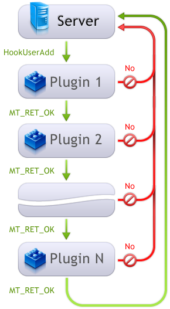

[🏠 Document Start](../README.md) / [Server API](README.md) / Hooks

[Previous](Creating-a-Simple-Plugin.md) | [Next](Request-Processing-on-the-Server.md)

# Hooks

Some interfaces of the server API contain methods-hooks that allow to influence the behavior of the server when processing an event. To help you better understand their essence, here is a table comparing the properties of hooks and [events (#events)](Creating-a-Simple-Plugin.md#events).

Events | Hooks  
---|---  
Sent upon the fact of an action. | Sent before an action.  
Is intended only for notifications. | Allows influencing the action performed.  
All parameters of methods-events are constant. Accordingly, they can be read but cannot be changed. | Some parameters are not constant. Accordingly, they can be changed.  
All subscribers receive event notifications. | Hooks are handles in the order of [configurations of plugins](../Configuration-Interfaces/Plugins.md). Within a plugin, handling is performed in the order of subscribing to an appropriate interface. Hook is handled until the first method that returns code other than [MT_RET_OK](../Return-Codes/Successful-completion.md) (except otherwise stated). In this case, the hook is not forwarded to next methods.  
Methods of events are of the "void" type. | Methods-hooks will always return one of the [return codes](../Return-Codes/README.md).  
  
Here is a diagram of hook handling:

