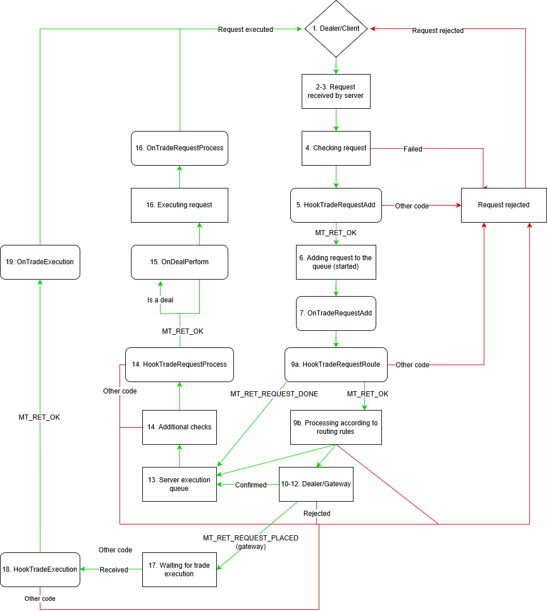

[🏠 Document Start](../README.md) / [Server API](README.md) / Request Processing on the Server

[Previous](Hooks.md) | [Next](Recommendations-for-Developers.md)

# Trade Request Processing by the Server and Call of Hooks (#trade-request-processing-by-the-server-and-call-of-hooks)

This section provides a description of the full path of a trade request from order placing by a client/dealer till its final processing on the server.

1\. A client or a dealer places an order through the client or manager terminal.

2\. The server receives the trade request and validates its digital signature.

3\. The server adds the request into the initial request queue.

4\. A separate stream performs a primary verification of requests. The following is checked at this stage:

a. the overall validity of the request;

b. the symbol specified in the request:
* if the account, from which the request has been received, is enabled;
* if trading is allowed for that account;
* if the account is not in the read-only mode;
* if there is a connection to the history server;
* Prices for the symbol are checked, current prices are received;
* Request parameters are checked:
* Check for sufficient margin.

• if symbol trading is allowed for the client group;

• if the request time is in the trading session time;

• if the request time falls on holiday;

• if the request time is in the server operation time;

• if the symbol trading time has not expired;

• if the request has not timed out due to the absence of symbol quotes;

• if the specified fill type is allowed for the symbols;

5\. After all checks and verifications, but prior to adding the order, the [HookTradeRequestAdd](Interface-of-Trade-Events/HookTradeRequestAdd.md) hook is called.

6\. If a request is successfully verified, the hook (hooks) returns the [MT_RET_OK](../Return-Codes/Successful-completion.md) code, and the request is a request to place an order, a new order in the ["Started" (#enorderstate)](../Database-Interfaces/Trade/Orders/IMTOrder/Enumerations.md#enorderstate) state is created.

7\. After adding an order, the [OnTradeRequestAdd](Interface-of-Trade-Events/OnTradeRequestAdd.md) event is called.

8\. If any errors were detected during previous stages, the request is removed from the queue, and a transaction about the request deletion with a corresponding error code is sent.

9\. Verified requests are added to the routing queue, in which they are also handled in a separate thread.

a. Before processing in accordance with the routing rules, the [HookTradeRequestRoute](Interface-of-Trade-Events/HookTradeRequestRoute.md) hook is called:
* A request is analyzed in accordance with the routing rules from top to bottom.

• If [MT_RET_REQUEST_DONE](../Return-Codes/Trade-Requests.md) is returned from the hook, the request will be confirmed without using routing rules;

• If [MT_RET_OK](../Return-Codes/Successful-completion.md) is returned from the hook, the request will be processed in accordance with the routing rule;

• If a different response code is returned, the request will be rejected with the appropriate return code.

10\. Depending on the routing rules, the request is forwarded to a dealer/gateway or it can be automatically confirmed and added to a separate server execution queue.

11\. A separate queue of requests is available for dealers. A dealer blocks an enqueued request, which the dealer is going to process. After that this request will not be visible to other dealers. The dealer then either confirms the request or rejects it using [IMTManagerAPI::DealerAnswer](../Manager-API/Manager-Interface/Trade-Activity/Dealing/DealerAnswer.md) and passing the appropriate [response code](../Return-Codes/Trade-Requests.md) among other things in it. The following response codes highlight confirmation:

a. MT_RET_REQUEST_DONE — request fulfilled.

b. MT_RET_REQUEST_DONE_PARTIAL — request partially fulfilled.

c. MT_RET_REQUEST_REQUOTE — request requoted.

d. MT_RET_REQUEST_REQUOTE_RETURN — request requoted and returned to the queue with new prices.

12\. If a gateway processes a request on the trading platform side, it responds to the request using [IMTGatewayAPI::DealerAnswerAsync](../Gateway-API/Main-Interface/Processing-Trade-Requests/DealerAnswerAsync.md) with the [MT_RET_REQUEST_DONE](../Return-Codes/Trade-Requests.md) code. In this case, the request is added to the execution queue (13). If the gateway processes a request at the external system, it responds the request using [IMTGatewayAPI::DealerAnswerAsync](../Gateway-API/Main-Interface/Processing-Trade-Requests/DealerAnswerAsync.md) with the [MT_RET_REQUEST_PLACED](../Return-Codes/Trade-Requests.md) code. The request (order) is set to Placed, while the platform asynchronously waits for a [trade execution](../Database-Interfaces/Trade/Trade-Requests/Requests-IMTExecution.md) (17) at the gateway.

13\. If confirmed, the request is added to the execution queue. A separate stream executes verified requests.

14\. After an additional verification of all incoming parameters of a request, immediately before execution, the [HookTradeRequestProcess](Interface-of-Trade-Events/HookTradeRequestProcess.md) hook is called.
* If request execution implies creation of a deal, the [OnDealPerform](../Database-Interfaces/Trade/Deals/IMTDealSink/OnDealPerform.md) event is triggered.
* After a successful execution of a request, the [OnTradeRequestProcess](Interface-of-Trade-Events/OnTradeRequestProcess.md) event is called.
* After receiving a response from the gateway that the order is to be processed in the external system ([IMTGatewayAPI::DealerAnswerAsync](../Gateway-API/Main-Interface/Processing-Trade-Requests/DealerAnswerAsync.md) with the [MT_RET_REQUEST_PLACED](../Return-Codes/Trade-Requests.md) code), the platform asynchronously waits for a trade execution at the gateway.
* As soon as the gateway generates and sends the trade execution to the platform using [IMTGatewayAPI::DealerExecuteAsync](../Gateway-API/Main-Interface/Processing-Trade-Requests/DealerExecuteAsync.md), the [HookTradeExecution](Interface-of-Trade-Events/HookTradeExecution.md) hook is called. The hook is called before the execution is applied.
* If the [MT_RET_OK](../Return-Codes/Successful-completion.md) code is returned from the hook, the trade execution is applied and the [OnTradeExecution](Interface-of-Trade-Events/OnTradeExecution.md) handler is called. Otherwise, the request will be rejected with a response code returned from the hook.

a. If [MT_RET_OK](../Return-Codes/Successful-completion.md) is returned from the hook, the request will be executed;

b. If a different response code is returned, the request will be rejected with the appropriate return code.

> The [IMTRequestSink::OnRequestDelete](../Database-Interfaces/Trade/Trade-Requests/IMTRequestSink/Requests-OnRequestDelete.md) handler is called for all requests. It can be called at any stage of request lifetime, starting with the moment when the request is added to the server queue ([IMTRequestSink::OnRequestAdd](../Database-Interfaces/Trade/Trade-Requests/IMTRequestSink/Requests-OnRequestAdd.md)). The request deletion moment depends on how it has been handled: whether it has been executed, rejected, canceled by timeout, etc.

## Processing Ticks and Orders (#ticks)

This section described the procedure of how new ticks are applied to client groups, as well as how pending order and position stop levels (Stop Loss, Take Profit and Stop Out) are checked and how they trigger.

1\. The server received the XXXYYY symbol tick.

2\. The current price ([IMTPosition::PriceCurrent](../Database-Interfaces/Trade/Positions/IMTPosition/PriceCurrent.md)) and profit ([IMTPosition::Profit](../Database-Interfaces/Trade/Positions/IMTPosition/Profit.md)) of positions for the XXXYYY symbol are updated.

3\. Hitting of Stop Loss levels of open positions for the XXXYYY symbol is checked.

4\. If Stop Loss has been hit and the position activation status ([IMTPosition::ActivationMode](../Database-Interfaces/Trade/Positions/IMTPosition/ActivationMode.md)) is equal to ACTIVATION_NONE, an order to close a position with [IMTOrder::Reason::ORDER_REASON_SL](../Database-Interfaces/Trade/Orders/IMTOrder/Reason.md) is created and the request to activate Stop Loss is added to the server queue.

5\. The position activation status changes to ACTIVATION_SL.

6\. Hitting of Take Profit levels of open positions for the XXXYYY symbol is checked.

7\. If Take Profit has been hit and the position activation status ([IMTPosition::ActivationMode](../Database-Interfaces/Trade/Positions/IMTPosition/ActivationMode.md)) is equal to ACTIVATION_NONE, an order to close a position with [IMTOrder::Reason::ORDER_REASON_TP](../Database-Interfaces/Trade/Orders/IMTOrder/Reason.md) is created and the request to activate Take Profit is added to the server queue.

8\. The position activation status changes to ACTIVATION_TP.

9\. Prices of pending orders for the XXXYYY symbol are updated ([IMTOrder::PriceCurrent](../Database-Interfaces/Trade/Orders/IMTOrder/PriceCurrent.md)).

10\. If the order price level has been hit, its activation status ([IMTOrder::ActivationMode](../Database-Interfaces/Trade/Orders/IMTOrder/ActivationMode.md)) is equal to ACTIVATION_NONE and the user has enough margin to execute the order, a request to activate a pending order is added to the trade server queue.

11\. The order activation status is changed to ACTIVATION_PENDING or ACTIVATION_STOPLIMIT.

12\. For the [trading accounts ](../Database-Interfaces/Users/IMTUser.md), on which profit of positions was recalculated (as per point 2) or the margin of orders for the XXXYYY symbol has changed, margin is checked.

13\. If the account falls under the Stop Out condition and the account activation state ([IMTAccount::SOActivation](../Database-Interfaces/Trade/Accounts/IMTAccount/SOActivation.md)) is equal to ACTIVATION_NONE, the following actions are performed:

• A pending order is searched, for which the largest margin amount is required (it must have non-zero margin, while symbol trading must be allowed). If such an order is found, a request to cancel such an order is added to the trade server queue. The order activation state ([IMTOrder::ActivationMode](../Database-Interfaces/Trade/Orders/IMTOrder/ActivationMode.md)) changes to ACTIVATION_STOPOUT.

• If the appropriate order is not found, the server searches for a position with a largest loss (while checking if symbol trading is allowed and taking into account the [FIFO rule (#entradeflags)](../Configuration-Interfaces/Groups/IMTConGroup/Enumerations.md#entradeflags)). If such a position is found, a request to close the position is added to the trade server queue. Position activation state ([IMTPosition::ActivationMode](../Database-Interfaces/Trade/Positions/IMTPosition/ActivationMode.md)) changes to ACTIVATION_STOPOUT.

• Account activation state ([IMTAccount::SOActivation](../Database-Interfaces/Trade/Accounts/IMTAccount/SOActivation.md)) is set to ACTIVATION_STOP_OUT.

Processing of pending order activation requests, position closure by Stop Loss, Take Profit and Stop Out requests is performed similarly to processing of regular trading requests sent by traders, following the [scheme described above](Request-Processing-on-the-Server.md). The request goes through the same processing steps, with the call of corresponding events and hooks.

## Removing unprocessed orders on launch (#removing-unprocessed-orders-on-launch)

At each launch, the trade server checks open orders and performs the following:

  * Removes Started orders ([IMTOrder::ORDER_STATE_STARTED (#enorderstate)](../Database-Interfaces/Trade/Orders/IMTOrder/Enumerations.md#enorderstate)) — orders that have not yet been passed for processing to an external system (if the work goes via the gateway), confirmed or processed. Otherwise, they would freeze in this state, since there are no further requests for their processing.
  * Resets order activation attributes ([IMTOrder::EnOrderActivation (#enorderactivation)](../Database-Interfaces/Trade/Orders/IMTOrder/Enumerations.md#enorderactivation)).
  * Checks the status of orders processed inside the platform (without sending to external systems via the gateway). If the market order ([IMTOrder::OP_BUY (#enordertype)](../Database-Interfaces/Trade/Orders/IMTOrder/Enumerations.md#enordertype) or [IMTOrder::OP_SELL (#enordertype)](../Database-Interfaces/Trade/Orders/IMTOrder/Enumerations.md#enordertype)) in Started or Partially Filled status ([IMTOrder::ORDER_STATE_STARTED (#enorderstate)](../Database-Interfaces/Trade/Orders/IMTOrder/Enumerations.md#enorderstate) or [IMTOrder::ORDER_STATE_PARTIAL (#enorderstate)](../Database-Interfaces/Trade/Orders/IMTOrder/Enumerations.md#enorderstate)) is detected, it is removed. The following entry is added to the server journal: "unfilled order XXX (account XXX) canceled".   
  
In the absence of such a check, market orders could freeze. For example: 

  * A trader creates a request by placing an order
  * A dealer partially confirms an order and its status changes to ORDER_STATE_PARTIAL
  * The platform is reset
  * The order would freeze in this state, since there are no further requests for its processing

> The [IMTOrder::ExternalID](../Database-Interfaces/Trade/Orders/IMTOrder/ExternalID.md) field defines whether an order is passed to an external system or processed in the platform. If it is filled, the ordered is displayed in the external system. The server does not remove such orders. Thus, the [IMTExecution::OrderExternalID](../Database-Interfaces/Trade/Trade-Requests/IMTExecution/Requests-OrderExternalID.md) field in the server's trade requests should be filled, so that the server does not remove orders from your gateway.
