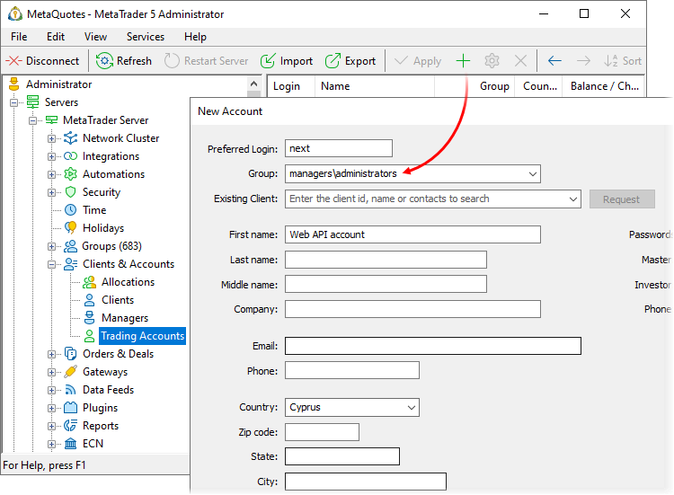
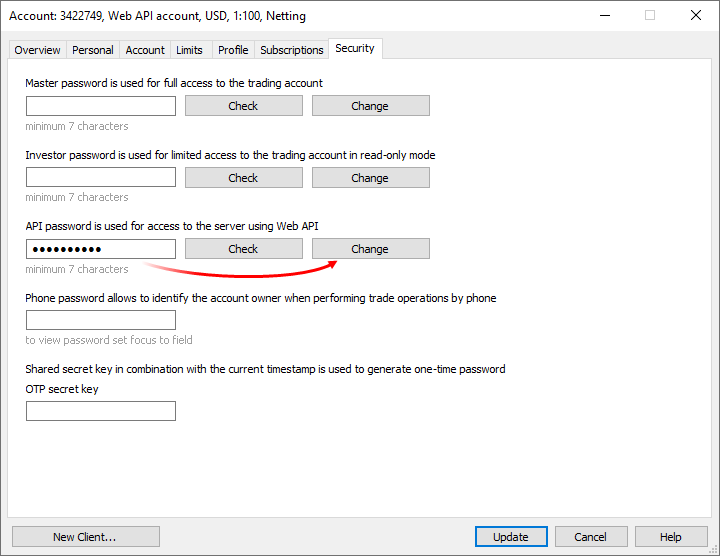
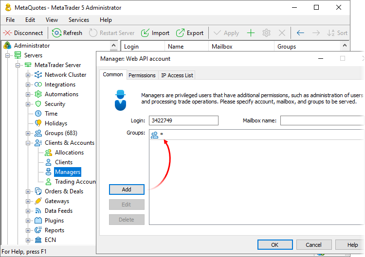
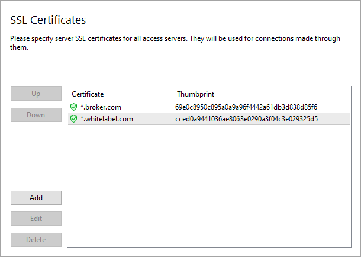

[🏠 Document Start](../README.md) / [Web API](README.md) / Getting Started

[Previous](README.md) | [Next](Format-of-Commands.md)

# Before You Begin (#before-you-begin)

Before you begin to work with the MetaTrader 5 Web API, prepare a special account on a trade server. This account is used for [authorizing](Manager-Interface-(Rest-API)/Text-Protocol-(Raw-API)/Authentication.md) a Web client.

  * [Creating an Account (#account-create)](Getting-Started.md#account-create)
  * [Configuring the account (#account-setup)](Getting-Started.md#account-setup)
  * [Configuring access to symbols (#symbols)](Getting-Started.md#symbols)
  * [Configuring the Manager (#manager-configuration)](Getting-Started.md#manager-configuration)
  * [Configuring the Access Server (#access)](Getting-Started.md#access)
  * [Setup of operation via HTTPS (#https)](Getting-Started.md#https)

## Creating an Account (#account-create)

To create an account, navigate to the relevant MetaTrader 5 Administrator section and click "Add". The account must be created in the Managers group.

## Configuring the account (#account-setup)

Set the API password in the "Security" tab:

Enter your password in the appropriate field and click "Change". This password is used for [connecting](Manager-Interface-(Rest-API)/Text-Protocol-(Raw-API)/Authentication.md#client-start) a Web client to a trade server.

> When working with the [debug server version](../Server-API/Debugging.md), the Manager password is always used regardless of the password actually set for the account.

## Configuring Access to Symbols (#symbols)

The list of [symbols](Manager-Interface-(Rest-API)/Configuration-Databases/Symbols.md) for which the Web client can access information is determined by the settings of the group which the manager account belongs to.

## Configuring the Manager (#manager-configuration)

When creating an account in the Managers group, MetaTrader 5 Administrator immediately creates a manager configuration based on this account. This is a special account add-on over extending account permissions.

Open this configuration under "Clients and accounts \ Managers". The configuration can be found by the account number or by name.

On the Common tab, specify [groups](Manager-Interface-(Rest-API)/Configuration-Databases/Groups.md) that the web client can work with. In fact, they define access to accounts and trading operations.

In the "Permissions" tab, set up access restrictions for a Web client.

The following permissions apply to the account used for a Web client:

  * Connection using MetaTrader 5 Administrator — enables the administrator connection to a trade server, which is used in the Web API. This permission is required for adding/modifying configurations of [groups](Manager-Interface-(Rest-API)/Configuration-Databases/Groups/Add.md) and [symbols](Manager-Interface-(Rest-API)/Configuration-Databases/Symbols/Add.md).
  * Connect using MetaTrader 5 Manager — enables the manager connection to a trade server, which is used in the Web API. This permission must necessarily be enabled.
  * Configuration setup — defines the types of configurations that can be changed through the Web API.
  * Sending emails — allows to [send messages](Manager-Interface-(Rest-API)/Mail/Send.md) through the internal mailing system.
  * Sending news — allows to [send news](Manager-Interface-(Rest-API)/News/Send.md).
  * Accountant — allows to perform [balance operations](Manager-Interface-(Rest-API)/Trading/Trade-Requests/DepositWithdrawal.md) on client accounts.
  * Access to accounts — allows to [request information about accounts](Manager-Interface-(Rest-API)/Users/Get-by-Login.md) (without access to personal data).
  * Access to personal data of accounts — allows to view personal data of accounts.

  * Name
  * Bank Account
  * Phone Password
  * Country
  * City
  * State
  * Zip/Postal code
  * Address
  * Phone
  * Email
  * Comment
  * ID
  * Status
  * API Data
  * Trade accounts in external systems
  * Modify accounts — allows to [add](Manager-Interface-(Rest-API)/Users/Add.md) and [modify](Manager-Interface-(Rest-API)/Users/Update.md) accounts.
  * Delete accounts — allows to [delete](Manager-Interface-(Rest-API)/Users/Delete.md) accounts.
  * Access to trade orders — this permission allows viewing [orders](Manager-Interface-(Rest-API)/Trading/Orders.md), [deals](Manager-Interface-(Rest-API)/Trading/Deals.md) and [positions](Manager-Interface-(Rest-API)/Trading/Positions.md) of clients.
  * Edit orders, positions and deals — allows the deletion of any orders, deals and positions.
  * Delete orders, positions and deals — allows the deletion of any orders, deals and positions.
  * Back office — access permissions to the [client](Manager-Interface-(Rest-API)/Clients.md) database.
  * Subscriptions — access permissions to the [Subscriptions](Manager-Interface-(Rest-API)/Subscriptions.md) service.

In the "List of allowed IP addresses", you can additionally restrict connection of a Web client based on IP address.

# Configuring the Access Server (#access)

To allow connections to the trading platform via the Web API, enable the corresponding option in the access server settings:

This setting affects normal connections and [connections via HTTPS](Format-of-Commands.md).

## Setup of operation via HTTPS (#https)

All connections to the trading platform are established through access servers. Support for connection over HTTPS is implemented on access servers (HTTP is not connected). Therefore, they can act as a web server.

To enable connection to the access server via HTTPS, at least one of its [public addresses (#public)](https://support.metaquotes.net/en/docs/mt5/platform/administration/admin_network/network_add_edit#public) must be associated with a certain domain, i.e. the host to which POST and GET requests will be implemented. For this purpose, the appropriate entry must be specified on the DNS server. For example, if you want to implement operation via the host abc.broker.com, the following entry should be added to DNS: "XXX.XXX.XXX.XXX abc.broker.com", where XXX.XXX.XXX.XXX is the public address of the access server.

Since only protected TLS connections (HTTPS) are supported, an SSL certificate must be installed on the access server for the appropriate domain. Use the "Integrations \ Web Services \ SSL Certificates" section of the MetaTrader 5 Administrator to upload and manage certificates:

These settings apply to all access servers. Changes in the list of certificates are applied instantly, so you do not need to restart the servers.

Connections from multiple domains can be supported on one server ([the SNI mode](https://ru.wikipedia.org/wiki/Server_Name_Indication)). In this case, the corresponding SSL certificate must be installed for each of them. When connecting, the client specifies the address to connect to. The access server checks all installed certificates and automatically provides the necessary one to the client:

  * First, the server tries to find a certificate for an exactly matching domain.
  * If not, it tries to find the most suitable one using mask "*".
  * If the certificate could not be found, the server returns the first certificate from the list.

> When using self-signed certificates on the Web API client side, add them in the list of trusted certificates or allow the use of untrusted certificates.
