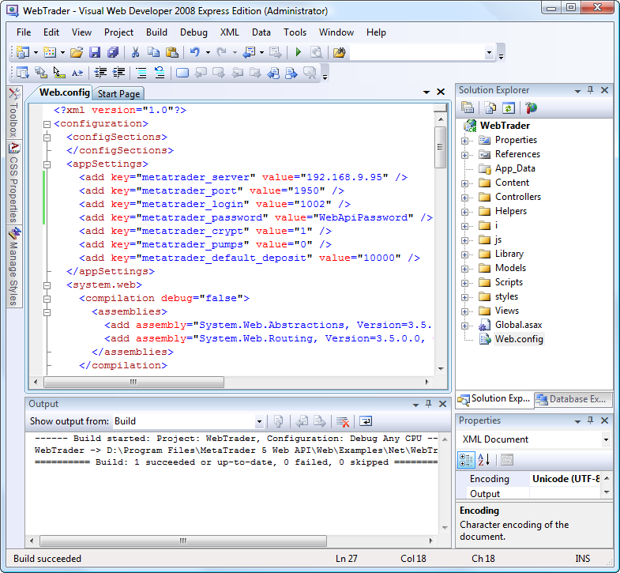
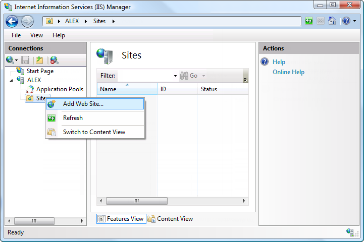
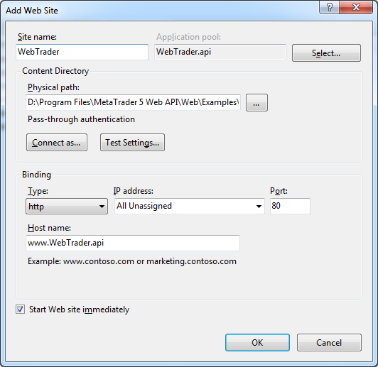
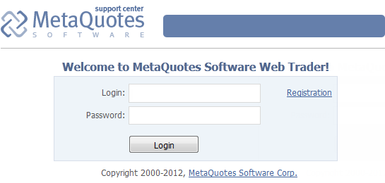
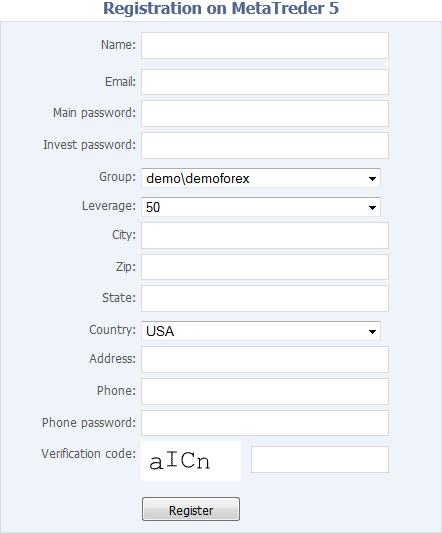
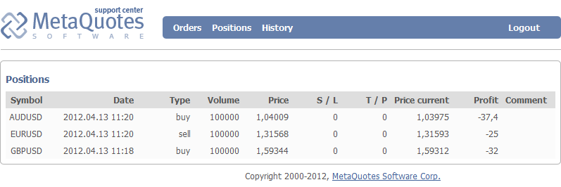

[🏠 Document Start](../../../README.md) / [Web API](../../README.md) / [Manager Interface (Rest API)](../../Manager-Interface-(Rest-API).md) / [.NET Implementation of Protocol](../NET-Implementation-of-Protocol.md) / WebTrader

[Previous](MT5WebAPI-Class/Custom-Commands/CustomSend.md) | [Next](../../../SQL-Export/README.md)

# WebTrader

The .NET implementation of the MetaTrader 5 Web API protocol includes an example of its use in the form of a source code of a finished website. The example is a Microsoft Visual Studio project. It is located in directory /Examples/NET/WebTrader.

## Running the Demo Site in Your Local Computer

For the first start of the demo site, open the WebTrader Microsoft Visual Studio project.

> To compile the project, you will need Microsoft Visual Studio Web Developer 2008 Express Edition with ASP.NET MVC 2.

After opening the project, open the file Web.config, which is in the root directory of the project.

In the block <appSettings> you must configure the project to connect to your MetaTrader 5 platform. Replace the values (value="") of the following parameters:

  * metatrader_server — the IP address of your trading platform.
  * metatrader_port — the port of the access server, through which connection to the platform is established.
  * metatrader_login — the login of the [manager account (#manager-configuration)](../../Getting-Started.md#manager-configuration) that will be used for connection.
  * metatrader_password — the API password of the manager account.
  * metatrader_crypt — data [encryption type](../Text-Protocol-(Raw-API)/Encryption.md). A value of 1 means that encryption is enabled. A value of 0 means that encryption is disabled.
  * metatrader_pump — the data pumping mode for connection. Currently pumping is not supported for this parameter, so use the default 0 value.
  * metatrader_default_deposit — the deposit that will be used for demo accounts created form the WebTrader interface. 

After you specify all the settings, compile the project. Then run the system utility program IIS Manager. Select Sites and choose "Add a Web Site" from the context menu:

This will bring up a window to add a website:

Specify the following parameters in this window:

  * Web site name — any name. In this example it is WebTrader.
  * Physical path — the path to the folder of the WebTrader project. In this example the path is D:\Program Files\MetaTrader 5 Web API\Web\Examples\Net\WebTrader.
  * Host name (block Binding) — the address at which the WebTrader page will open. In this case it is www.WebTrader.api.

After setting up the site, click "OK." To open the specified address on your computer, open the file hosts, located in the directory C:\Windows\System32\drivers\etc. Add the following entry to this file:

127.0.0.1 WebTrader.api  
---  
  
After you save the changes, go back to the IIS Manager and run the website. Then you can open a demo site in your browser.

## The Features of the Demo Site

Below is the homepage of the demo site:

Clicking "Registration" will take you to creation of a new demo account on the trading server. Account registration form will open:

Also on the home page you can go to the trader's personal area. To do this, enter the login and password of an existing account. The trader's personal area contains the list of orders, deals and positions:

You can use all of these features of the demo site in your project by copying and modifying the source code of the WebTrader project.
