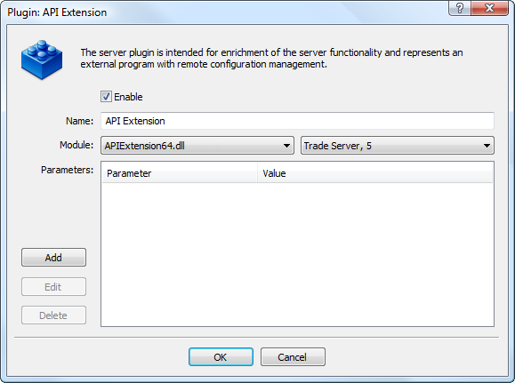

[🏠 Document Start](../../../../../README.md) / [Web API](../../../../README.md) / [Manager Interface (Rest API)](../../../../Manager-Interface-(Rest-API).md) / [PHP Implementation of Protocol](../../../PHP-Implementation-of-Protocol.md) / [Examples](../../Examples.md) / [Protocol Extension](../Protocol-Extension.md) / Setup

[Previous](Structure-of-Files.md) | [Next](Working-with-Example.md)

# Setup

Several actions must be performed to launch this example.

## System Requirements

The following conditions must be matched to launch the example:

  * MySQL server;
  * PHP version 5 or higher;
  * php_mbstring.dll, php_sockets.dll modules must be included into PHP project.

## Copying/Inclusion into the Project

The first step is copying the whole Examples/PHP directory from the one where Web API is [installed](../../../../../Getting-Started/Setup.md) to your project working directory. Further on, the main /Examples/api_extension/index.php file must be included in your PHP project.

> Note that the data from [authorization and commands execution forms](Working-with-Example.md) must be sent in UTF-8 format in this example. Therefore, UTF-8 encoding must be specified for the web page, in which they are integrated.

## Enabling the Plugin on the Server

APIExtension plugin must be enabled to allow the example operation on a trading server. That plugin is included into MetaTrader 5 Server API package as an example of handling custom commands sent from MetaTrader 5 Web API and MetaTrader 5 Manager API.

Add the plugin configuration via MetaTrader 5 Administrator:

