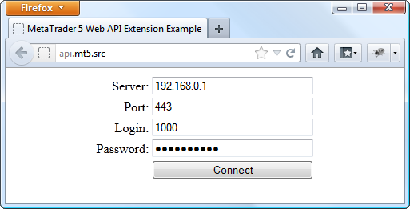
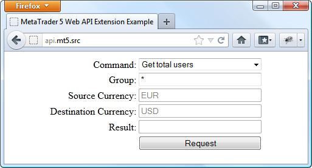

[🏠 Document Start](../../../../../README.md) / [Web API](../../../../README.md) / [Manager Interface (Rest API)](../../../../Manager-Interface-(Rest-API).md) / [PHP Implementation of Protocol](../../../PHP-Implementation-of-Protocol.md) / [Examples](../../Examples.md) / [Protocol Extension](../Protocol-Extension.md) / Working with Example

[Previous](Setup.md) | [Next](../../../NET-Implementation-of-Protocol.md)

# Working with Example

Open the appropriate page in your web browser after setting the example:

Specify the data for connection to the server (address, port, login and password) on the login page. [Account API password (#account-setup)](../../../../Getting-Started.md#account-setup) must be used for connection.

After connecting to the server, custom commands execution page will open:

It contains the following fields:

  * Command — selection of one of the implemented custom commands:

  * Get total users — get the number of users in specified groups;
  * Get total orders — get the number of open orders of users in specified groups;
  * Get total positions — get the number of positions of users in specified groups;
  * Get buy rate — get a buy rate for a pair of currencies specified in Source Currency and Destination Currency fields;
  * Get sell rate — get a sell rate for a pair of currencies specified in Source Currency and Destination Currency fields;
  * Group — group, for which the number of users, orders or positions is requested;
  * Source Currency — currency, for which buy/sell rate is requested;
  * Destination Currency — currency, for which buy/sell rate is requested;
  * Result — field displaying command execution result.

Click Request to execute the command.
