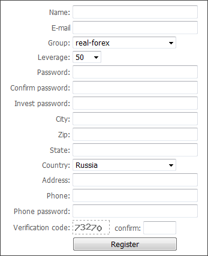

[🏠 Document Start](../../../../README.md) / [Web API](../../../README.md) / [Manager Interface (Rest API)](../../../Manager-Interface-(Rest-API).md) / [PHP Implementation of Protocol](../../PHP-Implementation-of-Protocol.md) / [Examples](../Examples.md) / Web Registration

[Previous](../Examples.md) | [Next](Web-Registration/Structure-of-Files-and-Folders.md)

# Web Registration

The MetaTrader 5 Web API includes a ready example of how to implement opening of accounts in the platform through a website.

To integrate the Web registration with your online resource, just follow a few [simple steps](Web-Registration/Setup.md). If you are an experienced PHP programmer, you can modify this example by making the necessary changes to its [source files](Web-Registration/Structure-of-Files-and-Folders.md).

> When implementing integration, please remember that data from the registration form must be sent in UTF-8. Accordingly, UTF-8 must be specified for the web page, into which you integrate the registration form.
