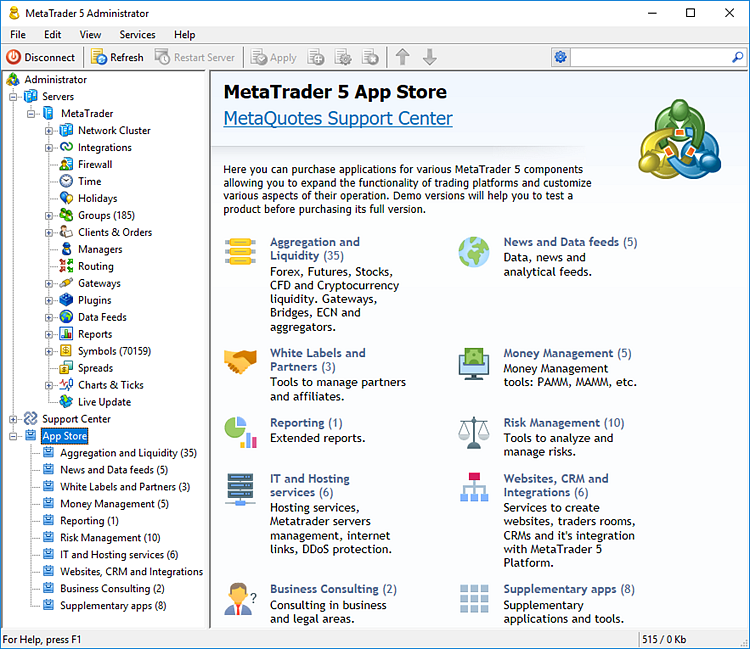
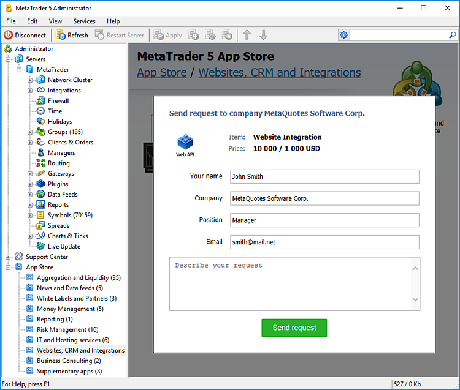

[🏠 Document Start](../README.md) / [MetaTrader 5 Trading Platform](../MetaTrader-5-Trading-Platform.md) / App Store

[Previous](MetaTrader-5-Administrator/Terminal-Settings/Confirmations.md) | [Next](Technical-Support.md)

# App Store

App Store is the market of MetaTrader 5 solutions from third-party software providers. It features dozens of products from various categories, including gateways, liquidity solutions, CRM systems and traders' rooms, as well as trade server hosting services. Every product is provided with a detailed description of functionality and scope of application.

All software providers in the App Store are subject to a special registration procedure. They all sign an agreement with MetaQuotes Software Corp. Detailed information on all third-party companies is provided under the [Vendors section of the technical support website](https://support.metaquotes.net/en/market/vendors).

For convenience, all products are divided into categories. Use the Navigator window to switch between the categories.

  * Aggregation and Liquidity: price aggregation software, liquidity sources and gateways
  * News and Data feeds: price feeds, news and analytics sources
  * White Labels and Partners: White Label for Introducing Brokers and Affiliate Programs
  * Money Management: money management software, implementation of PAMM and MAMM accounts
  * Reporting: expanded reports
  * Risk Management software
  * IT and Hosting services: hosting and MetaTrader 5 server management services
  * Websites, CRM and Integrations: creation of websites, traders' rooms, integration with the MetaTrader 5 platform
  * Business Consulting: legal and business advising services
  * Supplementary apps: additional applications

Fill out a simple form to request a desired product. After that, a vendor's representative will contact you to complete the order procedure.

  * The price of some applications may include mandatory monthly technical support fees.
  * [MetaQuotes support site](https://support.metaquotes.net/) account is required for accessing the App Store section. Specify the account credentials in the [Administrator terminal settings](MetaTrader-5-Administrator/Terminal-Settings/Support.md).

  
---
