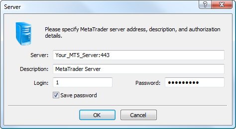

[🏠 Document Start](../../../README.md) / [MetaTrader 5 Trading Platform](../../../MetaTrader-5-Trading-Platform.md) / [MetaTrader 5 Administrator](../../MetaTrader-5-Administrator.md) / [Getting Started](../Getting-Started.md) / Add or Remove Servers

[Previous](Structure-of-Directories-and-Files.md) | [Next](Connect-to-Server.md)

# Add or Remove Servers

The administrator terminal allows managing operation of several servers. Servers and commands for working with them are located in the form of a tree in the left part of the terminal.

## Adding a Server

To add a server, one should execute the " Add Server" command in the ["File" (#add)](../User-Interface/Main-Menu/File.md#add) menu or use the similar context menu command of the left part of the terminal. After that the following window will appear:

In this window the following fields should be filled out:

  * Server — IP-address or domain name of the necessary server and its port number. If port number is not specified then port 443 is used on default;
  * Description — description or name of the server (not more than 128 symbols). This information will be displayed in the tree of servers in the left part of the terminal window;
  * Login — administrator account (login), using which connection to the server will be performed. If such an account has not been created on the server, connection is impossible;
  * Password — administrator password;
  * Save password — save password between program restarts.

It is not necessary to specify "Login" and "Password" when adding a server. These details will be requested when [connecting](Connect-to-Server.md) to it.

> Password to the server must be no less than six symbols long and contain at least two of three types of symbols (uppercase letters, lowercase letters and digits).

If there are several servers added to the administrator terminal, they can be moved relatively to each other in the tree-like list. To do that, one should use the  and  buttons of the ["Edit"](../User-Interface/Main-Menu/Edit.md) menu.

## Deleting a Server

In order to delete a server, execute the " Delete Server" command in the ["File" (#delete)](../User-Interface/Main-Menu/File.md#delete) menu or the similar context menu command in the left part of the administrator terminal. Further you can add this server again and start administering it.
