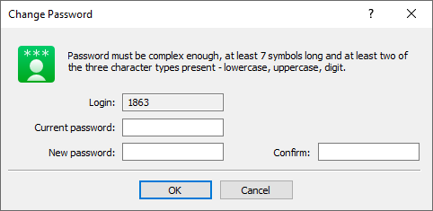

[🏠 Document Start](../../../README.md) / [MetaTrader 5 Trading Platform](../../../MetaTrader-5-Trading-Platform.md) / [MetaTrader 5 Administrator](../../MetaTrader-5-Administrator.md) / [Getting Started](../Getting-Started.md) / Change Password

[Previous](Connect-to-Server/2FATOTP.md) | [Next](Live-Update.md)

# Change Password

To change the password for the Administrator account with which you are currently connected to the server, select "Change password" in the [File](../User-Interface/Main-Menu/File.md) menu.

In the window that appears, enter the current account password, and then the new password twice.

The same action can be performed via the [Accounts](../../Platform-Setup/Accounts.md) section. Find the account based on which your Administrator account was created, and change the password on the [Security (#security)](../../Platform-Setup/Accounts/Editing-Account.md#security) tab.
