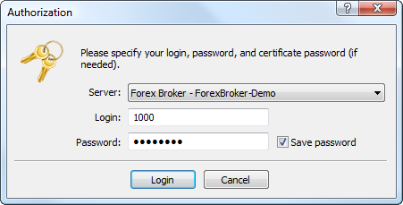
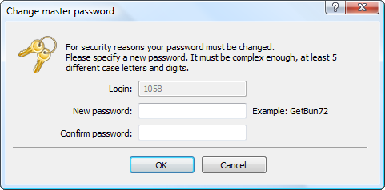

[🏠 Document Start](../../../README.md) / [MetaTrader 5 Trading Platform](../../../MetaTrader-5-Trading-Platform.md) / [MetaTrader 5 Administrator](../../MetaTrader-5-Administrator.md) / [Getting Started](../Getting-Started.md) / Connect to Server

[Previous](Add-or-Remove-Servers.md) | [Next](Connect-to-Server/Extended-Authorization.md)

# Connect to Server (#connect-to-server)

To start administering a server, one should connect to it. The " Connect" command of the ["File" (#connect)](../User-Interface/Main-Menu/File.md#connect) menu, the similar command of the [toolbar](../User-Interface/Toolbar/Standard.md) and the corresponding command of the context menu are used for it. Once one of them is pressed the following window will appear:

The window contains the following fields:

  * Server — this field contains the server the connection to which will be performed. From the list here one can choose any server from those [added](Add-or-Remove-Servers.md) to the terminal.
  * Login — administrator account (login), using which the connection to the server will be performed. If such an account has not been created on the server, connection is impossible.
  * Password — administrator password. 
  * Save Password — save password between program restarts.

In order to connect to a server, one should press the "Login" button.

  * To be able to connect to a server, one should first [add](Add-or-Remove-Servers.md) it to the administrator terminal.
  * In case the mode of extended authorization is enabled for [managers](../../Platform-Setup/Groups.md), the procedure of additional authorization is conducted.
  * If the connection to the administered servers is performed through a proxy server, it is necessary to [set up the terminal (#proxy)](../Terminal-Settings/Common.md#proxy) in the corresponding way.

  
---  
  
If the authorization is successful, the connection icon  appears in the [status bar](../User-Interface/Status-Bar.md), as well as two following entries appear in the [journal](../User-Interface/Toolbox/Journal.md):

  1. 'login number' authorized on 'server name';
  2. 'login number' configuration synchronized with 'server name'.

After the successful authorization you can start administering the server. If any problems occur while connecting to the server and you don't get one of the messages mentioned above, you should check the correctness of all specified connection settings, address and port of the server.

> While performing [full installation (#full)](../../Platform-Installation/Installation.md#full) of the platform one [administrator account](../../Platform-Setup/Managers.md) with login "1001" and random password is automatically created.

If there are several [trade servers](../../Platform-Setup/Network-cluster/Configuring-Servers/Trade-Server.md) within the platform, note that different accounts are used to connect to each of them.

An administrator connected to the main trade server can set up the whole trading platform and manage trade databases and account databases of this server. The main server administrator configures [groups](../../Platform-Setup/Groups.md), [symbols](../../Platform-Setup/Symbols.md), [security settings](../../Platform-Setup/Security/Firewall.md), etc.

Administrator of additional trade servers do not have an access to the platform settings, but they can manage trade and account databases of their specific servers.

## Forced Change of Password (#change-password)

After authorizing you may be asked to change master password to your account. The forced change of password can be enabled in the [group settings (#change-password)](../../Platform-Setup/Groups/Group-Settings.md#change-password) or in the [account settings (#change-password)](../../Platform-Setup/Accounts/Editing-Account.md#change-password). The procedure of master password changing, whether at first login or periodically, increases the security of working.

Type a new password in the "New password" field and them type it again in the "Confirm password" field. The new password must comply with the following requirements:

  * It must be no shorter than the length requirement displayed in the password change dialog. The minimum number of characters is determined by [group settings (#minimum-password)](../../Platform-Setup/Groups/Group-Settings.md#minimum-password), while the lowest possible value is 8 characters. The maximum length is 16 characters.

  * It must contain four character types: lowercase letters, uppercase letters, numbers, and [special characters](https://learn.microsoft.com/en-us/style-guide/a-z-word-list-term-collections/term-collections/special-characters) (#, @, ! etc.). For example, 1Ar#pqkj.

  * It should not be the same as the previous password.

