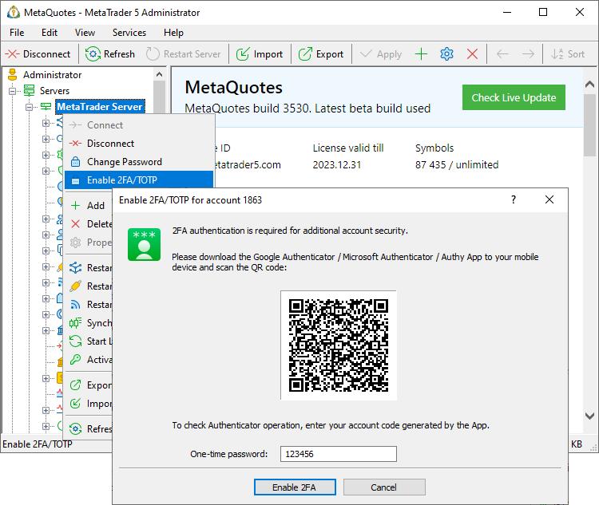
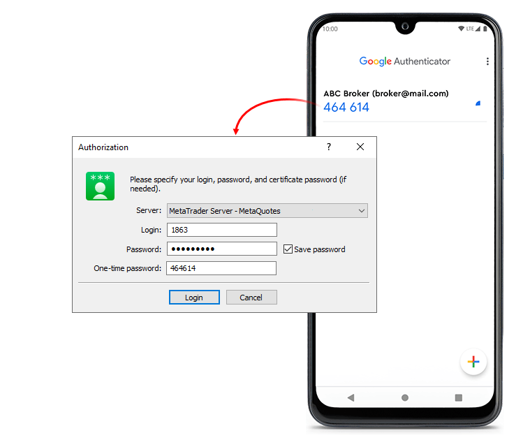
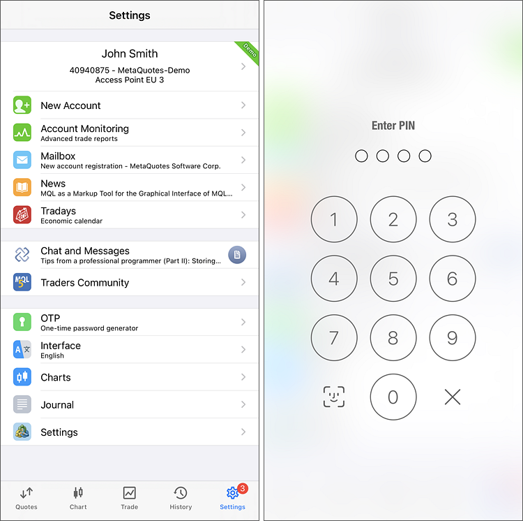
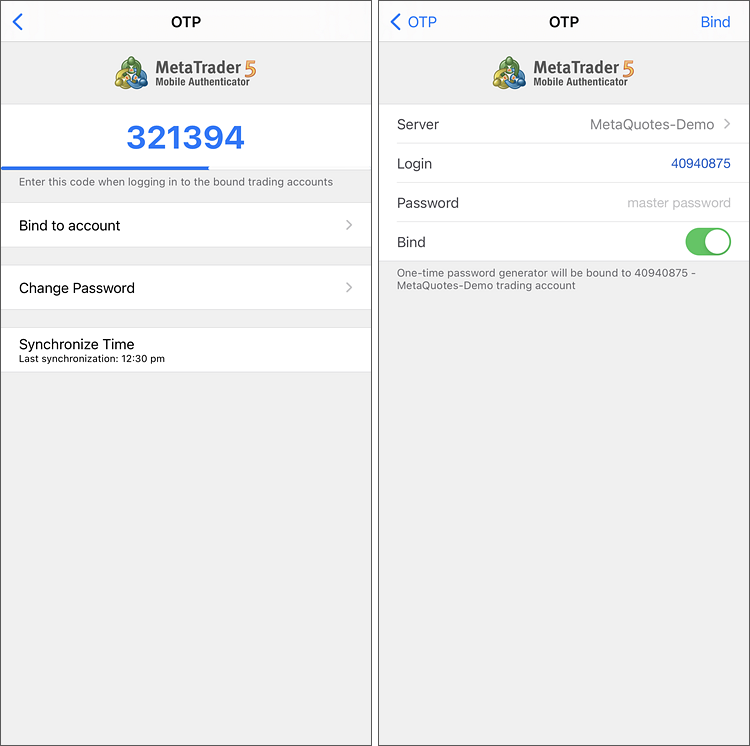
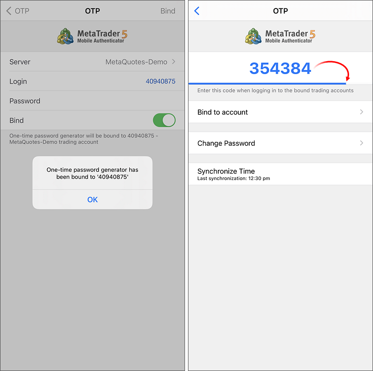
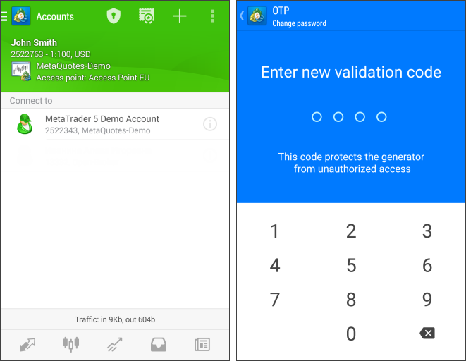
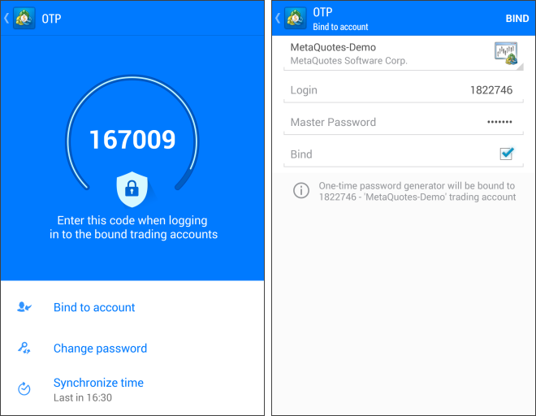
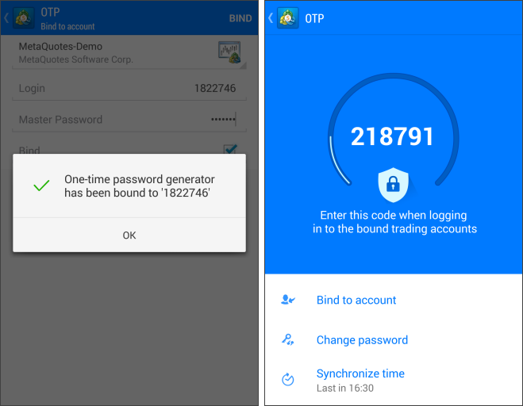
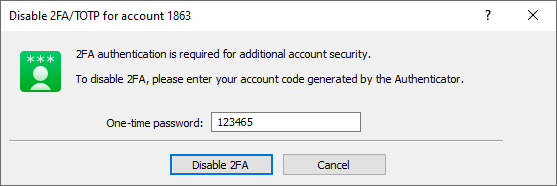
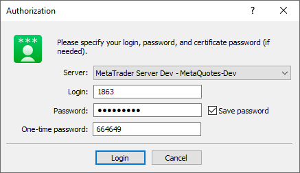

[🏠 Document Start](../../../../README.md) / [MetaTrader 5 Trading Platform](../../../../MetaTrader-5-Trading-Platform.md) / [MetaTrader 5 Administrator](../../../MetaTrader-5-Administrator.md) / [Getting Started](../../Getting-Started.md) / [Connect to Server](../Connect-to-Server.md) / 2FATOTP

[Previous](Extended-Authorization.md) | [Next](../Change-Password.md)

# 2FA/TOTP — Authentication Using One-Time Password (#2fatotp-authentication-using-one-time-password)

The use of one-time passwords ([Time-based One-time Password Algorithm, TOTP](https://en.wikipedia.org/wiki/Time-based_one-time_password)) or two-factor authentication (2FA) provides an additional level of security for trading accounts. This technology protects a trading account from unauthorized access even if its login and password are leaked.

If 2FA/TOTP is enabled, users are required to enter a special one-time password every time they connect to their accounts, in addition to standard account login and password (as well as a certificate if the extended authentication is enabled). One-time passwords can be generated by:

  * Mobile terminals for [iPhone](https://download.mql5.com/cdn/mobile/mt5/ios?hl=en&utm_campaign=download&utm_source=metatrader5.help "mobile terminal for iPhone") and [Android](https://download.mql5.com/cdn/mobile/mt5/android?hl=en&utm_campaign=download&utm_source=metatrader5.help "mobile terminal for Android").
  * The most popular 2FA applications, including Google Authenticator, Microsoft Authenticator, LastPass Authenticator and Authy. They can be downloaded to a mobile device from the App Store or Google Play.

The ability to use OTPs should be [enabled on the trading server (#otp)](../../../Platform-Setup/Groups/Group-Settings.md#otp). This additional level of security can be optional or mandatory, depending on the specific regulatory or market requirements.

## Enabling 2FA/TOTP in the desktop terminal (#desktop)

To enable the two-factor authentication option, connect to your account in the usual way. Then click "Enable 2FA/TOTP" in the server menu.

Run the Authenticator app on your mobile device, click "+" to add your account and scan the QR code from the terminal. Enter the received code in the "One-Time Password" field and click "Enable 2FA". This will link your account to the generator with a secret key.

A one-time password will be required for each connection to the account. Each OTP is valid for 30 seconds. After that a new one is generated.

## How to enable 2FA/TOTP on iPhone (#ios)

## To start using one-time passwords, you should bind your account with the password generator, which is the mobile terminal 5 for iPhone. (#to-start-using-one-time-passwords-you-should-bind-your-account-with-the-password-generator-which-is-the-mobile-terminal-5-for-iphone)

Go to the Settings of your mobile terminal and select OTP. For security reasons, when you first open this section, you will be required to set a four-digit password. The password must be entered every time you access the password generator.

> If you forgot your password to the password generator but still use the same mobile device, reinstall the mobile platform and rebind your account to the generator. If you no longer have access to the mobile device, the binding to the password generator can be reset in the [account settings (#otp)](../../../Platform-Setup/Accounts/Editing-Account.md#otp).

In the window that opens, select "Bind to account".

Next, specify the name of the server on which the account was created, the account number and the master password to it. The "Bind" should be kept enabled. It must be disabled, if you are going to unbind the specified account from the generator and stop using one-time passwords.

After you tap the "Bind" button located in the upper part of the window, your trading account will be bound to the generator, and an appropriate message will appear.

Likewise, you can bind an unlimited number of accounts to the generator.

The one-time password is displayed at the top of the OTP section. Underneath, a blue bar visualizes the password lifetime. Once the password expires, it is no longer valid, and a new password will be generated.

Additional Commands:

  * Change Password — change the generator password.
  * Synchronize Time — synchronize the time of the mobile device with the reference server. Accuracy requirement is connected with the fact that the one-time password is bound with the current time interval, and this time should be the same on the client terminal and the server side.

## How to Enable 2FA/TOTP on Android Based Devices (#android)

Go to the Accounts of your mobile terminal and tap . For security reasons, when you first open this section, you will be required to set a four-digit password. The password must be entered every time you access the password generator.

> If you forgot your password to the password generator but still use the same mobile device, reinstall the mobile platform and rebind your account to the generator. If you no longer have access to the mobile device, the binding to the password generator can be reset in the [account settings (#otp)](../../../Platform-Setup/Accounts/Editing-Account.md#otp).

In the window that opens, select "Bind to account".

Next, specify the name of the server on which the trading account was opened, the account number and the master password to it. The "Bind" should be kept enabled. It must be disabled, if you are going to unbind the specified account from the generator and stop using one-time passwords.

After you tap the "Bind" button located in the upper part of the window, your trading account will be bound to the generator, and an appropriate message will appear.

Likewise, you can bind an unlimited number of accounts to the generator.

The one-time password is displayed at the top of the OTP section. Underneath, a blue bar visualizes the password lifetime. Once the password expires, it is no longer valid, and a new password will be generated.

Additional Commands:

  * Change Password — change the generator password.
  * Synchronize Time — synchronize the time of the mobile device with the reference server. Accuracy requirement is connected with the fact that the one-time password is bound with the current time interval, and this time should be the same on the trading platform and the server side.

## Disabling TOTP/changing password generator (#disable)

An account can only be linked to one OTP generator. To switch to another one, first disable OTP. If you use a mobile terminal as the password generator, go to the OTP section in it and select "Unbind". If you bound a third party Authenticator using the administrator terminal, select "Disable 2FA/TOTP" from the server context menu. You will need to enter a one-time password generated by the old generator.

If you do not have access to the device with the old password generator (for example, a mobile device is lost), you can reset the binding on the server side, via the account's "[Security (#security)](../../../Platform-Setup/Accounts/Editing-Account.md#security)" section.

## How to Use 2FA/TOTP in the Terminal (#login)

After binding an account to the generator, a one-time password will be additionally requested when connecting to it from the administrator terminal:

