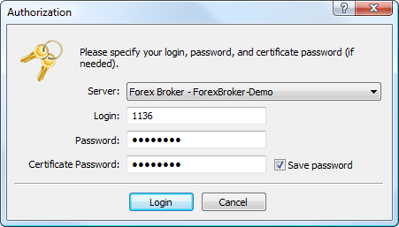

[🏠 Document Start](../../../../README.md) / [MetaTrader 5 Trading Platform](../../../../MetaTrader-5-Trading-Platform.md) / [MetaTrader 5 Administrator](../../../MetaTrader-5-Administrator.md) / [Getting Started](../../Getting-Started.md) / [Connect to Server](../Connect-to-Server.md) / Extended Authorization

[Previous](../Connect-to-Server.md) | [Next](2FATOTP.md)

# Extended Authorization (#extended-authorization)

The trading platform offers the possibility of an extended authorization using SSL certificate which considerably increases the system security. The extended authorization is enabled in [group settings (#authorization)](../../../Platform-Setup/Groups/Group-Settings.md#authorization). If this connection mode is enabled, [standard authorization](../Connect-to-Server.md) is still enabled too. It means that a user will have to enter account details in any authorization mode.

  * The authorization algorithm is generally accepted and secure. It is fully analogous to the SSL authorization. 
  * Connection between a terminal and a server is established by a custom protocol with the encryption of all the data transmitted.
  * A public key can be freely distributed and used for verifying the message signed by the secret key. It is guaranteed that knowing a public key it is impossible to count the secret one within reasonable time. The calculation of a secret key based on a public one even with powerful computers can take tens or even hundreds of years. 
  * A detailed description of the entire process of the extended authorization is given in a [separate section](../../../Platform-Setup/Groups/Extended-Authentication-Setup.md).

  
---  
  

## Generating and Getting a Certificate (#generation)

At the attempt to authorize through an account from a group with the enabled extended authorization, the [standard authorization](../Connect-to-Server.md) must be performed first. After that a trade server sends a request to an administrator terminal for the generation of two keys: private and public. A public key is sent to a trade server.

Based on the account data, a server generates a certificate and signs it by its private key (signing of a certificate by a server's private key guarantees that the certificate can't be falsified). After that a window appears in the administrator terminal, where the password must be indicated to protect the certificate:

The following fields and parameters are available in this window:

  * Password — password for the certificate installation;
  * Confirm Password — password confirmation to eliminate errors;
  * Add certificate to the Windows System Storage — if this option is enabled, the certificate will be automatically added to the operating system storage.

> The password for the certificate must contain at least two types of symbols (lower case, upper case, digits), and be at least 5 symbols long.

After all the required data are specified, press "Continue". After that the certificate is packed and protected by the specified password. The resulting *.pfx file of the certificate is saved in [/profiles/server name/certificates (#certificates)](../Structure-of-Directories-and-Files.md#certificates) of the administrator terminal to enable its further relocation. Certificate files are named according to the following rule: Login_ID_Name.pfx, where:

  * Login — account number;
  * ID — short company name where the account is opened;
  * Name — client's name specified during account creation.

  * Even getting access to the *.pfx file one can't use the certificate without the password. The minimum length of a password is set in [group settings (#minimum-password)](../../../Platform-Setup/Groups/Group-Settings.md#minimum-password).
  * Generation of certificates is performed only during the first account connection or when a certificate was intentionally [reset (#authorization)](../../../Platform-Setup/Accounts/Editing-Account.md#authorization) on the server.
  * The certificate is not required when connecting using an [investor password (#invest)](../../../Platform-Setup/Accounts/Editing-Account.md#invest).

  
---  
  

## Authorization (#authorization)

In further attempts to connect with the extended authorization, the certificate password will be required together with the main account details:

## Confirmation of Certificates (#confirm)

The additional mode of [certificate confirmation (#confirm)](../../../Platform-Setup/Groups/Group-Settings.md#confirm) can be enabled on a server — this considerably increases the platform operation security. Until the certificate is confirmed, connection using the account in a manager or administrator terminal is impossible, while connection in a client terminal can be established only in the investor mode without the possibility to trade.

In this mode, after a certificate is received, a [special email (#certificate)](../../../Platform-Components/Trade-Server/Mail-Templates.md#certificate) is sent to the terminal describing actions that must be taken to confirm the certificate (for example, call at the specified number and identify a person). The email can be viewed on the ["Mailbox"](../../../Platform-Setup/Mailbox.md) tab of the "Toolbox" window.

Once a client or manager performs the actions specified in the email, the administrator can confirm the certificate of the account on the ["Security" (#security)](../../../Platform-Setup/Accounts/Editing-Account.md#security) tab.

  * For demo accounts the certificate confirmation is performed automatically, as soon as the certificate is generated. 
  * After the certificate has been confirmed, the reconnection using account details is necessary in the client terminal.

  
---
