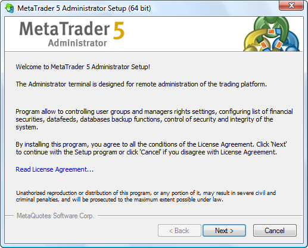
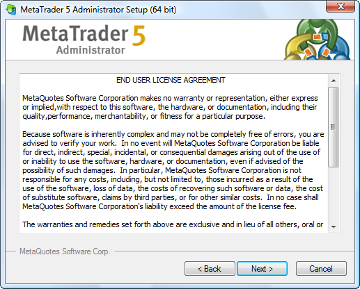
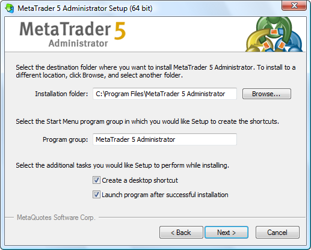
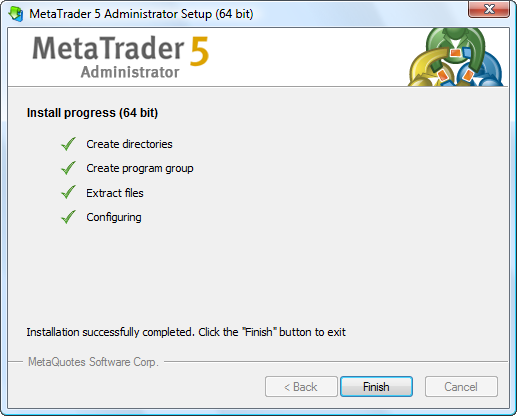

[🏠 Document Start](../../../README.md) / [MetaTrader 5 Trading Platform](../../../MetaTrader-5-Trading-Platform.md) / [MetaTrader 5 Administrator](../../MetaTrader-5-Administrator.md) / [Getting Started](../Getting-Started.md) / Install Terminal

[Previous](../Getting-Started.md) | [Next](Start-Terminal.md)

# Install Terminal

In order to install the administrator terminal, it is necessary to [download its distribution](https://support.metaquotes.net/en/download/mt5) and launch it.

  * The installation program is a web installer; this means that the major portion of the distributive will be downloaded from the Internet during installation.

  * The administrator terminal installer determines type of an operating system and installs the corresponding version of the terminal.
  * The terminal can operate under Microsoft Windows 10/11 or Windows Server 2008R2/2012/2012R2/2016. A processor with SSE2 support (Pentium 4/Athlon 64 or higher) is required for operating as well. Other hardware requirements are limited with software ones.

  * The terminal can run on devices with ARM64 (for examples, on Microsoft Surface tablets), but in this case, the minimum OS version is Windows 11.

  
---  
  

At the first step of installation, read the program description and the copyright notice. To get acquainted with the full text of the End User License Agreement, press the "Read License Agreement" button. If you agree with the license terms without seeing, press the "Next" button.

If you agree with all terms of the agreement, press the "Next" button. If you do not agree, exit the terminal installation program.

The following parameters should be selected at this installation stage:

  * Installation folder — specify a folder to install the terminal to. Another folder can be selected by writing a path to it manually or using the "Browse" button.
  * Program group — the name of the program group that will be created in the "Start" menu is indicated in this field.
  * Create a desktop shortcut — if this field is checked, a shortcut for launching the terminal will be additionally created on the desktop.
  * Launch program after successful installation — if this field is checked, the terminal will be automatically launched after the successful installation.

> Terminal can be installed over an installed version of it. At that, all terminal settings remain the same.

After "Next" is pressed, the terminal downloading and installation process will start.

To complete the installation process, press "Done". After that you can [launch](Start-Terminal.md) the terminal.
