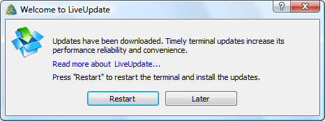
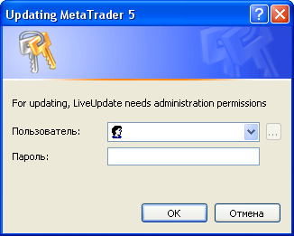
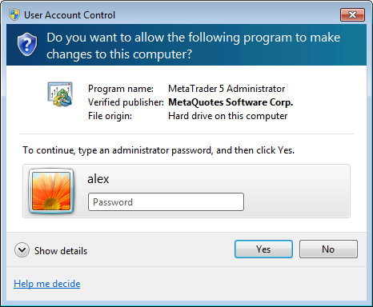

[🏠 Document Start](../../../README.md) / [MetaTrader 5 Trading Platform](../../../MetaTrader-5-Trading-Platform.md) / [MetaTrader 5 Administrator](../../MetaTrader-5-Administrator.md) / [Getting Started](../Getting-Started.md) / Live Update

[Previous](Change-Password.md) | [Next](Uninstall-Terminal.md)

# Live Update

A system of automatic updates is built into the terminal. It allows to get informed about and install new versions of the program promptly. This system is always enabled, it is impossible to disable it. Updating of all components of the trading platform can be managed at the ["Live Update"](../../Platform-Setup/Live-Update.md) section.

## Updating Procedure

The terminal checks for new versions of the program when it connects to the server. If a new version of any of the terminal components has been discovered, it will be automatically downloaded in the background mode.

After all the updates have been downloaded, the below window offering to update the terminal will appear:

One of the buttons must be pressed in this window:

  * Restart — if this button is pressed, window of the terminal will be closed, the terminal will be updated and automatically re-opened.
  * Later — in this case the window will be hidden and the terminal will be automatically updated during the next launch. 

  * All the stages of the updating are reflected in the administrator terminal [journal](../User-Interface/Toolbox/Journal.md). "LiveUpdate" is specified in the Server column of such entries.
  * In case of unsuccessful updating (server connection lost) the next attempt is performed one hour later. In this case only missing data will be additionally downloaded.

  
---  
  
## Update in the Guest Mode

If an administrator terminal has been launched in the [guest mode (#guest)](Start-Terminal.md#guest) (if the OS user has insufficient rights), a window requesting the increase of the user's permissions will be shown at the attempt to update.

### Microsoft Windows XP

In this case you are requested to specify details of the administrator account with enough permission to write files into the terminal installation directory.

### Microsoft Windows Vista

Depending on the user's permissions in MS Windows Vista, it is necessary either to allow the operation (if a user is an administrator) or specify administrator's account details.
