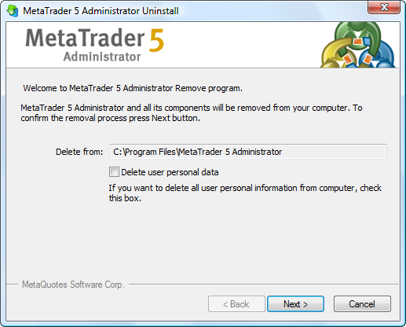
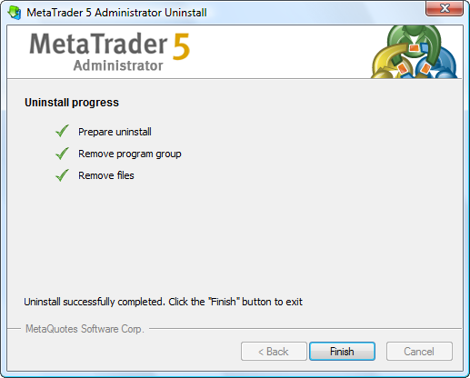

[🏠 Document Start](../../../README.md) / [MetaTrader 5 Trading Platform](../../../MetaTrader-5-Trading-Platform.md) / [MetaTrader 5 Administrator](../../MetaTrader-5-Administrator.md) / [Getting Started](../Getting-Started.md) / Uninstall Terminal

[Previous](Live-Update.md) | [Next](../User-Interface.md)

# Uninstall Terminal

In order to start the process of terminal deletion from the PC one should launch the "Uninstall.exe" file in the folder, where the client terminal is installed, or execute the "Uninstall" commands in the "MetaTrader 5 Administrator" group of programs in the "Start" menu. The following window will be opened as soon as it is done:

The folder from which the administrator terminal will be removed is displayed at this window. Also there is the "Delete user personal data" option. If it is checked then all the user's information (terminal settings, mailing, news, etc.) will be deleted together with the [permanent files](Structure-of-Directories-and-Files.md) of the terminal.

If one is sure to continue the deinstallation of the administrator terminal, it is necessary to press the "Next" button. The deletion process will be started as soon as it is done:

In order to finish the deinstallation one should press the "Finish" button.

  * It is recommended to be careful with the deletion of the terminal. If the user data is deleted it will be impossible to recover it.
  * If the "Delete user personal data" option is not enabled then further it is possible to recover the terminal operation with all its settings and information by installing it to the same folder.

  
---
